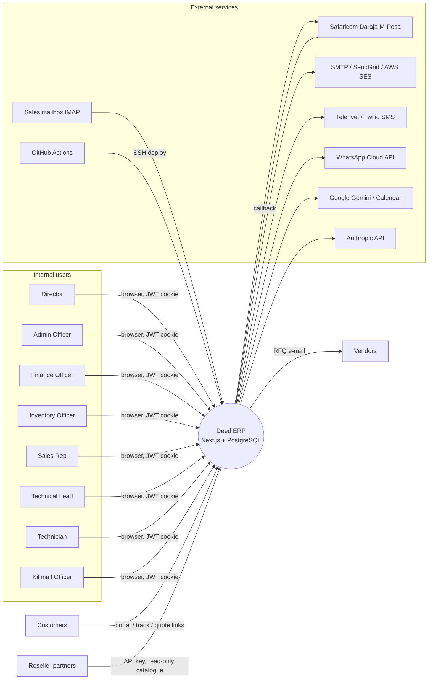
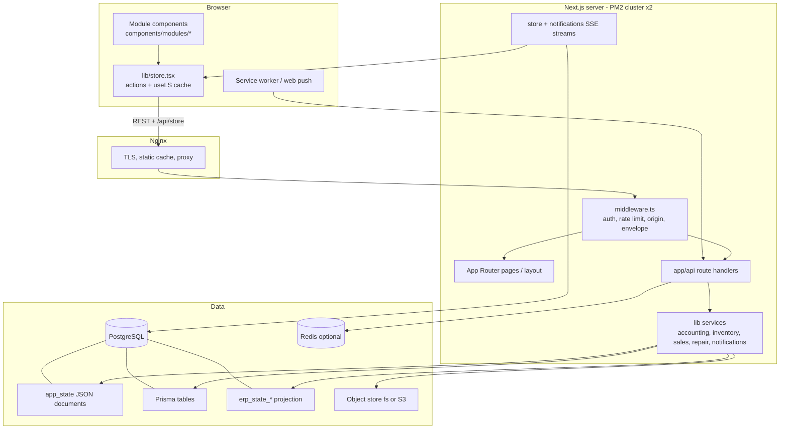

# Deed Technologies ERP — System Documentation

## 1. Document control

| Field | Value |
|---|---|
| **Document title** | Deed Technologies ERP — System Documentation (master document) |
| **System name** | Deed ERP (`package.json` name `deed-erp`, version `0.1.0`) |
| **Company** | Deed Technologies (Kenya; functional currency KES) |
| **Review date** | 2026-10-01 |
| **Repository** | `brianogango/deed-erp` |
| **Branch reviewed** | `claude/focused-einstein-lqo6u8` |
| **Commit reviewed** | `1713b7bf39c24703b8f5ab986104868d9de89b87` ("Warehouse: group stock into Inbound, Ready for Sale, With Issues, Held for others", committed 2026-09-30). The documentation files were added in a later commit on the same branch; no application file was changed. |
| **Document version** | 1.0 |
| **Prepared by** | Claude Code (automated code review and documentation; human review recommended) |
| **Document status** | Draft for review. Describes the system **as implemented in the code at the reviewed commit**, not as originally intended. |

**Supporting documents (this master document summarises and links to them):**

| Document | Contents |
|---|---|
| [`ERP_MODULE_INVENTORY.md`](./ERP_MODULE_INVENTORY.md) | Every module and screen, classification, store-action inventory |
| [`ERP_API_REFERENCE.md`](./ERP_API_REFERENCE.md) | All 270 route files / 410 method-level endpoints with gates, persistence, callers; verified detail for money-critical routes |
| [`ERP_DATA_MODEL.md`](./ERP_DATA_MODEL.md) | All 145 Prisma models, ER diagrams, enums, raw-SQL tables, source-of-truth matrix, store-key inventory |
| [`ERP_BUSINESS_FLOWS.md`](./ERP_BUSINESS_FLOWS.md) | The 21 end-to-end flows with diagrams |
| [`ERP_ROLES_AND_PERMISSIONS.md`](./ERP_ROLES_AND_PERMISSIONS.md) | Roles, permission matrix, store ACL, record-level rules, gaps |
| [`ERP_DEPLOYMENT_RUNBOOK.md`](./ERP_DEPLOYMENT_RUNBOOK.md) | Environments, CI/CD, migrations, backups, restore, rollback, procedures |
| [`ERP_KNOWN_ISSUES_AND_TECHNICAL_DEBT.md`](./ERP_KNOWN_ISSUES_AND_TECHNICAL_DEBT.md) | 40 numbered findings (KI-xx) with severity, evidence, remediation |

**Evidence conventions.** Paths are repository-relative; symbols are function, class, route or model names. "Verified" means the cited code was read and followed. **The application was not executed and the test suite was not run in this review** (see §19), so no statement says "works in production". Statements about the live server (environment values, cron entries, Nginx files, backup schedule, `STORE_BACKEND` value) cannot be verified from the repository and are marked *unverified*.

**Existing documentation vs code.** Where `README.md`, `docs/*.md`, `role_access_design.md` or `remediation/IMPLEMENTATION_STATUS.md` disagree with the code, the code is treated as authoritative and the discrepancy is recorded in KI-30 (for example: README says Next.js 14 and lists Odoo-style modules that do not exist; `docs/DATA_SAFETY_MIGRATION.md` says `STORE_BACKEND` defaults to `prisma` while `lib/store-backend.ts` defaults to `app_state`).

---

## 2. Executive summary

**Purpose.** Deed ERP is a single-company, Kenya-focused business system for an IT-hardware retailer and device-repair workshop (business type inferred from the product catalogue, serial-number tracking and repair workflows; `PRODUCT.md` is itself marked as inferred). It covers CRM → quotation → sales order → delivery → invoice → payment, purchasing and goods receipt, serial-tracked inventory with FIFO/standard costing, a point-of-sale till, a device-repair workshop with customer portal, device reconfiguration (component upgrade/downgrade), after-sales (returns, trade-ins, warranties), deposits/holdovers, HR with Kenyan statutory payroll, expenses, and a double-entry general ledger with trial balance, P&L, balance sheet, cash flow, VAT control and month-end integrity checks.

**Users.** Eight roles: Director, Admin Officer, Finance Officer, Inventory Officer, Kilimall Officer, Sales Rep, Technical Lead, Technician, plus customers (repair portal/quote links) and resellers (partner API). A DIA/"Jarvis" AI assistant is available per user.

**Major capabilities (code-verified).** Server-side invoice immutability and reversal journals; server-generated document numbers with DB uniqueness for most commercial documents; fiscal-lock enforcement in the journal service; idempotent journal refs; segregation-of-duties on invoice payment; 3-way match on vendor bills; serial-number uniqueness on receipt; repair state machine with ORC (outbound release control) gate; TOTP MFA, lockouts, session revocation, input envelope validation, CSP and security headers; verified-restore backups and automatic rollback on failed deploy.

**Current maturity.** The *financial core* (journals, invoices, payments, GL reports, deposits, payroll, reconfiguration) is normalised in PostgreSQL via Prisma and is the most mature part. The *operational core* (stock serials/moves, deliveries, receipts, POS, expenses, bank reconciliation, repairs UI logic, kilimall, outsource, refurbishment, KPI) still runs through a 21 848-line browser store (`lib/store.tsx`) that syncs whole collections to a legacy JSON store (`app_state`), with fire-and-forget mirrors into Prisma. The system is in the middle of a migration from that model to Prisma/PostgreSQL as the single source of truth; the migration is incomplete and the production configuration of the switch (`STORE_BACKEND`) is not in the repository.

**Most important architectural risks** (full list: [`ERP_KNOWN_ISSUES_AND_TECHNICAL_DEBT.md`](./ERP_KNOWN_ISSUES_AND_TECHNICAL_DEBT.md)):

1. **Multiple sources of truth** with asynchronous mirrors (KI-01, KI-33).
2. **Best-effort GL posting** after invoice commit (KI-02) and client-orchestrated POS posting with client-supplied totals (KI-07).
3. **A vendor-bill payment path that posts to AR instead of AP** (KI-03) — needs data confirmation.
4. **Authorisation gaps** on specific endpoints: delivery validation, outbound-release PATCH, company/customer master edits, session-only read APIs (invoices, deposits, products with cost), system journals (KI-04, 05, 06, 08, 10, 40).
5. **Closing controls**: fiscal lock/period reopen are API-only, unaudited in part, and inconsistent (KI-09).
6. **Application-level-only immutability** of ledger and audit data (KI-11).
7. **Operational evidence gaps**: no scheduled backup/retention/off-site/monitoring evidence in the repository (KI-31); test suite not runnable with the documented install command (KI-24).

No Critical (unauthenticated remote) vulnerability was verified.

---

## 3. System scope

| Aspect | Content |
|---|---|
| **Business processes covered** | CRM/lead intake; quotations; sales orders with approvals, reservations, versions; delivery notes and back-orders; invoicing (tax-categorised, eTIMS status columns), payments/allocations, credit notes, customer credits, deposits/layby, holdovers; purchasing with RFQ e-mail, POs, GRN, vendor bills, vendor returns, 3-way match; inventory (products, serials, bulk stock, locations, adjustments, stock checkouts, opening stock, valuation); POS sessions and tickets; repairs end-to-end incl. portal approval, QC, ORC release, warranty/no-charge paths, outsource and refurbishment; device reconfiguration; after-sales (RMA, trade-in/buy-back, donations, exchanges); expenses; bank/cashbook; GL, VAT, budgets, fixed assets/PPE depreciation, FX revaluation, month-end integrity; HR (employees, leave, Kenyan payroll PAYE/NSSF/SHIF/AHL, salary advances, performance, recruitment, training, assets); KPI targets/SOPs; notifications; AI assistant. |
| **Not covered** | Subscriptions, helpdesk, project, field service, marketing, events, team chat, e-signature (README items with no code); live Kilimall/marketplace sync; e-commerce storefront orders; bank-feed import; automatic KRA eTIMS transmission (status columns exist, no transmission client was found); payroll payment file generation; multi-company; multi-warehouse master data (fixed location list); year-end closing entries (no retained-earnings roll found). |
| **Primary users** | Director/owner, admin officers, finance officers, inventory officers, kilimall officers, sales reps, technical leads, technicians; every employee for self-service HR/leave/expenses/KPI. |
| **Departments** | Sales/CRM, Procurement & Inventory, Workshop (repairs, refurbishment, reconfiguration), Finance/Accounting, HR, Delivery/Logistics, Marketplace (Kilimall), Management. |
| **External parties** | Customers (portal, e-mail/SMS/WhatsApp links, M-Pesa), vendors (RFQ e-mail), resellers (partner API), Safaricom Daraja, e-mail/SMS/WhatsApp providers, Google (Gemini, Calendar), Anthropic, GitHub Actions, Contabo hosting, Let's Encrypt. |
| **Environments** | Production (Contabo VPS), CI (GitHub Actions + Postgres 16), Netlify deploy preview, local/cloud-agent (visual-regression bypass or disposable DB). No staging environment found. See [`ERP_DEPLOYMENT_RUNBOOK.md`](./ERP_DEPLOYMENT_RUNBOOK.md) §1. |

---

## 4. Architecture overview

### 4.1 Layers

| Layer | Implementation | Evidence |
|---|---|---|
| **Frontend** | Next.js 15.5.24 App Router; pages are thin wrappers (`app/(app)/*/page.tsx`) that dynamically import large client components (`components/modules/*.tsx`); Tailwind; FontAwesome; client PDF generation | `package.json`, `app/(app)/finance/page.tsx` |
| **Backend** | Next.js route handlers (`app/api/**`, 270 files); shared services in `lib/**`; middleware for auth, rate limit, origin and input envelope | `middleware.ts` |
| **Database** | PostgreSQL via Prisma 7 (`@prisma/adapter-pg`) for normalised models; raw `pg` SQL for `app_state`, `users`, counters, MFA | `lib/prisma.ts`, `lib/auth/db.ts` |
| **Authentication** | Credentials login (`/api/auth/login`) → NextAuth-compatible JWT cookie `deed-session` (12 h, 24 h absolute max, refresh threshold 2 h), bcrypt cost 12, legacy SHA-256 upgrade on login, 5-failure/15-min lockout, optional TOTP MFA with trusted-browser tokens for DIR/ADM/FIN | `lib/auth/*` |
| **Authorisation** | 8 roles, 26 module grants, 50 named permissions, per-route role arrays, store ACL (role + module per `deed_*` key), row slicing, record-level checks, client-only guards | [`ERP_ROLES_AND_PERMISSIONS.md`](./ERP_ROLES_AND_PERMISSIONS.md) |
| **API layer** | REST-style JSON; wrapper `withApiErrorHandling`; zod schemas on newer routes; generic collection CRUD factory for legacy blob collections (`lib/server-store-crud.ts`) | [`ERP_API_REFERENCE.md`](./ERP_API_REFERENCE.md) |
| **State management** | `lib/store.tsx` React context with `useLS` (localStorage cache + debounced sync + SSE `/api/store/stream`/polling merge), Zustand slices (`hooks/useHrStore.ts`, `useInventoryDomainStore.ts`, `useSettingsStore.ts`, `useNotificationStore.ts`), REST hooks | `lib/store.tsx`, `hooks/` |
| **Storage** | PostgreSQL; object store (`fs` or S3-compatible) for photos, reports, receipts (`blobs`, `.uploads`); browser localStorage | `lib/infra/object-store.ts`, `lib/blob-store.ts` |
| **Reporting** | Prisma-only GL reports (`lib/accounting/gl-reports.ts`, `financial-report.ts`) through an optional read replica (`REPORTING_DATABASE_URL`) with Redis/snapshot cache (`lib/infra/report-snapshots.ts`) | |
| **Background jobs** | None in-process. HTTP-triggered workers (`/api/cron/*`) invoked by server cron (unverified); durable job table `BackgroundJob` + `lib/infra/worker.ts`; SSE streams poll the DB every 10 s | |
| **Integrations** | See §17 | |
| **Deployment** | GitHub Actions → SSH → `deed-erp-deploy.sh` → PM2 cluster ×2 behind Nginx | [`ERP_DEPLOYMENT_RUNBOOK.md`](./ERP_DEPLOYMENT_RUNBOOK.md) |
| **Monitoring** | In-process HTTP metrics, PM2 logs, `/api/version`; no external APM/uptime evidence | |
| **Backups** | `scripts/backup-db.sh` with verified isolated restore; pre-deploy only in repo | |

### 4.2 System context

### 4.3 Container / component view

---

## 5. Repository structure

| Directory | Purpose | Important files | Related modules |
|---|---|---|---|
| `app/(app)/` | Authenticated page routes (thin wrappers) and the persistent shell layout | `layout.tsx`, `*/page.tsx` | all |
| `app/api/` | 270 route handlers | see API reference | all |
| `app/login`, `app/portal`, `app/track` | Public/customer pages | `portal/repair/[ref]/page.tsx` | Repair portal, quotes |
| `app/sales-prototype/` | Static demo/look-alike pages (not production flows) | | Sales (design review) |
| `components/modules/` | Module UIs (`Sales`, `Accounting`, `Repair`, `Inventory`, …) and sub-folders (`accounting/`, `purchase/`, `sales/`, `settings/`, `hr/`, `repair/`) | `Accounting.tsx`, `Repair.tsx` | all |
| `components/` (other) | Shell, layout, ui kit, data-table, pdf, portal, pos, jarvis, reconfiguration | `AppShell.tsx`, `layout/Sidebar.tsx` | shell |
| `lib/store.tsx` | **Client application store** (21 848 lines): state, actions, business rules, numbering, sync | | all legacy domains |
| `lib/auth/` | Auth, session, MFA, passwords, roles, store ACL | `authorization.ts`, `store-write-policy.ts`, `access.ts` | users, security |
| `lib/accounting/` | Posting engine, journals, reports, valuation journals, deposits, credit notes, fixed assets, VAT | `posting-service.ts`, `journal-service.ts`, `invoice-journals.ts`, `gl-reports.ts` | finance |
| `lib/inventory/` | Stock transactions, valuation (FIFO/standard), ledger, serials, labels | `stock-transactions.ts`, `valuation-service.ts` | inventory |
| `lib/sales/`, `lib/odoo-sales-flow.ts`, `lib/services/` | Sales rules, line math, approvals, state machine | `odoo-sales-flow.ts` | sales |
| `lib/purchase/` | PO helpers, 3-way match, GRN serials | `three-way-match.ts` | purchase |
| `lib/repair*`, `lib/repair/` | Repair types, transition policy/guard, mirror, billing, QC, handover | `repair-mirror.ts`, `repair-transition-policy.ts` | repair |
| `lib/reconfiguration/` | Work-order state machine, costing, compatibility | `state-machine.ts`, `service.ts` | reconfiguration |
| `lib/notifications/`, `lib/integrations/`, `lib/mpesa/`, `lib/crm/`, `lib/jarvis/` | Messaging, providers, Daraja, inbox pipeline, AI | | integrations |
| `lib/infra/` | Redis, cache, queue, jobs, worker, object store, reporting DB, snapshots | | platform |
| `lib/hr/` | Payroll, leave, advances (Kenya statutory) | `kenya-payroll.ts` | HR |
| `lib/server-store*.ts`, `lib/prisma-state-store.ts`, `lib/store-backend.ts`, `lib/blob-*.ts` | Legacy state persistence and cutover tooling | `server-store.ts` | platform |
| `prisma/` | `schema.prisma` (145 models) and legacy numbered SQL | | data |
| `database/migrations/` | 45 hand-written idempotent SQL migrations applied in production | | data |
| `scripts/` | Safe-migration wrappers, backfills, seeds, ops helpers, deploy/backup/verify, security checks, visual regression | `deploy/deed-erp-deploy.sh`, `backup-db.sh` | ops |
| `ops/` | Request files for ops workflows; Nginx example | | ops |
| `.github/workflows/` | CI/deploy + 23 `ops-*` workflows | `deploy.yml` | CI/CD |
| `__tests__/`, `e2e/` | 383 Vitest files; 3 Playwright specs | | QA |
| `docs/` | Existing design/runbook documents (partly stale) and this documentation set | | docs |
| `design-system/`, `DESIGN.md`, `PRODUCT.md`, `.cursor/`, `.claude/`, `.agents/`, `.impeccable/`, `.github/skills` | Design-system and agent skill assets (≈ 600 files) | | tooling |
| `data/catalog-photos/` | Product photo fixtures for the catalogue seed | | inventory |
| `types/`, `hooks/`, `public/` | Type declarations, React hooks, static assets | | |
| root | `middleware.ts`, `next.config.js`, `ecosystem.config.js`, `vitest.config.ts`, `playwright.config.ts`, `prisma.config.ts`, lockfiles, stray tarballs/log (KI-22) | | |

---

## 6. Module catalogue

The one-line-per-module classification (62 requested modules + extras) is in [`ERP_MODULE_INVENTORY.md`](./ERP_MODULE_INVENTORY.md) §3. This section gives the detailed catalogue grouped into families. For every family: purpose, main users, screens/routes, API endpoints, services, Prisma models, permissions, inputs/outputs, main actions, business rules, statuses, documents, accounting entries, integrations, limitations, source references. "Client-side" marks rules enforced only in `lib/store.tsx`.

### 6.1 Dashboard
| | |
|---|---|
| Purpose / users | Role-tailored overview of sales, invoices, repairs, expenses, deposits; all roles with `dashboard` module |
| Screens / routes | `/` → `components/modules/Dashboard.tsx`, `SalesDashboard.tsx`, `RepPerformance.tsx` |
| APIs / services | Store hydration of keys in `appStateKeysForRoute('/')` (`lib/app-state-hydration.ts`); `GET /api/accounting/dashboard` (Prisma) for finance cards; `lib/dashboard-priority.ts` |
| Models | Reads `Invoice`, `Journal*`, `ProductValuation`, `PayrollRun`, `BankAccount` (accounting dashboard) |
| Permissions | Module `dashboard`; accounting dashboard DIR/FIN/ADM |
| Limitations | KPIs computed in the browser from whatever the role is allowed to hydrate (content-filtered), so numbers differ by role; no server aggregation for operational KPIs |
| Source | `components/modules/Dashboard.tsx`, `app/api/accounting/dashboard/route.ts` |

### 6.2 Contacts, Customers, Vendors
| | |
|---|---|
| Purpose / users | Master data for customers, vendors, companies, contact persons; Sales, Admin, Finance, Inventory (read), Director |
| Screens | `/contacts` tabs `all, customers, vendors, companies, individuals, persons, chatter, financial, history, info` |
| APIs | `/api/contacts` (GET/POST), `/api/contacts/[id]` (+`archive`, `restore`), `/api/contacts/merge` (DIR), `/api/companies*`, `/api/contact-persons*`, `/api/crm/duplicate-contacts`, `/api/chatter` |
| Services | `lib/contact-prisma.ts`, `lib/contact-search.ts`, `lib/crm/duplicate-contact-policy.ts` |
| Models | `Client` (`clientType`, `isCustomer`, `isVendor`, `creditLimit`, `paymentTermsDays`, `kraPin`, `loyaltyPoints`, `clientNumber` `CLT-NNNNN`), `ContactPerson`, `DocumentMessage`, `DocumentActivity` |
| Permissions | contacts routes DIR/ADM/FIN/SALES; archive/restore DIR/ADM; merge DIR; **companies and contact-persons routes: session only (KI-10)** |
| Rules | Archive/restore instead of delete; duplicate-contact policy; customer credit limit/gate (`lib/customer-credit-gate.ts`); payment terms default 0 days (SQL `20260829_contact_payment_terms_default_zero_safe.sql`) |
| Statuses | `isActive`, archived flag |
| Accounting | None directly (credit limit feeds sale-order confirmation) |
| Limitations | `Supplier` model unused; vendors are `Client` rows |
| Source | `app/api/contacts/**`, `lib/contact-prisma.ts` |

### 6.3 CRM
| | |
|---|---|
| Purpose / users | Leads, pipeline, activities, contracts, SLA; Sales reps, Admin, Finance, Director |
| Screens | `/crm` tabs `contacts, companies, leads, opportunities, pipeline, activities, contracts, sla, dup_contacts, email_review` |
| APIs | `/api/leads*`, `/api/opportunities*`, `/api/opportunity-activities*`, `/api/activities`, `/api/crm/email-review`, `/api/cron/sales-inbox-*`, `/api/salespeople` |
| Models | `Lead`, `SalesInboundEmail`, `Opportunity` (stages `prospecting…closed_won/lost/on_hold`), `OpportunityActivity`, `Quote` |
| Permissions | leads DIR/ADM/SALES/FIN; opportunities DIR/ADM/SALES (reps own rows); round-robin assignment |
| Rules | Lead convert (idempotent, `409` if converted); inbox relevance filter; advisory lock for mailbox processing |
| Integrations | IMAP mailbox, Gemini relevance model |
| Limitations | `deed_customerContracts` is a store key (blob) |
| Source | `lib/crm/*`, `app/api/leads/**` |

### 6.4 Sales: quotations and sales orders
| | |
|---|---|
| Purpose / users | Quote, confirm, version, cancel, deliver and invoice; Sales rep, Admin, Finance, TL (repair-linked), Director |
| Screens | `/sales` tabs `quotations, orders, crm, after_sales`; workbench stepper (`components/modules/sales/*`) |
| APIs | `/api/sale-orders` (+ `[id]`, `create-invoice`, `credit-note`, `deliver-lines`, `new-version`, `versions`, `reconfiguration`), `/api/quotes*`, `/api/portal/quotes/*`, `/api/sale-order-attachments/*`, `/api/sales-commissions`, `/api/salesperson-sales` |
| Services | `lib/odoo-sales-flow.ts` (state machine, invoiceable qty, cancel blockers), `lib/sales/*` (line math, down payment, margin approval), `lib/services/sale-order.service.ts`, `lib/inventory/stock-transactions.ts` (`reserveStockForSaleOrder`) |
| Models | `SaleOrder`, `SaleOrderItem`, `Quote`, `QuoteItem`, `StockReservation`, `SalesCommission`, `ApprovalRule` |
| Permissions | create/edit `manageSaleOrders` roles (DIR/ADM/FIN/SALES/TL); confirm DIR/SALES/ADM (+FIN/TL if repair-linked); cancel/reset confirmed DIR/FIN/ADM; reps limited to own rows |
| Inputs / outputs | Lines (product, qty, price, discount %, tax), customer, validity, terms → SO `SO/YYYY/NNNN`, delivery note, PDF/e-mail |
| Business rules | See [`ERP_BUSINESS_FLOWS.md`](./ERP_BUSINESS_FLOWS.md) flows 1–4 and §13 status catalogue; credit check at confirm (override DIR/FIN); expiry check; margin/discount/backorder approvals; optimistic lock; versioning |
| Statuses | `quotation → quotation_sent → sale`, `cancelled` |
| Documents | Quotation/proforma PDF, SO PDF, delivery note |
| Accounting | None until invoice |
| Limitations | CRM `Quote` and quotation-state `SaleOrder` coexist; sale-order list partly client-held (`deed_saleOrders`); confirmation orchestration (number, PATCH, delivery) is client-driven (heal logic exists for drift) |
| Source | `app/api/sale-orders/**`, `lib/odoo-sales-flow.ts`, `lib/store.tsx` `confirmSO` |

### 6.5 Customer invoices, credit notes, payments and collections
| | |
|---|---|
| Purpose / users | Bill and collect; Finance, Admin (SoD-limited), Director; TL for repair invoices |
| Screens | `/finance` tabs `invoices, bills, credits, refunds, partner_ledger, ageing, commissions`; `/finance/invoices/[id]` |
| APIs | `/api/invoices*`, `/api/payments*`, `/api/mpesa/*`, `/api/sale-orders/[id]/credit-note`, `/api/deposits*`, `/api/accounting/ageing` |
| Services | `lib/finance-invoice.ts`, `lib/accounting/invoice-journals.ts`, `posting-service.ts`, `payment-allocations.ts`, `credit-note-service.ts`, `residuals.ts`, `lib/finance-controls.ts` |
| Models | `Invoice`, `InvoiceItem`, `TaxTransaction`, `Payment`, `PaymentAllocation`, `CreditNote`, `CreditNoteLine`, `CreditApplication`, `MpesaStkRequest` |
| Permissions | invoice write DIR/FIN/ADM/TL(+TECH repair); payment DIR/FIN/ADM; credit note DIR/FIN; list/read: session (KI-08) |
| Rules | Posted invoices immutable; tax category mandatory; reset only unpaid; void blocked when paid → credit note; payment capped at balance; idempotency key; fiscal lock |
| Statuses | `draft, pending_approval, approved, rejected, invoiced, dispatched, delivered, paid, partially_paid, cancelled, voided` (enum) — API collapses payment states onto `approved`; payment progress derived |
| Documents | Invoice PDF, receipt, statement |
| Accounting | See §8.4 matrix |
| Limitations | KI-02, KI-03, KI-08, KI-37, KI-38, KI-39 |
| Source | `app/api/invoices/**`, `app/api/payments/**` |

### 6.6 Purchase: RFQ, purchase orders, receipts, vendor bills
| | |
|---|---|
| Purpose / users | Procure and receive; Inventory Officer, Admin, Finance, TL, Director |
| Screens | `/purchases` tabs `orders, receipts`; Finance `bills` |
| APIs | `/api/purchase-orders*` (aliases `/api/purchase`, `/api/purchases`), `/api/inventory/validate-receipt`, `/api/inventory/apply-vendor-return-stock`, `/api/integrations/send-rfq`, `/api/scan-purchase-document`, `/api/scan-receipt`, `/api/receipts` (blob CRUD) |
| Services | `lib/purchase/*` (3-way match, bill/PO line match, GRN serials, receipt contents), `lib/accounting/vendor-bill-perpetual.ts` |
| Models | `PurchaseOrder`, `PurchaseOrderItem`, `GoodsReceivedNote`, `GrnItem`, `Invoice` (vendor_bill), `SupplierPayment` (unused) |
| Permissions | PO write DIR/ADM/FIN/INV/TL; receipt validate DIR/ADM/INV; bills DIR/FIN/ADM; vendor return DIR/ADM/INV |
| Rules | Receipt validation idempotent; bill qty ≤ received − billed; 3-way match server-side; RFQ is an e-mailed draft PO (no vendor comparison) |
| Statuses | PO `draft, sent, confirmed, partial, received, cancelled`; receipt `draft, validated`; return `draft, confirmed`; bill = invoice statuses |
| Documents | PO/RFQ PDF, GRN, vendor bill |
| Accounting | Receipt: Dr Inventory / Cr 3201 GRNI (+PPV); bill: Dr GRNI, Dr/Cr variance, Dr 1150 / Cr 3000; vendor return: Dr 3201 / Cr Inventory |
| Limitations | KI-03; receipts/serials are blob-operational (KI-01); no PO transition table server-side (only `lockVersion` and role) |
| Source | `app/api/purchase-orders/**`, `app/api/inventory/validate-receipt/route.ts` |

### 6.7 Expenses
| | |
|---|---|
| Purpose / users | Staff claims and company expenses; everyone submits, Finance/Director review and pay |
| Screens | `/expenses` tabs `mine, review` |
| APIs | `POST /api/expenses/post-journal`, `/api/expense-receipts/[expenseId]` |
| Services | `lib/expense-approval-chain.ts`, `lib/accounting/expense-pos-accounts.ts`, `posting-service.ts` |
| Models | none (blob `deed_expenses`; `ExpenseRecord` unused) |
| Rules / statuses | `submitted → approved → paid \| reimbursed`, `rejected`; approval chain; receipt required by policy (client) |
| Accounting | §8.4 rows E1–E3 |
| Limitations | Expense records are blob-only; expense row slicing by submitter |
| Source | `app/api/expenses/post-journal/route.ts` |

### 6.8 Point of Sale
See flow 10. **Screens** `/pos`; **APIs** `/api/pos/record-order`, `/api/pos/post-sale-journal`, `/api/inventory/apply-pos-stock`, `/api/invoices` (POS invoice), dead `/api/pos/charge`; **models** blob `deed_posOrders`, `deed_posSessions`, `deed_customerCredits`; `Invoice`; **permissions** DIR/FIN/ADM/SALES/KIL; **rules** open session required, loyalty (`lib/loyalty.ts`), client-credit tender, bank-payment references; **accounting** §8.4 row P1; **limitations** KI-07, KI-26.

### 6.9 Finance core: chart of accounts, journals, GL, trial balance, P&L, balance sheet, cash flow, VAT
See §8 for logic. **Screens** `/finance` tabs `dashboard, coa, journals, gl, trial_balance, pl, bs, cash_flow, cash_position, vat, financial_report, reports, fx, migration, integrity, monthly`; **APIs** `/api/accounting/*` (27 route files); **models** `AccountCode, Journal, JournalEntry, JournalEntryLine, FiscalLock, FiscalPeriod, FinancialAuditEvent, FinancialReconciliation, TaxTransaction, AnalyticAccount, AnalyticBudget, FixedAsset, AssetDepreciationEntry`; **permissions** DIR/FIN/ADM read, DIR/FIN write; **limitations** KI-09, KI-11, KI-27, KI-33.

### 6.10 Cashbook, bank accounts, bank reconciliation
**Screens** `/cashbook`, Finance `cashbook`/`cash_position`; **APIs** `/api/bank-recon/adjustments`, `/api/bank-recon/suggest-outstanding`, `/api/accounting/bank-statements*` (no UI callers); **models** blob `deed_bankAccounts`, `deed_bankRecons`, `deed_bankStatementLines`; Prisma `BankAccount`, `BankStatement*`; **permissions** `manageBankRecon` DIR/FIN; **rules** monthly recon per account, statement-line match scoring, reconciled period lock (client); **accounting** bank charges Dr 6703/Cr bank, interest Dr bank/Cr 5201 (API only); **limitations** KI-16, KI-28.

### 6.11 Financial periods, month-end, budgets and analytics
**Screens** Finance `integrity`, `monthly`, `analytics`; **APIs** `/api/accounting/integrity`, `/month-end`, `/fiscal-periods*`, `/fiscal-lock`, `/analytic-accounts`, `/analytic-budgets`, `/budget-vs-actual`; **models** `FiscalPeriod, FiscalLock, FinancialReconciliation, AnalyticAccount, AnalyticBudget`; **rules** §8.9; **limitations** period/lock API-only (KI-09), two always-green gates (KI-27), `AnalyticBudgetLine` unused.

### 6.12 Inventory: products, warehouses/locations, transfers, receipts, issues, Computer Aid
| | |
|---|---|
| Screens | `/inventory` tabs `stock_on_hand, warehouse_view, product_master, product_catalog, serial_tracking, serial_lookup, stock_in, stock_out, transfers, adjustments, checkouts, stock_take, opening_stock, opening_closing, low_stock, parts_requests, movements, valuation, reports`; `/inventory/serial/[id]` |
| APIs | `/api/products*`, `/api/categories`, `/api/serials*`, `/api/stock-moves`, `/api/inventory/*` (apply-pos/transfer/adjustment/customer-return/vendor-return stock, intake-serials, validate-opening-stock, post-opening-valuation, stock-checkouts, computer-aid, consignments, valuation-report, normalize-tags) |
| Services | `lib/inventory/*` (stock-transactions, valuation-service, inventory-ledger-service, serial-*, label-*), `lib/product-*.ts`, `lib/pricing/*` |
| Models | `Product, Category, ProductImage, SerialNumber, StockLevel, BulkStockLevel, StockMovement, InventoryBatch, InventoryLedgerEntry, ProductValuation, ValuationEvent, StockReservation, ConsignmentDevice, CustomerAsset` |
| Permissions | products DIR/ADM/INV/TL(/FIN images); GRN DIR/ADM/INV; serial edit DIR/ADM/INV/TL; stock-checkout request/approve sets; apply-* routes inline role sets |
| Rules | Serial uniqueness (case-insensitive) and barcode generation; product identity duplicate checks (name/SKU/barcode); reserve at SO confirm; costing FIFO or standard per product; stage rules (only "Ready for Sale" is sellable — `lib/inventory/sellable-stock.ts`); 11 fixed locations |
| Statuses | Serial `available, assigned, sold, under_repair, returned, written_off, refurbishment, reconfiguration, capitalised`; adjustments `pending, approved, rejected` |
| Accounting | Receipt/COGS/adjustment/opening/return journals (`STK`), §8.4 |
| Limitations | Stock truth is split blob (`deed_serials`, `deed_bulkStock`, `deed_stockMoves`) vs Prisma (KI-01); no warehouse master; adjustments have no Prisma table (KI-25) |
| Source | `lib/inventory/stock-transactions.ts`, `valuation-service.ts` |

### 6.13 Delivery and outbound release control
| | |
|---|---|
| Screens | `/delivery` tabs `jobs, riders, weekly_pay`; delivery panels in Sales; `OutboundReleasePanel` |
| APIs | `/api/deliveries*` (blob CRUD + validate + reverse), `/api/outbound-releases*` |
| Models | blob `deed_deliveries`, `deed_deliveryJobs`, `deed_riders`, `deed_riderWeeklyPays`; Prisma `DeliveryNote(+Item)`, `OutboundRelease(+Item,+Log)` |
| Permissions | deliveries write DIR/ADM/FIN/SALES/INV(+TL on detail); reverse DIR/INV/ADM; ORC pick/void DIR/ADM/FIN/SALES/TL, verify/release DIR/ADM |
| Rules | Delivery state `draft/waiting/ready/done/cancelled`; back-orders; hollow-done detection; ORC unique per repair/invoice/delivery note |
| Accounting | COGS on validation (flow 3) |
| Limitations | KI-04, KI-05 |

### 6.14 Repair family: booking, diagnosis, parts, quotation, approval, assignment, QC, warranty, completion, collection
| | |
|---|---|
| Purpose / users | Workshop job lifecycle; Admin (intake), TL (assign, QC), Technician (diagnose/repair), Sales/Finance (quote/billing), customers (portal) |
| Screens | `/repairs` (tabs `client`, `refurb`), modals, `/portal/repair/*`, `/track/*` |
| APIs | `/api/repairs*`, `/api/repair-photos\|diagnosis-reports\|qc-reports/[repairRef]`, `/api/portal/repair/**` (approve, messages, payment-confirmation, payment-proof, PDFs, photos, sync), `/api/portal/intake*`, `/api/technicians`, `/api/outbound-releases*` |
| Services | `lib/repair-*.ts`, `lib/repair/*`, `lib/repair-mirror.ts`, `lib/diagnosis-fee.ts`, `lib/repair-warranty.ts`, `lib/repair-billing-exempt.ts`, `lib/repair-transition-policy.ts` / `-guard.ts`, `lib/sales/repair-quote-revision.ts` |
| Models | `Repair` (payload column + device columns), `RepairPart/Stage/Diagnostic/ClientCommunication` (unused), `OutboundRelease*`, `Invoice` (repairId), blob `deed_repairs_v2`, `deed_warranties`, `deed_outsourceJobs` |
| Permissions | server DIR/ADM/TL/TECH + module `repair`, record firewall; client-side per-action guards (see roles doc §8) |
| Rules | 20 statuses and transition table; server guard only for arrivals at ready/verified_released/delivered/collected/closed; diagnosis fee KES 1 000 (policy since 3 Aug 2026); Direct Repair, warranty, billing-exempt paths; QC by someone other than the technician; ORC verification before handover; billing independent of repair status; invoice re-issue for revised quotes after posting |
| Statuses | see §13 |
| Documents | Repair sticker, quote PDF, invoice/receipt PDF, QC and diagnosis reports, ORC record |
| Accounting | Parts consumption Dr 6301 / Cr Inventory; revenue via linked invoice (service lines 5121) |
| Integrations | SMS/WhatsApp/e-mail to customers; portal |
| Limitations | KI-05, KI-14, KI-35; most rules client-side; repair blob retained as backup copy |
| Source | `lib/store.tsx` repair actions (lines ~15 500–18 700), `app/api/repairs/**`, `docs/architecture/repair-business-flow.md` (contract) |

### 6.15 Refurbishment, Outsource, Device reconfiguration
- **Refurbishment** (`/refurbishment`): internal device prep jobs (statuses `queued, assigned, in_progress, ready, transferred, written_off`; parts `needed, requested, allocated, ordered, received, used`); store-only (`deed_refurbishmentJobs`); `transferToSell` moves units to sellable stock.
- **Outsource** (`/outsource` tabs `jobs, vendors`): send repairs/units to external vendors; statuses `sent, returned_resolved, returned_unresolved`; vendor payments (`deed_outsourcePayments`, FINANCE write); server write ACL includes inventory officers.
- **Device reconfiguration** (`/reconfiguration`): Prisma-native work orders for serialised machines: statuses `draft → pending_stock_check → components_reserved → pending_approval → approved → in_progress → pending_qa → completed`, `cancelled`, `reversed`; 17 API routes with 15 dedicated permissions; removal/installation lines, component disposition (`quarantine, pending_testing, ready_for_sale, repair_required, parts_harvesting, damaged, write_off, supplier_return`), costing and optional sales bridge; bench jobs complete in one step (`POST /api/reconfiguration/bench`); reference `RCF/YYYY/NNNN` (DB-unique).

### 6.16 After-sales, Holdovers, Deposits
- **After-Sales** (`/aftersales` tabs `returns, trade, warranties`): RMA (`requested → approved → received → processed | rejected`), buy-backs (`draft → approved → paid → stocked`), donations, exchanges (`draft → approved → completed | cancelled`), refunds; blob keys; accounting via `system-journals` kinds `rma_refund`, `buyback_credit`.
- **Holdovers** (`/holdovers`): temporary device loans (`active, returned, overdue`) in Prisma `Holdover` with blob mirror.
- **Deposits** (`/deposits`): layby/customer deposits (`active, partially_paid, fully_paid, completed, cancelled`), receipts, application to invoices, refunds; `lib/accounting/deposit-service.ts`; journals Dr cash / Cr 3100, application Dr 3100 / Cr 1800 (`JRN/DEP/APPLY/…`), refund (`JRN/DEP/REFUND/…`); `/api/deposits*` DIR/ADM/FIN (+ session-only `payments` route, KI-04-class gap).

### 6.17 Asset management
`/property` (`CompanyProperty.tsx`): office furniture/fittings register, custody, disposal/write-off, monthly depreciation (`runCompanyAssetDepreciation`), link serial → asset; server journals via system-journals kind `fixed_asset`; `/api/accounting/fixed-assets*` (capitalise Dr PPE 1701–1704 / Cr 3000; depreciation Dr depreciation expense / Cr accumulated depreciation by class) has **no UI caller**; roles manage DIR/ADM, view +FIN; store key write DIR/ADM with non-existent module `property` (director-only in effect).

### 6.18 HR, payroll, KPI targets and standards
- **HR** (`/hr`): employees, departments, leave (`LeaveRequest` statuses `pending, approved, rejected, cancelled, pending_hr`), payroll runs (`draft → pending_approval → approved → posted`, then payment via `/api/payroll/[id]/pay`), salary advances (`pending → approved → paid → repaid | rejected | cancelled`), recruitment, training, performance, HR documents, assets, reports; APIs `/api/employees*`, `/api/leave-requests*`, `/api/payroll*`, `/api/salary-advances*`, `/api/sop-files*`; `lib/hr/kenya-payroll.ts` (PAYE, NSSF, SHIF, AHL via versioned `StatutoryRuleVersion`); payroll posting journal `JRN/PAYROLL/<run>` (Dr 6601 Salaries + employer NSSF/AHL expense, Cr 3310 net pay, 3302 PAYE, 3303 NSSF, 3304 SHIF, 3305 AHL, 3306 pension, 1931 advances, 3311 other); sensitive store keys read-gated; self-service endpoints ownership-scoped.
- **KPI targets / SOPs** (`/sops`, `/sop-documents`): blob-only (`deed_sops`, `deed_sopActuals`, `deed_hr_perf_targets`, `deed_ref_sops`, `deed_sop_documents`); status `on_track, at_risk, achieved, missed`.

### 6.19 Kilimall and E-commerce
- **Kilimall** (`/kilimall`): manual order/dispatch/return/settlement workbench (statuses `pending, dispatched, delivered, returned, cancelled`; settlements `draft, posted, partially_matched, reconciled`); blob keys; **no marketplace API integration**; Prisma `Kilimall*` models have no operational reader/writer.
- **E-commerce** (`/ecommerce`): **UI-only** list of sellable products, empty orders, unsaved settings.

### 6.20 Reports, PDFs and printing; Settings; Audit; Notifications; Users
Covered in §15 (reports/PDF), §16 (security & audit), §17 (notifications/integrations) and the roles document (users). Settings (`/settings`, director-only navigation) contains company/system settings, users and security dashboards, approval rules, margin policy, commission rates, currency/price lists, notification operations, SMS center, partner API keys, production-env check, document layout configurator.

### 6.21 Customer portal, partner API, DIA assistant
- **Portal** (`/portal/*`, `/track/*`, `/api/portal/*`): customer repair tracking, quote approve/decline with phone verification, payment proof, PDFs.
- **Partner API** (`/api/public/v1/*`, `/api/partner-keys*`): read-only product catalogue and images; hashed `deed_pk_` keys; hidden categories via `partnerHiddenCategories`; `docs/PARTNER_API.md`.
- **DIA / Jarvis** (`/api/jarvis/*`): chat with 16 tools (inventory, warranty, invoices, quotations, repairs tracking, sales summaries, leads import, document search); providers Gemini or Anthropic; module `jarvis`; audit in `AiAuditLog`.

---

## 7. End-to-end business processes

The 21 processes are traced in [`ERP_BUSINESS_FLOWS.md`](./ERP_BUSINESS_FLOWS.md), each with actors, trigger, preconditions, steps, validation, status changes, database writes, accounting impact, audit events, failure paths, recovery and output, plus Mermaid diagrams for the complex flows.

| # | Flow | Implemented? | Key accounting effect | Main caveat |
|---|---|---|---|---|
| 1 | Lead/contact → quotation | Yes | none | two quotation models |
| 2 | Quotation → sales order | Yes | none | client-driven orchestration |
| 3 | SO → delivery | Yes | Dr COGS / Cr Inventory | KI-04 |
| 4 | SO/delivery → invoice | Yes | Dr AR / Cr Revenue / Cr VAT | KI-02 |
| 5 | Invoice → payment/allocation | Yes | Dr cash / Cr AR (or outstanding 1933) | no payment void (KI-38) |
| 6 | RFQ/PR → PO | Yes (RFQ = e-mailed draft PO) | none | no vendor-quote comparison |
| 7 | PO → receipt | Yes | Dr Inventory / Cr GRNI | blob-operational |
| 8 | Vendor bill → payment | Yes | bill: clear GRNI + VAT + AP; **payment posts to AR (KI-03)** | |
| 9 | Expense → posting | Yes | Dr expense / Cr 3312 or 3202; payment Dr 3202/3312 / Cr bank | blob-only records |
| 10 | POS → stock and finance | Yes | Dr tender / Cr revenue / Cr VAT; COGS | KI-07 |
| 11–15 | Repair booking → diagnosis → quote → approval/parts → QC → delivery | Yes | parts COGS 6301; invoice per flow 4 | client-side rules |
| 14 | Declined quote → closure | Yes | fee invoice | donation accounting not traced |
| 16 | Warranty repair | Yes | none (COGS on parts) | warranty creation not traced |
| 17 | Warehouse transfer | Yes | none | client-numbered |
| 18 | Computer Aid custody | Yes | none | contract not in repo |
| 19 | Bank reconciliation | Yes (client) | adjustments via API only | KI-16 |
| 20 | Month-end close | Yes (API + integrity UI) | no closing entries | KI-09, KI-27 |
| 21 | Documents/printing | Yes | none | multiple PDF builders |

---

## 8. Financial and accounting logic

### 8.1 Chart of accounts
- Table `account_codes` (`AccountCode`: code unique, name, `accountType` asset/liability/equity/revenue/expense, group/subgroup, `isActive`); the official Deed CoA (2025) is installed by `POST /api/accounting/bootstrap-coa` (template `lib/accounting/coa-template.ts`) and aligned in production by SQL migrations (`20260828_coa_alignment_safe.sql`, `20260828_official_coa_alignment_safe.sql`).
- **Roles → live codes** (`lib/accounting/coa-roles.ts`; "do not renumber production accounts"): AR 1800, AP 3000, Output VAT 3301, Input VAT 1150, Customer deposits 3100, Customer credits 3313, Inventory 1200, COGS 6001, GRNI/Accruals 3201, Revenue products 5000, ABSA 2201, Equity bank 2202, Petty cash/mobile money 2211, Employee reimbursements 3312, Outstanding receipts 1933, Outstanding payments 3202, Bank charges 6703, Interest income 5201, Salaries 6601, Employer NSSF 6606, Employer AHL 6609, Net payroll payable 3310, PAYE 3302, NSSF 3303, SHIF 3304, AHL 3305, Pension 3306, Other deductions 3311, Employee advances 1931. Other literals: 5121 Hardware Support (repair services), 5200 Sales Discounts (loyalty), 6101 purchases (default cost account), 6301 repair services costs, 6305/6306/6307 adjustment/write-off/price difference, PPE 1701–1704.
- Per-product account overrides (`Product.saleAccountCode`… ) fall back to category defaults then company fallbacks (`lib/product-accounts.ts`: sale 5000, cost 6101, inventory 1200, COGS 6001, adjustment 6305, write-off 6306, price difference 6307).

### 8.2 Journal structure
`Journal` (code SAL, PUR, BNK, CSH, STK, PAY, GEN/MISC; auto-created on first use) → `JournalEntry` (unique `ref`, `entryDate`, `sourceType`, `sourceId`, `sourceVersion` — unique together —, `invoiceId`/`paymentId`/`blobId` soft links, `isPosted`, `postedAt`, `postedById`, `isReversed`, `reversalOfId`, totals) → `JournalEntryLine` (`accountId` FK, `accountLabel`, debit, credit, `partnerId`, `analyticAccountId`, `sortOrder`).
Validation in `lib/accounting/journal-service.ts`: ≥ 2 lines; no negative; no line with both sides; no zero line; totals > 0 and balanced within 0.009; account code must exist and be active (`Unknown account … Create and approve the account in the Chart of Accounts`); analytic account active; fiscal lock/period check; duplicate `ref` either returns the existing entry (`skipIfExists`, default) or fails `409`. Account labels are strings `"<code> - <name>"`; the code is parsed (`extractAccountCode`).

### 8.3 Posting events, idempotency and numbering of journals
All postings go through `createJournalEntry*`/`persistStoreJournalEntry*`; the central builder module `posting-service.ts` (`commitPosting`) resolves CoA roles, asserts balance (±0.02) and persists. Refs are deterministic per document: `JRN/<invoiceNo>`, `JRN/PAY/<invoiceNo>/<paymentId>`, `JRN/<POS ref>`, `JRN/EXP/<ref>`, `JRN/EXPPAY/<ref>`, `JRN/RIM/<ref>`, `JRN/PAYROLL/<run>`, `JRN/DEP/<ref>/<paymentId>`, `JRN/CN/<creditNote>`, `JRN/AST-CAP/<asset>`, stock journals from `stockValuationJournalRef(kind, reference, productId)`, reversals `REV/<ref>`; re-posting after reversal takes `…/2`, `/3` (`allocateInvoiceJournalRef`). `ACCOUNTING_POSTING_ENGINE` must be true in production (`posting-flag.ts`; the comment states surfaces no longer skip when false).

### 8.4 Accounting-event matrix

Journal codes in brackets. "Posting status" is how the posting is committed. "Evidence" paths are in `lib/accounting/` unless noted.

| ID | Business event | Triggering module | Debit | Credit | Database record | Posting status | Reversal method | Source-code evidence |
|---|---|---|---|---|---|---|---|---|
| S1 | Customer invoice confirmed | Sales/Finance | 1800 AR (total) | Revenue per line account, default 5000 (subtotal); 3301 Output VAT (tax) [SAL] | `JournalEntry` `JRN/<inv>`, `TaxTransaction` | Best-effort after commit (KI-02) | `reverseInvoiceJournalInPrisma` on reset/void/cancel (unpaid) | `invoice-journals.ts` `buildInvoiceJournalInput`; `app/api/invoices/[id]/route.ts` |
| S2 | Repair invoice service lines | Repair/Finance | 1800 | 5121 Hardware Support (labour/logistics/diagnosis without product) + VAT | same as S1 | same | same | `invoice-journals.ts` (`isRepair`) |
| S3 | Customer payment (cash/M-Pesa) | Finance | 2211 Petty cash/mobile money (or the mapped bank GL) | 1800 [CSH] | `Payment`, `PaymentAllocation`, `JournalEntry` | Atomic with payment | reverse journal (no void route) | `app/api/invoices/[id]/payments/route.ts`, `payment-allocations.ts` |
| S4 | Customer payment (bank transfer) | Finance | 2201 ABSA (or mapped GL) | 1800 [BNK] | same | Atomic | same | same |
| S5 | Payment with unallocated remainder | Finance | cash/bank | 1800 (allocated) + 1933 Outstanding Receipts (rest) | `Payment` + journal | Atomic | reverse | `posting-service.ts` `buildPaymentWithOutstandingLines` |
| S6 | Allocate outstanding receipt | Finance | 1933 | 1800 | journal `JRN/PAYALC/…` | Atomic | reverse | `buildAllocateOutstandingLines` |
| S7 | Customer credit applied | Finance | 3313 | 1800 [MISC/SAL] | journal | Atomic | reverse | `buildInvoicePaymentLines` |
| S8 | Deposit applied to invoice | Deposits | 3100 | 1800 [SAL] | `DepositApplication`, journal `JRN/DEP/APPLY/…` | Service tx | reverse | `deposit-service.ts` |
| S9 | Deposit received | Deposits | cash/bank | 3100 [CSH/BNK] | `DepositPayment`, journal | Service tx | cancel/refund journal `JRN/DEP/REFUND/…` | `deposit-service.ts` |
| S10 | Credit note | Finance | 5000 revenue (subtotal), 3301 (tax) | 1800 (applied to AR) and/or 3313 (credit balance) [SAL] | `CreditNote(+Line)`, journal `JRN/CN/…` | Service tx | n/a (credit note is the correction) | `credit-note-service.ts` (KI-39) |
| S11 | Paid invoice cancelled | Finance | revenue, 3301 | 3313 [SAL] | journal `JRN/<creditRef>` | Best-effort after commit | — | `postCustomerCreditJournalToPrisma` |
| P1 | POS sale | POS | tender (2211/bank), 3313 (credit tender), 5200 (loyalty) | revenue per product account, 3301 [CSH/BNK/SAL] | `JournalEntry` `JRN/POS/NNNN` | Separate client call (KI-07) | reverse; refund via system journal | `posting-service.ts` `postPosSale`; `app/api/pos/post-sale-journal/route.ts` |
| I1 | Goods receipt (GRN) | Inventory | product inventory account (1200) + 6307 variance (if cost > receipt) | 3201 GRNI [STK] | `InventoryLedgerEntry`, `ValuationEvent`, journal | In stock transaction; finance-setup gaps skip journal | vendor return | `valuation-service.ts` `processStockReceipt` |
| I2 | Delivery / sale of stock | Delivery | 6001 COGS (product cogs account) | 1200 [STK] | journal, `ValuationEvent`, batch consumption | Swallowed on failure (KI-04) | `POST /api/deliveries/[id]/reverse` reverses the COGS journal and restores stock | `processStockDelivery` |
| I3 | POS stock | POS | 6001 | 1200 [STK] | same | hard-fail blocks sale | `reversePosSaleValuation` | `processStockPosSale` |
| I4 | Repair parts consumed | Repair | 6301 | 1200 [STK] | same | idempotent per repair+product | none found | `processStockRepairConsume` |
| I5 | Customer return | After-sales | 1200 | 6001 [STK] | same | | | `buildStockCustomerReturnLines` |
| I6 | Vendor return | Purchase | 3201 | 1200 [STK] | same | | | `buildStockVendorReturnLines` |
| I7 | Stock adjustment | Inventory | 6305 adjustment / 6306 write-off or 1200 | 1200 or 6305 [STK] | same | | | `processStockAdjustment` |
| I8 | Opening stock | Inventory | 1200 | opening-stock offset account (not traced) [STK] | same | | | `processOpeningStockValuation` |
| B1 | Vendor bill (PO, perpetual) | Purchase | 3201 GRNI at receipt cost, 6307 variance, 1150 Input VAT | 3000 AP [PUR] | `Invoice` bill, `TaxTransaction` input | Best-effort after commit | reverse on reset/void | `vendor-bill-perpetual.ts` |
| B2 | Vendor bill (non-stock/PPE) | Purchase | 6101 or PPE 1701–1704; 1150 | 3000 [PUR] | same | same | same | same |
| B3 | Vendor payment | Finance | 3000 | cash/bank | — | **Route posts Dr cash / Cr 1800 (KI-03)**; builder `buildInvoicePaymentLines(isVendor)` exists | reverse | `posting-service.ts` vs route |
| E1 | Expense approved | Expenses | expense by category | 3312 (reimbursement) or 3202 (company) [MISC] | `JournalEntry` `JRN/EXP/…` | Tx with audit | reverse | `buildExpenseApprovalLines` |
| E2 | Company expense paid | Expenses | 3202 | bank/cash [CSH/BNK] | `JRN/EXPPAY/…` | Tx with audit | reverse | `buildExpenseCompanyPaymentLines` |
| E3 | Employee reimbursed | Expenses | 3312 | bank [MISC] | `JRN/RIM/…` | Tx with audit | reverse | `buildExpenseReimbursementLines` |
| H1 | Payroll posted | HR | 6601 gross, 6606/6609 employer NSSF/AHL | 3310 net, 3302, 3303, 3304, 3305, 3306, 1931, 3311 [PAY] | `PayrollRun.postedJournalId` | Tx; status check | reverse (no UI) | `app/api/payroll/[id]/route.ts` |
| F1 | Bank charge / interest | Bank recon | 6703 / bank | bank / 5201 [BNK] | `JRN/BNK/<kind>/<line>` | API only | reverse | `postBankStatementAdjustment` |
| F2 | Asset capitalised | Assets | PPE 1701–1704 | 3000 [MISC] | `FixedAsset`, `JRN/AST-CAP/…` | Tx | reverse | `fixed-asset-service.ts` |
| F3 | Depreciation | Assets | depreciation expense | accumulated depreciation [MISC] | `AssetDepreciationEntry` | Tx | reverse | same |
| F4 | FX revaluation | Finance | balance account or FX loss | FX gain or balance account | journal | API | reverse | `fx-journals.ts` |
| M1 | Manual journal | Finance | any active account | any | `JournalEntry` (`sourceType='manual'`) | Immediate | `REV/<ref>` | `app/api/accounting/journals/route.ts` |
| M2 | System journal (6 kinds) | Various | caller-supplied (KI-06) | caller-supplied | `JournalEntry` | Immediate | reverse | `app/api/accounting/system-journals/route.ts` |
| M3 | Reversal | Finance | opposite of original | opposite | `REV/<ref>`, original `isReversed` | Serializable tx | not reversible again (idempotent) | `journal-service.ts` `reverseJournalEntry` |

### 8.5 Tax and VAT
- Line tax categories: `standard_16`, `zero_rated`, `exempt`, `out_of_scope`, `non_vat_supplier`, `not_selected` (`TaxType` enum / `taxCategory` strings); **posting requires an explicit category on every line** ("A 0% amount is not automatically zero-rated VAT"); 16 % standard rate. Diagnosis fee VAT is always 0 %.
- `TaxTransaction` per invoice line (`direction` output/input, base, tax, `taxPoint`, `taxPeriod` `YYYY-MM`, partner PIN, `transmissionStatus` `pending`/`pending_evidence`/`not_required`, `inputClaimEligible`) is written after invoice posting; credit notes carry tax lines.
- VAT control report: GL aggregates on 3301 (output) and 1150 (input), payable = output − input (`vat-reports.ts`, `GET /api/accounting/vat-control`); a VAT return draft builder exists; integrity gate `vat_vs_tax_txns` reconciles GL to `tax_transactions`.
- KRA capital allowances helper (`lib/tax/kra-capital-allowances.ts`). **No eTIMS transmission client was found.**

### 8.6 Stock valuation and cost of goods
Per-product costing method resolved at runtime: **FIFO** (batches in `InventoryBatch`, consumed oldest-first; shortfall for legacy stock is covered by an auto-created layer at standard cost), **standard**, or weighted average (`ProductValuation.averageCost`). Every valuation event is idempotent via `ValuationEvent.eventKey`; `InventoryLedgerEntry` records quantity/cost per movement; the integrity gate `inventory_vs_gl` compares total valuation to account 1200. Setting `invAutomatedValuation` (default on) controls perpetual posting; bills linked to a PO clear GRNI instead of expensing.

### 8.7 Cashbook and bank reconciliation
Cashbook is derived in the browser from journal lines on cash/bank accounts and the `deed_bankAccounts` list (each with a GL mapping); reconciliation records per account/month are stored in `deed_bankRecons`; statement lines in `deed_bankStatementLines`; matching helper `lib/accounting/bank-statement-match.ts`. The cash-flow statement uses the cash account prefix `22` (2201, 2202, 2211) in the GL, not the cashbook.

### 8.8 Financial statements (generation and source of truth)
All financial reports read **Prisma journal lines only** (`accountingReportSourceOfTruth()` returns `'prisma'`; `getReportingPrisma()` may point at a replica):

| Report | Endpoint | Generation | Notes |
|---|---|---|---|
| Trial balance | `/api/accounting/trial-balance` | `fetchPostedLines` (all entries with `isPosted`, **reversed originals and their reversals both included**, up to `asOf`) aggregated by account; unmapped account → error (fails closed) | no opening-balance/period logic: cumulative since inception |
| Profit and loss | `/api/accounting/profit-loss` | management P&L: revenue less COGS/operating/finance buckets by account group (`management-pl.ts`); date-ranged | |
| Balance sheet | `/api/accounting/balance-sheet` | cumulative asset/liability/equity balances to `asOf`; revenue − expense **since inception** shown as "Current period earnings" (no year-end close; no retained-earnings journal exists); `equationDifference`/`balanced` returned | |
| Cash flow | `/api/accounting/cash-flow` | direct method: movements on cash accounts grouped by contra account into operating / investing (17, 16) / financing (40, 35, 34) | |
| General ledger | `/api/accounting/general-ledger` | line list by account/date | |
| Ageing | `/api/accounting/ageing`, `lib/accounting/ageing*.ts` | AR/AP buckets from invoices and residuals | subledger |
| VAT | `/api/accounting/vat-control` | §8.5 | |
| Budget vs actual | `/api/accounting/budget-vs-actual` | analytic budgets compared with journal-line actuals (`analyticBudget`, `journalEntryLine`, `accountCode` queries; detailed grouping not traced) | |
| Financial report pack | `/api/accounting/financial-report` | P&L + BS + CF + TB + daily revenue/expense | DIR/FIN/ADM |
`Reports still reading legacy data`: dashboard KPIs, cashbook, kilimall/financial and expense lists use store arrays (not the GL).

### 8.9 Financial-period locking, reversals, immutability, numbering, audit
- **Locking:** `FiscalLock.lockDate` (latest row) and `FiscalPeriod.state` (`closed`/`locked` block; `draft`/`open` allow) are enforced inside every journal creation (`409`), plus pre-checks in invoices, payments, POS, expenses, system journals, sale-order confirm. Journal dates ≤ lock date are rejected.
- **Reversals:** `reverseJournalEntry` (Serializable; idempotent; marks original `isReversed`). Reports include both entries (net zero); the journal list hides reversed originals.
- **Immutability:** posted invoices (server `409`), posted journals (no edit/delete API), financial audit rows (append-only by convention). **No database-level enforcement** (KI-11).
- **Numbering:** see §14.
- **Audit trail:** `AuditLog` + `FinancialAuditEvent` written in the same transaction as the financial mutation (`writeFinancialAuditInTx`, fail-closed) for invoice post/void, payment, POS journal, expense journals, month-end, period close/reopen, payroll posting; store audit timeline for legacy writes (capped, archived); `store_audit_archive`; Director export `/api/admin/audit`.
- **Source of truth per report:** GL reports → Prisma journals; invoice/AR/AP ageing → Prisma invoices & payments; inventory valuation → `ProductValuation`/batches; dashboard & cashbook → store arrays.

---

## 9. Data architecture

Full detail: [`ERP_DATA_MODEL.md`](./ERP_DATA_MODEL.md) — 145 models in 13 domains, 23 enums, entity-relationship diagrams per domain and for the cross-domain spine, raw-SQL tables (`app_state`, counters, MFA, `users`), per-model PK/FK/unique/index/status/audit/soft-delete columns, ORM-usage evidence, table-to-module mapping and the **source-of-truth matrix**.

Key facts:
- Three persistence layers coexist (normalised Prisma tables; legacy `app_state` JSON documents; `erp_state_*` projection). `STORE_BACKEND` (default `app_state`) selects the legacy store's location; the production value is *unverified*.
- Primary keys are UUIDs (Prisma `@default(uuid())`), commercial documents carry human numbers with unique indexes; `lockVersion` provides optimistic locking on `Invoice`, `SaleOrder`, `PurchaseOrder`, `ReconfigurationWorkOrder`.
- **Soft-delete:** invoices are voided, contacts archived, journals reversed; repairs are hard-deleted with tombstones; blob collections are replaced as arrays (bulk-delete guard).
- **25 models have no ORM usage in application code** (data model §2.1, KI-25).
- Raw SQL tables (not in `schema.prisma`): `app_state`, `doc_ref_counter`, `orc_ref_counter`, `deposit_ref_counter`, `admin_audit_log`, `user_mfa`, `user_trusted_browsers`; the `users` table is managed by raw SQL in `lib/auth/users-repository.ts`.

---

## 10. Prisma and blob-storage migration

### 10.1 Where data lives today

| Category | Content |
|---|---|
| **Still in legacy store only** (`deed_*` keys under `app_state`, or `erp_state_*` after cutover; no Prisma counterpart found) | POS orders/sessions/opening cash, expenses, bank accounts/reconciliations/statement lines, customer credits, approval requests, workflow approvals, company/system settings, document payment details, riders/delivery jobs/weekly pay, outsource jobs/vendors/payments, refurbishment jobs, warranties, return orders, buy-backs, donations, exchanges, refund payments, kilimall orders/dispatches/settlements, company assets, KPI/SOP keys, HR recruitment/training/contracts/employee assets/documents, stock checkouts, stock adjustments, stock transfers, profile images, product price history, bulk stock levels (also in `BulkStockLevel`), customer contracts |
| **In Prisma and still dual-written / mirrored** | accounts, journals, stock reservations, deposits, holdovers, deliveries, purchase orders, serials, stock moves, receipts, repairs (blob = backup), invoices, sale orders, products, payments (legacy path) |
| **Prisma-only (client writes blocked)** | CRM quotes, opportunities, activities, contacts, companies, contact persons, leave requests/balances, payroll runs (key `PRISMA_REST_SOT_STORE_KEYS`); notifications, reconfiguration, outbound release, salary advances, employees |
| **Object store (binaries)** | `expense_receipt_*`, `repair_photos_*`, `repair_payment_proof_*`, `product_photos_*` (`isBlobKey`), QC/diagnosis report files, label images |
| **Browser storage** | `localStorage` caches of every store key (`persistClientStoreValue`, quota-guarded) plus pinned modules, drafts, dirty-key recovery (`deed_dirty_keys`, `deed_client_recovered`, `deed_last_synced_at`) |

### 10.2 Mechanisms
- **Fallback reads:** `loadStateWithLegacyFallback` (Prisma projection → `store_records` → `app_state` for keys never backfilled); `overlayAuthoritativeRepairs` (repairs always from Prisma); `overlayExternalBlobs` (binary keys from the object store).
- **Dual writes:** `saveStoreKeys` → `app_state` and/or Prisma projection per `STORE_BACKEND`; then fire-and-forget domain mirrors (`mirrorAccountsToPrisma`, `mirrorJournalEntriesToPrisma`, `mirrorStockReservationsToPrisma`, `mirrorDepositsToPrisma`, `mirrorHoldoversToPrisma`, `mirrorDeliveriesToPrisma`, `mirrorKnownDomain` for POs/serials/stock moves/receipts); repairs mirror is synchronous and fingerprinted.
- **Migration scripts:** `npm run transfer:blobs` (`scripts/transfer-blobs-to-prisma.mjs` → `POST /api/admin/blob-transfer`), `backfill:app-state`, `backfill:accounting`, `backfill:notifications`, `scripts/backfill-leave|payroll|salary-advances-to-prisma.mjs`, `backfill-bulk-stock-levels-from-blob.mjs`, `converge-po-ids.mjs`, `dedupe-contacts-blob.mjs`, `dedupe-operational-data.mjs`, `fix-coa-blob-alignment.mjs`, `externalize-repair-reports.mjs`, `fix-prisma-timestamptz-offset.mjs`, plus 14 `migrate:*:safe` SQL wrappers.
- **Reconciliation:** `lib/blob-cutover.ts`/`.server.ts` (verify → certify → archive → retire with `BlobCutoverCertificate`; "never DELETE live keys without a parity certificate"), `lib/accounting/journal-parity.ts`, `journal-retire-readiness.ts`, `posting-soak.ts`, `journal-mirror-failures.ts`, `npm run parity:check`, `docs/BLOB_PRISMA_PARITY.md`, integrity gates `journal_mirror_backlog`/`journal_parity_posted` (the latter is hard-coded true).
- **Data that may be duplicated:** invoices/sale orders/deliveries/POs (blob and Prisma rows with possibly different ids — "twin-id" handling in `po-prisma-sync.ts`, `resolve-invoice-mirror.ts`); journals (client-built `JRN/…` in the blob vs Prisma entries — idempotent by ref); contacts (blob vs `Client`, dedupe scripts); products (blob merge).
- **Modules depending on blobs:** POS, expenses, bank/cashbook, kilimall, outsource, refurbishment, after-sales, delivery jobs, KPI, asset register, stock transfers/adjustments/checkouts, settings.
- **Reports on Prisma:** TB, P&L, BS, cash flow, GL, VAT, ageing, budget-vs-actual, financial report, inventory valuation, integrity suite. **Reports/screens on legacy data:** dashboard KPIs, cashbook, expense and kilimall financial tabs, stock-on-hand screens (blob serials/bulk stock).
- **Inconsistency risks:** see KI-01, KI-12, KI-33; the 2026-09-21 incident (cutover code deployed without backfill/tables; paginated 200-row pages overwrote whole collections; rollback + restore) is the documented precedent.

### 10.3 Migration-status table

| Domain | Legacy source | Prisma model | Read source | Write source | Fallback behaviour | Migration status | Data risk | Required next action |
|---|---|---|---|---|---|---|---|---|
| Products | `deed_products` | `Product` (+images, levels) | Prisma-hydrated into client store (`refreshProductCatalog`) | `/api/products*` (Prisma) + blob merge | blob if Prisma list empty | Mostly migrated | Medium (stock counters in client) | Certify parity, retire blob (`CATALOG_BLOB_KEYS`) |
| CRM quotes/opportunities/activities/contacts/companies/persons | `deed_quotes`, `deed_opportunities`, … | `Quote`, `Opportunity`, `OpportunityActivity`, `Client`, `ContactPerson` | REST | REST only | none (client POST dropped) | **Complete** | Low | Delete obsolete keys after archive |
| Sale orders | `deed_saleOrders` | `SaleOrder(+Item)` | Prisma list merged with local drafts | `/api/sale-orders*` | local draft preservation merge | Prisma-authoritative, blob mirror | Medium (drift of local `status`) | Retire blob mirror |
| Invoices / vendor bills | `deed_invoices` | `Invoice(+Item)`, `TaxTransaction` | Prisma + role-sliced blob | `/api/invoices*` | `resolveBlobInvoiceMirror` | Prisma-authoritative, blob mirror refreshed | Medium–High (KI-02/03) | Remove blob dependency in journal/payment paths |
| Payments | `deed_payments` | `Payment`, `PaymentAllocation` | Prisma (finance) | `/api/payments` two paths | legacy blob path when no allocations | Partial | Medium | Single Prisma path; number/void |
| Journals / GL | `deed_journalEntries`, `deed_accounts` | `JournalEntry*`, `AccountCode` | Prisma (reports), blob list in UI | Prisma services + client blob writes | `mirror*ToPrisma`, `orphaned-invoice-journals` | Reports migrated; writers dual | High if mirror fails | Enable `ACCOUNTING_PRISMA_JOURNAL_WRITERS` after retire-readiness certificate |
| Deposits / holdovers | `deed_deposits(_v1)`, `deed_holdovers` | `Deposit*`, `Holdover` | Prisma | `/api/deposits*` | blob mirror | Migrated | Low–Medium | Retire `_v1` key |
| Stock reservations | `deed_stockReservations` | `StockReservation` | blob | server `reserveStockForSaleOrder` + mirror | | Dual-write | Medium | Read from Prisma |
| Purchase orders | `deed_purchaseOrders` | `PurchaseOrder(+Item)` | Prisma-hydrated | `/api/purchase-orders*` | twin-id sync | Row-projection / partial | Medium | Finish; drop blob |
| Receipts / GRN | `deed_receipts` | `GoodsReceivedNote`, `GrnItem` | blob | validate route (blob + Prisma GRN) | `mirrorKnownDomain` | Partial | Medium–High | Receipt REST service |
| Serials | `deed_serials` | `SerialNumber` | blob | `/api/serials*` blob CRUD (`lockKey`) + stock txns + mirror | | Partial (row projection) | **High** (stock identity) | Make Prisma authoritative |
| Stock moves | `deed_stockMoves` | `StockMovement` | blob | stock routes + mirror | | Partial | High | same |
| Bulk stock | `deed_bulkStock` | `BulkStockLevel`, `StockLevel` | blob | store + backfill script | | Partial | High | same |
| Deliveries | `deed_deliveries` | `DeliveryNote(+Item)` | blob | validate route (blob) | `mirrorDeliveriesToPrisma` | Blob authoritative, Prisma mirror | High (KI-04) | Move validate to Prisma tx |
| Repairs | `deed_repairs_v2` | `Repair` | Prisma (`overlayAuthoritativeRepairs`) | store → `mirrorRepairsToPrisma` (sync) | blob write-only backup | Phase 2c: table authoritative | Medium (payload JSON, columns partial) | Remove blob write; move rules server-side |
| POS | `deed_posOrders`, `deed_posSessions` | `PosTransaction*`, `PosSession` (unused) | blob | `/api/pos/*` | union merge | **Not migrated** | High | New POS service (KI-07) |
| Expenses | `deed_expenses` | `ExpenseRecord` (unused) | blob | store + `/api/expenses/post-journal` | | Not migrated | Medium | Prisma model + REST |
| Bank / cashbook | `deed_bankAccounts`, `deed_bankRecons`, `deed_bankStatementLines` | `BankAccount`, `BankStatement*` | blob | store | | Not migrated | Medium | UI to Prisma APIs |
| Customer credits / refunds | `deed_customerCredits`, `deed_refundPayments` | `CreditNote`, `CreditApplication` (partial) | blob | store + system journals | | Partial | Medium | |
| HR: leave, payroll, advances, employees | `deed_leave*`, `deed_payrollRuns`, `deed_salaryAdvances` | Prisma tables | REST | REST | none | **Complete** | Low | Remove keys |
| HR: recruitment, training, contracts, documents, assets | `deed_jobPostings` … | none | blob | store | | Not migrated | Low | |
| Notifications | `deed_notifications` (old) | `Notification*` | REST/SSE | services | backfill script | **Complete** | Low | |
| Reconfiguration | none (`deed_*` retired) | `Reconfiguration*` | REST | REST | | **Native Prisma** | Low | |
| Outbound release | `deed_outboundReleases` | `OutboundRelease*` | REST | REST (+ key still writable) | | Migrated | Medium (KI-05) | Remove key ACL |
| Settings | `deed_companySettings`, `deed_systemSettings` | `CompanySetting` (separate fields) | blob (PDFs, UI) | blob; `/api/settings` writes Prisma | | Split | Medium | Choose one |
| Kilimall / outsource / refurb / aftersales / KPI / assets | `deed_*` | `Kilimall*` etc. unused | blob | store | | Not migrated | Low–Medium | |
| Binary attachments | object store | n/a | object store | object store | `.uploads` vs `blobs` dirs | Stable | Low | Include in backups (done) |

### 10.4 Steps to complete the cutover safely
1. Freeze the target state: record the production `STORE_BACKEND`, `ACCOUNTING_*`, `RETIRE_APP_STATE` values (server side).
2. For each domain in the table marked *Partial/Blob authoritative*, deliver a dedicated REST service writing Prisma transactionally (serials/stock first, then receipts, deliveries, POS, expenses, bank) — follow the existing pattern (`/api/deposits`, `/api/reconfiguration`).
3. Add the domain's key to `PRISMA_REST_SOT_STORE_KEYS` so client writes are dropped; keep read-through hydration for old clients.
4. Run `npm run parity:check` / `blob-cutover` verify for the domain; require equal counts and ids; issue the certificate.
5. Only then archive and retire keys (never delete `app_state` rows before certification — `docs/DATA_SAFETY_MIGRATION.md`).
6. Flip `ACCOUNTING_PRISMA_JOURNAL_WRITERS` after `journal-retire-readiness` passes; finally follow `docs/PRISMA_STATE_CUTOVER.md` (`dual` for a business day, compare counts, backup, then `prisma`).
7. Each step is preceded by a verified backup and followed by integrity-suite and E2E runs.

---

## 11. API reference

All 270 route files / 410 method-level handlers are listed in [`ERP_API_REFERENCE.md`](./ERP_API_REFERENCE.md) §2, grouped by module, with method, route, gate, persistence, caller and source file; §1 documents cross-cutting behaviour (auth, rate limits, error shape, CSRF, locking); §3 gives verified request/validation/side-effect detail for the money- and security-critical endpoints. Route-file counts by gate class:

| Gate class (method-level endpoints) | Count |
|---|---|
| role-gated (inline role list / requireRole) | 200 |
| permission-gated (roleMatrix) | 33 |
| store-key ACL (session + store policy) | 8 |
| session, rows scoped to the caller | 8 |
| session + inline role/module logic | 25 |
| session-only (no role check) | 68 |
| secret / provider-verified | 19 |
| public or self-authenticated | 33 |
| re-export of another route | 8 |
| other / see source | 9 |
| **Total** | **411** |

_Counts are derived from the static gate detection described in the API reference header; the "session-only (no role check)" row includes endpoints explicitly marked ⚠ in the table._

---

## 12. Roles and permissions

Full detail and matrices: [`ERP_ROLES_AND_PERMISSIONS.md`](./ERP_ROLES_AND_PERMISSIONS.md) (8 roles × 50 named permissions, 78 store-key write policies, 26 default module grants, record-level rules, finance-sensitive and repair permissions, 9 gap findings P-1…P-9).

Summary: Director holds everything; Admin Officer and Finance Officer share posting rights (payment SoD-limited for Admin); Inventory Officer controls stock and GRN; Sales Rep and Kilimall Officer sell and run the till; Technical Lead assigns/QCs repairs and may bill them; Technician works assigned jobs. Enforcement is layered and **not unified** (role arrays per route, `roleMatrix`, store ACL with module grants, record-level checks, client-only guards). Notable gaps: module access not enforced on pages; 68 method-level endpoints with no role check (mostly `GET` reads of Prisma-backed documents) and 9 named permissions never enforced; client-only repair/bank-recon rules; settings/property store keys effectively director-only because of invalid module ids.

---

## 13. Status and workflow reference

"Permission" = server-side gate where one exists; **(client)** = enforced only in the browser action. "Reversal" = how the state can be undone.

### 13.1 Quotations and sales orders

| Entity | Status | Meaning | Allowed next | Trigger | Permission | Side effects | Reversal |
|---|---|---|---|---|---|---|---|
| CRM `Quote` | `draft` | being prepared | `sent` | `sendQuote` | CRM write roles | PDF/e-mail, token link | edit |
| | `sent` / `viewed` | delivered / opened by customer | `accepted`, `rejected`, `expired`, `revised` | portal view/accept, staff update | portal token; staff roles | portal accept creates SO (`/api/portal/quotes/[id]/accept`) | `revised` creates new version |
| | `accepted` | customer agreed | convert to SO | `convertQuoteToSaleOrder` (needs `accepted/sent/viewed`) | sales roles (client) | creates quotation-state SO (`QUO` ref) | — |
| | `rejected`, `expired`, `revised` | terminal-ish | — | | | | new quote |
| `SaleOrder` | `quotation` | draft quotation | `quotation_sent`, `sale`, `cancelled` | create / save | SALES/ADM/FIN/TL/DIR | — | — |
| | `quotation_sent` | sent to customer | `sale`, `cancelled`, `quotation` | `markQuotationSent`, confirm | confirm DIR/SALES/ADM | — | reset |
| | `sale` | confirmed Sales Order | `cancelled`, `quotation` (reset) | `confirmSO` → PATCH | DIR/SALES/ADM (+FIN/TL repair-linked) | SO number, `confirmedAt`, stock reservation, waiting DN, audit | cancel/reset only DIR/FIN/ADM and only when no completed delivery/posted invoice/payment (`saleOrderCancelBlockers`) |
| | `cancelled` | cancelled | `quotation` | `resetSOToDraft` | DIR/FIN/ADM if previously confirmed | releases reservations | — |

### 13.2 Deliveries

| Status | Meaning | Allowed next | Trigger | Permission | Side effects | Reversal |
|---|---|---|---|---|---|---|
| `draft` | being prepared | `waiting`, `ready`, `cancelled` | create | write roles | — | cancel |
| `waiting` | awaiting stock | `ready`, `done`, `cancelled` | confirm SO | | reservation | |
| `ready` | picked | `done`, `cancelled` | `prepareDelivery` | | | |
| `done` | validated | — (back-order split for partials) | `POST …/validate` | **session only (KI-04)** | stock out, serial → sold, COGS | `POST …/reverse` (DIR/INV/ADM) |
| `cancelled` | cancelled | replacement DN | | | | |

### 13.3 Invoices, vendor bills, payments

| Entity | Status | Meaning | Allowed next | Trigger | Permission | Side effects | Reversal |
|---|---|---|---|---|---|---|---|
| `Invoice` / vendor bill | `draft` | unposted | `approved`, `pending_approval`, `cancelled` | create from SO/PO/manual | WRITE_ROLES | number assigned at post | delete via void |
| | `pending_approval` / `rejected` | approval gate | `approved` / `draft` | approval rules | DIR/ADM/FIN | not payable | — |
| | `approved` ("posted") | confirmed; payment progress derived from `amountPaid` | `cancelled`, `voided`, `draft` (reset) | `PUT` confirm | DIR/FIN/ADM (+TL repair-linked) | journal, `TaxTransaction`, commission, audit | reset (unpaid, `resetToDraft:true`) or cancel/void → `REV/<ref>`; paid → credit note |
| | `cancelled`, `voided` | terminal | — | cancel / `DELETE` | DIR/FIN/ADM | journal reversed (unpaid); paid → credit | — |
| posting state | `unposted → posting → posted` | GL status | | after commit | system | | `orphaned-invoice-journals` re-post |
| payment progress (derived) | Not Paid, In Payment, Partially Paid, Paid, Reversed | | | payments | | | |
| `Payment` | `postingStatus unposted/posted`, `reconciliationStatus unreconciled/…`, `isVoided` | | | record | DIR/FIN/ADM | journal | no void path |
| blob payment | `pending` | legacy path default | | | | | |

### 13.4 Purchasing and stock

| Entity | Status | Allowed next | Trigger / permission | Side effects | Reversal |
|---|---|---|---|---|---|
| Purchase order | `draft → sent → confirmed → partial → received`, `cancelled` | as listed; no server transition table | `sendPO`, `confirmPO`, receipt validation; WRITE_ROLES | RFQ e-mail; `qtyReceived` | `revertPOToDraft`, cancel |
| Receipt (GRN) | `draft → validated` | | validate: DIR/ADM/INV | stock in, GRNI journal | vendor return |
| Purchase return | `draft → confirmed` | | `manageProcurement` | stock out, Dr GRNI/Cr Inventory | — |
| Stock transfer | `draft → done` | | `canManageInventoryControl` (client) + route role set | location change | reverse transfer |
| Stock adjustment | `pending → approved \| rejected` | | approve DIR/ADM/INV/TL | Dr/Cr adjustment account | opposite adjustment |
| Serial | `available, assigned, sold, under_repair, returned, written_off, refurbishment, reconfiguration, capitalised` | by process | various | | `releaseSerialToStock` |
| Outbound release | `pending → all_picked → verified → released`, `voided` | pick, verify, release, void | pick/void DIR/ADM/FIN/SALES/TL; verify/release DIR/ADM; void-after-verify DIR | `outbound_release_log` | void |

### 13.5 Repairs

| Status | Meaning | Allowed next (server `REPAIR_TRANSITIONS`) | Trigger / permission | Side effects |
|---|---|---|---|---|
| `pending_verification` | portal/self intake | `received`, `cancelled` | verify (TL/DIR/ADM, client) | |
| `received` | verified | `assigned`, `cancelled` | | |
| `assigned` | technician set | `diagnosed`, `awaiting_approval`, `in_repair`, `unrepairable`, `cancelled` | assign (TL) | |
| `diagnosed` | findings logged | `awaiting_approval`, `in_repair`, `unrepairable`, `returned`, `retained`, `cancelled` | technician/TL | |
| `awaiting_approval` | quote sent | `approved`, `declined`, `returned`, `retained`, `cancelled` | quote send | portal link |
| `declined` | customer declined | `diagnosed`, `awaiting_approval`, `returned`, `retained` | portal/staff | fee billing |
| `approved` | quote approved | `awaiting_parts`, `in_repair`, `cancelled` | portal/staff | SO/invoice chain, procurement |
| `awaiting_parts` | waiting | `in_repair`, `cancelled` | | PO |
| `in_repair` | work | `qc`, `awaiting_parts`, `unrepairable`, `cancelled` | assigned technician | |
| `qc` | testing | `ready`, `in_repair` | DIR/TL (not the technician) | parts COGS |
| `ready` | passed QC | `verified_released`, `delivered`, `collected` | | **server-guarded arrival** |
| `verified_released` | ORC verified | `ready`, `delivered`, `collected` | DIR/ADM | guarded |
| `delivered` / `collected` | handed over | `closed` | | guarded |
| `closed` | done | — | | guarded |
| `unrepairable` | cannot repair | `returned`, `retained` | | |
| `returned` / `retained` / `cancelled` | terminal | — | | retained → donation/buy-back |
| `invoiced` | legacy | `verified_released`, `delivered`, `collected` | never written by new code | |
Prisma enum `RepairStatus` is coarser (`intake, diagnosis, awaiting_parts, in_repair, qc, ready, verified_released, collected, cancelled, unrepairable`); the full status lives in the payload (`STATUS_MAP` in `lib/repair-mirror.ts`).

### 13.6 Other entities

| Entity | Statuses and transitions | Trigger / permission | Side effects | Reversal |
|---|---|---|---|---|
| Fiscal period | `draft → open → closed → (reopen) open`; `locked` accepted by the guard | close DIR/FIN (needs 18 gates pass); reopen DIR + reason | raises `FiscalLock` | reopen (lock separately) |
| Month-end certification | `certified`, `certified_with_exceptions`, per-gate `signed_off`/`failed` | DIR/FIN (force DIR) | audit | re-run |
| Reconfiguration | `draft → pending_stock_check → components_reserved → pending_approval → approved → in_progress → pending_qa → completed`; `reject → components_reserved`; `qa_fail → in_progress`; `completed → reversed`; `cancelled` from most | named permissions (roles doc) | reservations, costing, serial/config change | `reverse` (DIR/FIN/TL) |
| Deposit | `active → partially_paid → fully_paid → completed`; `cancelled` | DIR/FIN/ADM (complete/cancel DIR/FIN) | journals | cancel/refund journal |
| Holdover | `active → returned \| overdue` | holdovers module | | |
| Expense | `submitted → approved → paid \| reimbursed`; `rejected` | review/pay DIR/FIN | journals | reverse journal |
| Payroll run | `draft → pending_approval → approved → posted` (+paid) | approve DIR/FIN; post | `PAY` journal | reverse |
| Leave request | `pending → pending_hr → approved \| rejected \| cancelled` | approvers DIR/ADM/FIN/TL | balance update | cancel |
| Salary advance | `pending → approved → paid → repaid`; `rejected`, `cancelled` | HR/finance | payroll recovery line | cancel |
| Opportunity | `prospecting → qualification → proposal → negotiation → closed_won \| closed_lost`; `on_hold` | sales | | reopen |
| Refurbishment job | `queued → assigned → in_progress → ready → transferred`; `written_off` | TL | stock transfer to sell | |
| Outsource job | `sent → returned_resolved \| returned_unresolved` | TL/INV | repair status change | |
| RMA | `requested → approved → received → processed \| rejected` | after-sales | refund journal | |
| Buy-back | `draft → approved → paid → stocked` | approve/pay FIN | credit/payment | |
| POS session | open → closed | POS roles | session journal (`pos_session` kind) | |
| Kilimall order | `pending → dispatched → delivered \| returned \| cancelled` | KIL | | |
| Notification delivery | `status` column default `queued`; values written by `lib/notifications/*` (retry, dead-letter tables exist) — full value list not enumerated in this review | worker | | retry / `NotificationDeadLetter` |

---

## 14. Document numbering

| Document | Format | Generator | Enforcement | Collision risk |
|---|---|---|---|---|
| Quotation (CRM quote and quotation-state SO) | `QUO/YYYY/NNNN` | server `getNextDocNumber('quote'\|'quotation')` via `/api/doc-numbers` | atomic `doc_ref_counter` row `QUO_YYYY`; unique `quotes.quote_number`, `sale_orders.order_number`; counter seeded from max of both tables | Low; one counter shared by two tables by design; client local fallback if API fails |
| Sales order | `SO/YYYY/NNNN` | server counter | unique `order_number` | Low (same fallback) |
| Customer invoice | `INV/YYYY/NNNN` | server counter (also at posting if client number clashes) | unique `invoice_number` | Low; POS invoices use the till ref `POS/NNNN` |
| Credit note | `CN/YYYY/NNNN` | server counter | unique `credit_note_number`; seeded from blobs | Low |
| Vendor bill | `BILL/YYYY/NNNN` | server counter (`vendor_bill`), draft ref `draftInvoiceRef` | unique `invoice_number` | Low; draft refs are temporary |
| Receipt (GRN) | `REC/YYYY/NNNN`; GRN number unique | server counter; seeded from blob `deed_receipts` | unique `grn_number` | Medium (blob seeding) |
| Payment receipt | `RCT/YYYY/NNNN` declared | **never allocated** (`payment_receipt` absent from `/api/doc-numbers`) | none | n/a |
| Payment (`Payment` row) | legacy `PAY/<first 8 hex of uuid>`; Prisma path has none | derived from UUID | none (`reference` free text; idempotency key unique) | Medium (KI-38) |
| Purchase order | `PO/YYYY/NNNN` | server counter; seeded from blob | unique `po_number` | Low–Medium |
| Delivery note | `DN/YYYY/NNNN` | server counter; seeded from blob | unique `dn_number` | Low–Medium |
| Delivery job | `DJB/NNNN` (yearless) | server counter `djb_seq` seeded from blob | blob only | Medium |
| POS ticket | `POS/NNNN` (yearless) | server counter `pos_seq`; client `nextPosTicketRef` fallback | invoice unique when invoiced | Medium |
| Client | `CLT-NNNNN` | server counter `client_seq` | unique `client_number` | Low |
| Repair | `REP-XXXXXXXX` random Crockford (new); legacy `REP/NNNN` | `allocateRepairRef` (taken-set check) | unique `repairs.job_number` | Low |
| Reconfiguration | `RCF/YYYY/NNNN` | server counter | unique `ref` | Low |
| Outbound release | `ORC/NNNN` | `orc_ref_counter` (server); client `seq('ORC','orc')` also exists | unique `ref` | Low |
| Deposit | `DEP/NNNN` | `deposit_ref_counter` (server); client `seq('DEP','dep')` also exists | unique `ref` | Low |
| Payroll run / advance | `runReference`, `reference` | service | unique | Low |
| Journal entry | deterministic `JRN/<doc>`, `JRN/PAY/<inv>/<paymentId>`, `REV/<ref>`; manual: user supplied `ref` | service | unique `ref`; `(source_type, source_id, source_version)` unique | Low (idempotent by design); `PAYALC` uses a timestamp suffix |
| Stock transfer | `TR-NNNN`-style (`seq('TR','tr')`) | **client-generated** from a per-browser `localStorage` counter (`deed_seq2_tr`) | none (blob) | **High** — two browsers can mint the same number |
| Other store documents: adjustments `ADJ`, salary advances `ADV`, buy-backs `BBK`, donations `DON`, exchanges `EXC`, expenses `EXP`, Kilimall `KO/KS/KD`, procurement `PROC`, refurbishment `REF`, returns `RET`, refunds `RFD`, RMA `RMA`, rider weekly pay `RWP`, warranties `WAR`, contracts `CTR`, opportunity `OPP`, draft vendor bill/credit `BILL/CN/VCN` | prefix + counter | **client-generated** by `seq()` in `lib/store.tsx` (per-browser `localStorage` counter) | none for blob-only documents | Medium–High |
Numbering is **server-generated and DB-enforced** for the main commercial documents (quotations, sale orders, invoices, POs, GRNs, delivery notes, credit notes, repairs, journals, deposits, reconfigurations); **client-generated** (browser-local counters, no uniqueness guarantee) for the 25 prefixes listed above and as a fallback (`allocateDocNumberSync`); **blob-seeded** counters for PO/DN/REC/CN/BILL/POS/DJB.

---

## 15. Reports, PDFs and printing templates

| Topic | Finding |
|---|---|
| Available reports | Finance: ageing (AR/AP), trial balance, P&L, balance sheet, cash flow, GL, VAT control, financial-report pack, budget vs actual, partner ledger, commissions, integrity; Inventory: stock on hand, movements, valuation, low stock, opening/closing, reports tab; HR reports; Kilimall reports; dashboard KPIs |
| Data sources | GL reports: Prisma journals (replica-capable, cached by `report-snapshots`); ageing/invoices: Prisma; inventory valuation: Prisma valuation tables; dashboard/cashbook/expenses/kilimall: store arrays |
| Filters | Date ranges, `asOf`, account, source, search (API `?dateFrom&dateTo&asOf&source&q&limit`) |
| Export | XLSX (`lib/export-utils.ts`, `xlsx-lazy.ts`), CSV, PDF (`export-utils-pdf` tests), print |
| PDF mechanism | `jspdf` + `jspdf-autotable`, client-side through `buildDeedDocumentPdf` (`lib/deed-document-pdf.ts`), re-used server-side for e-mail attachments; thermal label PDFs; no external PDF service |
| Templates | 7 layouts (`standard, boxed, bold, striped, bubble, wave, folder`), 7 fonts (`lato, roboto, open_sans, montserrat, raleway, times, courier`), backgrounds `blank\|demo_logo`, paper `a4\|letter`, primary/secondary colours (defaults `#1B2762` / `#00AEEF`), tagline, logo (`logoUrl`, `lib/pdf-logo*.ts`); legacy values mapped; configured in Settings → `DocumentLayoutConfigurator` |
| Template selection | One global company layout applies to all commercial PDFs (`commercial-pdf.ts` passes `printTemplate/printFont/…`); no per-document-type template |
| Differences from configured template | Older builders (`components/modules/invoice-pdf.ts`, `lib/pdf-quote.ts`, `lib/pdf.ts`) and `components/pdf/InvoicePDF.tsx` coexist; portal PDF routes not traced; company settings live in blob `deed_companySettings` while `/api/settings` writes `CompanySetting` (KI-30 theme) |
| Risks of legacy data in reports | Dashboard and cashbook can disagree with GL when mirrors lag (KI-01) |

---

## 16. Security and audit assessment

No intrusive testing was performed. Classification uses the scale in the known-issues document.

| Area | Assessment | Severity of residual risk | Evidence / issue |
|---|---|---|---|
| Authentication | Strong baseline: bcrypt 12, lockout, session version, MFA option, trusted browser, return-to sanitising, password policy (12+ chars, complexity, history 5) | Low | `lib/auth/*` |
| Session handling | JWT cookie httpOnly, sameSite=lax, 12 h; revocation via validity cache; fail-open on cache miss then DB re-check | Low | `lib/auth/session-validity.ts` |
| Password security | bcrypt; legacy SHA-256 hashes accepted until rehash on login; temporary credentials generated server-side and e-mailed | Medium (legacy hashes may remain) | `lib/auth/password.ts` |
| Server-side authorisation | Layered but inconsistent; specific gaps | **High** | KI-04, 05, 06, 08, 10, 13 |
| Input validation | Central envelope (`assertSafeRequestEnvelope`, depth/size/key limits), zod on newer routes, ad-hoc elsewhere; mass assignment in two routes | Medium | KI-05, KI-17 |
| CSRF | SameSite + Sec-Fetch-Site + Origin match; no token; missing Origin allowed | Medium | KI-19 |
| XSS | React escaping; a single `dangerouslySetInnerHTML` (inline script in `ClientStoreShapeGuard.tsx`); CSP allows `unsafe-inline` | Medium | KI-19 |
| SQL injection | Parameterised `sql` template and Prisma; `$queryRawUnsafe/$executeRawUnsafe` used in 7 files with bound parameters (advisory locks, bulk upserts) | Low | `lib/crm/inbox/advisory-lock.ts`, `lib/prisma-state-store.ts` |
| File uploads | Content sniffing (`lib/file-validation.ts`: magic bytes, size 10 MB for reports), image normalisation (`server-image-normalization.ts`), writer role gates; storage under object store/`.uploads` | Low–Medium | `app/api/repair-*-reports` |
| Secret management | Env vars only; placeholders in templates; `verify-production-config.mjs`, rotation date check, `rotate-production-secrets.mjs`; no secrets found in tracked files by regex scan | Low | scripts/security |
| Audit logs | Financial audit transactional and fail-closed; store audit trail capped; 3 trails | Medium | KI-11 |
| Audit immutability | Application convention only | Medium | KI-11 |
| Posted-record immutability | Server-enforced for invoices; journals have no mutation API | Low (app) / Medium (DB) | |
| Financial period locks | Enforced in journal service; control surface weak | **High** | KI-09 |
| Data exposure | Row slicing on store; Prisma-backed `GET` endpoints unsliced (invoices, deposits, products with cost); 5xx masked | **High** | KI-08, KI-40 |
| Rate limiting | Middleware tiers; memory fallback | Medium | KI-21 |
| Backup security | Mode 077 umask, SHA-256 manifest, no secrets in artefacts, off-site encrypted copy only a template | Medium | KI-31 |
| SSH/server hardening | `scripts/ops/srv-001-ssh-hardening.sh` (human-gated), `audit-production-host.sh` in deploy; production state unverified | Unable to verify | |
| Public endpoints | Portal/track/intake, M-Pesa callback, partner API, webhooks | Medium | KI-18, KI-35 |
| Dependency risk | `pnpm audit --prod --audit-level high` in CI with 2 ignored advisories; `xlsx` from CDN tarball | Medium | KI-24 |

---

## 17. Integrations

| Integration | Mechanism | Configuration (names) | Status |
|---|---|---|---|
| E-mail | SMTP (nodemailer), SendGrid, AWS SES; provider auto-select; role mailboxes (HR/sales/accounts); delivery webhooks (SendGrid, SES via SNS signature verification) | `EMAIL_PROVIDER, EMAIL_FROM, SMTP_*, SENDGRID_API_KEY, AWS_SES_*, HR_EMAIL, SALES_EMAIL, ACCOUNTS_EMAIL, *_SMTP_USER/PASS` | Implemented, config-dependent |
| SMS | Telerivet (default if keys) or Twilio; two-way conversations; delivery webhooks | `SMS_PROVIDER, TELERIVET_*, TWILIO_*` | Implemented |
| WhatsApp | Meta WhatsApp Cloud API (send, webhook verify + signature) and share links | `WHATSAPP_*` | Implemented, config-dependent |
| Payments (M-Pesa) | Safaricom Daraja STK push/query + callback | `MPESA_*` | Implemented; callback unauthenticated, no auto-posting (KI-18) |
| Banks | None (no feeds/APIs); manual statement entry | — | Not implemented |
| E-commerce / Kilimall | None (manual) ; `img.kilimall.com` image host allow-listed | — | Not implemented |
| Cloud storage | S3-compatible object store option; local disk default | `OBJECT_STORE_*` | Implemented |
| PDF services | None (jsPDF in-process) | — | n/a |
| External accounting | None | — | Not implemented |
| External auth | None (credentials + TOTP); Google OAuth variables exist for Calendar | `GOOGLE_*` | Calendar only |
| Calendar | Google Calendar API (`/api/integrations/calendar`, `lib/integrations/calendar.ts`) | `GOOGLE_*` | Implemented, any session (KI) |
| AI | Gemini (default) / Anthropic via `JARVIS_PROVIDER`; sales-inbox relevance via Gemini | `GEMINI_*, ANTHROPIC_*, JARVIS_*` | Implemented, config-dependent |
| Mail ingestion | IMAP (`imapflow`) for sales inbox | `SALES_IMAP_*` | Implemented |
| Web push | VAPID web-push | `VAPID_*` | Implemented |
| Monitoring/analytics | In-process HTTP metrics, UX telemetry (`lib/ux-telemetry.ts`); no third-party analytics | — | Internal only |
| KRA eTIMS | status columns only | — | Not implemented |
| Redis / Upstash | cache, queue, rate limit | `REDIS_URL, UPSTASH_REDIS_REST_*` | Optional |

---

## 18. Deployment and operations

Full detail: [`ERP_DEPLOYMENT_RUNBOOK.md`](./ERP_DEPLOYMENT_RUNBOOK.md). Summary: pnpm 10 + Node 22 build (`prisma generate && next build`, ~4 GB heap); GitHub Actions `quality` → `e2e` → `deploy` (SSH, installed `deed-erp-deploy.sh`: verified backup → staged build → atomic swap → PM2 reload → health check → automatic source/build rollback); SQL migrations applied by a fixed list after the deploy step; Nginx TLS reverse proxy to PM2 cluster (2 workers, port 3000); PostgreSQL on localhost; env names in the runbook §3; backups via `backup-db.sh` (custom dump + blob/upload tarballs + manifest with isolated restore proof) — pre-deploy only in repository; no staging; no external monitoring.

---

## 19. Testing and quality assurance

**Review limitation:** the test suites were **not executed** in this review. `npm ci` fails with `ERESOLVE`, and `pnpm install --frozen-lockfile` was blocked by the sandbox proxy (HTTP 403 on the `xlsx` tarball from `cdn.sheetjs.com`), so no test result is claimed.

| Item | Finding |
|---|---|
| Unit/integration framework | Vitest (`vitest.config.ts`: node env, `globals`, setup `__tests__/setup.ts`, test env secrets); **383 test files** |
| E2E | Playwright (`e2e/`): `smoke.spec.ts` (16), `critical-workflows.spec.ts` (6: login, quote→SO→invoice→payment, repair intake→collection, POS session, GRN→stock), `security-adversarial.spec.ts` (8); real DB (`prisma db push`), `next start` on 3100 |
| Fixtures | `__tests__/setup.ts`, per-test mocks of `sql`/Prisma, e2e `global-setup.ts` seeds a local-only director from `E2E_*` env |
| Coverage | v8 provider configured for `lib/**` and `app/api/**` excluding `lib/store.tsx`; no threshold; coverage not run |
| CI gates | `tsc --noEmit`, `pnpm test`, `pnpm audit` (high), build, Playwright; deploy needs all |
| Strong coverage (by test-file density) | accounting posting engine/journal service/fiscal lock/payment allocation, finance-invoice rules, sales workflow/state machine, repair transition/policy/mirror/billing, reconfiguration, inventory valuation/serials/stock transactions, auth/session/MFA/store permissions, notifications, doc counters |
| Weak/missing | 188 of 270 route files have no direct test reference (heuristic): e.g. `accounting/{balance-sheet, trial-balance, profit-loss, cash-flow, month-end, fiscal-periods*}`, `deliveries/[id]`, `deposits/[id]`, `mpesa/*`, `inventory/apply-*`, `portal/**`, `integrations/*`, `jarvis/*`; the browser store (`lib/store.tsx`, 21 848 lines) has only helper-level tests |

### 19.1 Traceability: critical flows → existing tests

| Critical flow | Tests found (representative) | Gap |
|---|---|---|
| Invoice posting/immutability | `finance-invoice`, `invoice-confirm-flow`, `api-invoices`, `api-invoices-fiscal-lock`, `invoice-journal-revenue-split`, `invoice-persist`, `orphaned-invoice-journals` | no test of journal-failure → `unposted` path end-to-end |
| Payments/allocations | `api-invoice-payment-posted-gate`, `payment-allocations`, `api-payments-fiscal-lock`, `accounting-outstanding-residuals`, `payment-bank-account-fk`, `finance-payment-preview` | **no vendor-bill payment journal test (KI-03)** |
| Journal engine/locks | `journal-service`, `accounting-posting-engine`, `fiscal-lock`, `api-journals-fiscal-lock`, `coa-posting-codes`, `official-coa-alignment-sql`, `gl-reports`, `financial-report` | period close/reopen, month-end routes untested |
| Sales workflow | `api-sale-order-workflow`, `sale-order-confirm-flow`, `odoo-sales-flow`, `api-create-invoice-from-so`, `sales-down-payment`, `sale-order-credit-netting`, `sales-margin-approval` | portal accept |
| Purchase/GRN/3-way | `api-purchase-orders`, `api-validate-receipt`, `purchase-process-grn`, `three-way-match`, `bill-po-line-match`, `vendor-bill-perpetual`, `api-receipts-accounting` | RFQ send |
| Stock/valuation | `stock-transactions`, `stock-valuation-posting`, `fifo-valuation`, `serial-*`, `api-serials-lock`, `api-deliveries-validate`, `api-deliveries-reverse` | transfer/adjustment/computer-aid routes |
| POS | `api-pos-post-sale-journal`, `api-pos-record-order`, `pos-session`, `pos-orders-merge`, `pos-bank-payment`, `api-apply-pos-stock`, E2E journey 4 | full createPOSOrder orchestration |
| Repair | `repair-transition-policy`, `repair-transition-guard`, `repair-mirror`, `repair-invoice`, `repair-qc`, `repair-handover`, `repair-warranty`, `repair-parts-cogs`, `api-repairs-*`, `api-portal-approve-*`, `api-outbound-releases-*`, E2E journey 3 | client-side action rules |
| Deposits/credits | `deposit-service`, `api-deposits`, `api-deposit-*`, `customer-credit-*` | |
| Expenses | `expense-pos-posting`, `expense-approval-chain`, `expense-review-authority` | `/api/expenses/post-journal` route |
| HR/payroll | `api-payroll`, `api-leave-*`, `api-salary-advances`, `salary-advance-*`, `leave-utils` | `kenya-payroll` unit tests not located by name |
| Auth/security | `login-route`, `mfa-policy`, `password-policy`, `session-*`, `middleware-*`, `input-security`, `store-write-policy`, `store-read-authorization`, `api-store-permissions`, `security-headers-portal`, `internal-secret-routes`, e2e adversarial | `deliveries/validate` role, `outbound-releases PATCH`, `invoices GET` slicing |
| Store/persistence | `server-store*`, `store-bulk-delete-guard`, `store-concurrency`, `prisma-state-cutover`, `domain-source-of-truth`, `blob-transfer`, `collection-merge` | dual-write failure handling |
| Month-end | `journal-retire-soak`, `journal-parity`, `ageing*` | integrity suite gates themselves |
| Document numbering | `doc-ref-counter` | client fallback collisions |
| PDFs | `commercial-pdf`, `delivery-note-pdf`, `purchase-pdf`, `export-utils-pdf`, `document-layout` | portal PDFs |

**Critical flows needing additional tests:** vendor-bill payment journal direction; invoice posting with journal failure; fiscal period close/reopen/lock interaction; month-end gates; system-journals authorisation; `deliveries/[id]/validate` role and valuation failure; `outbound-releases/[id]` PATCH; Prisma `GET` role slicing (invoices, deposits, products cost); POS full orchestration; M-Pesa callback; STORE_BACKEND dual-write parity.

---

## 20. Known issues and technical debt

Summarised here; full descriptions (evidence, impact, severity, module, remediation, dependencies, business-logic impact) are in [`ERP_KNOWN_ISSUES_AND_TECHNICAL_DEBT.md`](./ERP_KNOWN_ISSUES_AND_TECHNICAL_DEBT.md): 40 issues — 10 High (KI-01…10), 30 Medium/Low including source-of-truth conflicts, client-side-only rules, missing server authorisation on specific routes, mutable-by-DB financial records, dead endpoints and models, hard-coded values (statutory payroll rates, diagnosis fee, default accounts), placeholder demo pages, duplicate implementations (quotations, bank reconciliation, settings, payments, PDFs, audit trails), incomplete repair state-machine enforcement, missing migration/rollback evidence for schema changes, and missing backup schedule/off-site evidence.

---

## 21. Operational runbook

Procedures (start locally, build, test, migrations, seeding, deploy, logs, API/database diagnosis, failed migrations, restore, rollback, create user, assign permissions, close period, reopen/correct safely) are in [`ERP_DEPLOYMENT_RUNBOOK.md`](./ERP_DEPLOYMENT_RUNBOOK.md) §§5–11.

---

## 22. Maintenance and development rules

1. **Preserve business and accounting logic.** Do not change posting lines, account codes (`COA_ROLE_CODES`), numbering formats or status vocabularies without finance sign-off and a migration plan.
2. **Enforce rules on the server.** A rule that exists only in `lib/store.tsx` is not a control. Add the check to the route/service and keep the client check for UX.
3. **Do not introduce new blob/`app_state` collections.** New domains get Prisma models and dedicated REST routes.
4. **Prisma/PostgreSQL is the final source of truth.** Reports and integrity checks read Prisma only.
5. **Do not create duplicate records.** Use idempotency keys/unique refs (as payments, journals and valuation events do); prefer upsert by natural key.
6. **Do not mutate posted financial records.** Void/reverse/credit-note and re-issue; never `UPDATE` ledger tables.
7. **Use reversible journal entries** through `journal-service` (`reverseJournalEntry`); never delete journal rows.
8. **Use server-generated numbering** (`getNextDocNumber`) with a DB unique constraint; never allocate numbers in the browser.
9. **Add migrations for schema changes** (additive, idempotent `database/migrations/*_safe.sql` with grants) **and apply them before the code that needs them.**
10. **Add tests for business-critical changes** (posting lines, state transitions, role gates) — extend the traceability table in §19.
11. **Maintain audit logs:** call `writeFinancialAuditInTx` inside the same transaction as the mutation.
12. **Document state transitions** in code (transition tables) and in §13.
13. **Keep UI permissions and server permissions aligned;** change `lib/auth/authorization.ts`, route arrays, store ACL and client helpers together; one alias table.
14. **Do not add placeholder or demo data to production paths;** keep prototypes out of public routes.
15. **Never print or commit secrets;** use env names only.
16. **Fail closed** on financial and stock operations (do not swallow valuation/posting errors; queue and alert instead).
17. **Treat `lib/store.tsx` edits as high risk;** prefer moving logic out into server services.
18. **Respect the bulk-delete guard and `If-Match`** when writing store collections; never save paginated subsets over whole collections.

---

## 23. Glossary

| Term | Meaning |
|---|---|
| **ERP / Deed ERP** | This system |
| **Store (client store)** | `lib/store.tsx` React context holding collections and actions |
| **`app_state`** | Legacy table of JSON documents keyed by `deed_*` |
| **Blob** | Informal name for a legacy JSON collection (and, separately, binary files in the object store) |
| **Projection (`erp_state_*`)** | Per-record Prisma tables mirroring legacy keys |
| **SoT** | Source of truth |
| **Mirror / dual-write** | Writing the same data to legacy and Prisma stores |
| **Cutover** | Switching a domain's authority from legacy to Prisma |
| **REST-SoT key** | Store key whose client writes are dropped because REST owns it |
| **CoA** | Chart of accounts |
| **GL** | General ledger |
| **JE / journal** | `JournalEntry` with balanced lines |
| **Posting engine** | `posting-service.ts` builders + `commitPosting` |
| **GRNI** | Goods received not invoiced (account 3201 "Accruals") |
| **COGS** | Cost of goods sold (6001) |
| **PPV** | Purchase price variance (6307) |
| **AR / AP** | Accounts receivable (1800) / payable (3000) |
| **SoD** | Segregation of duties |
| **Fiscal lock** | Latest date on/before which postings are refused |
| **Month-end integrity suite** | 18 reconciliation gates run before certification/close |
| **QUO / SO / INV / PO / DN / CN / REC / RCT / BILL / RCF / POS / DJB / CLT / REP / ORC** | Document prefixes: quotation, sales order, invoice, purchase order, delivery note, credit note, receipt (GRN), payment receipt, vendor bill, reconfiguration, POS ticket, delivery job, client, repair, outbound release control |
| **ORC** | Outbound Release Control: pick → verify serial → release gate before a repair/invoice/delivery leaves |
| **Diagnosis First / Direct Repair** | Repair paths: diagnose then quote, or customer instructs repair scope without a diagnosis fee |
| **Billing exempt** | No-charge repair (company mistake/goodwill) approved by a manager |
| **Computer Aid** | Custody locations (`computer_aid`, `…_collected`, `…_issues`) for stock held with the partner of that name |
| **Holdover** | Temporary device loan/issue to a customer |
| **Layby / deposit** | Customer prepayment held as liability 3100 until applied |
| **Kilimall** | Kenyan online marketplace; module is a manual workbench |
| **Reconfiguration** | Upgrading/downgrading components of a serialised machine under a work order |
| **DIA / Jarvis** | Deed Intelligence Assistant (AI) |
| **MFA / TOTP** | Time-based one-time passwords for privileged roles |
| **KRA / PIN / eTIMS** | Kenya Revenue Authority / tax identifier / e-invoicing system |
| **PAYE / NSSF / SHIF / AHL** | Kenyan payroll deductions: income tax, social security, health fund, affordable housing levy |
| **PM2 / Contabo** | Process manager / hosting provider |
| **ESM / SSE** | Server-sent events used for store/notification updates |
| **VisReg bypass** | `VISREG_BYPASS_AUTH` development-only auth bypass |
| **Tombstone** | Marker preventing deleted repairs from being resurrected by stale clients |
| **lockVersion** | Optimistic-lock counter column |

---

## 24. Appendices

### A. Complete module inventory
See [`ERP_MODULE_INVENTORY.md`](./ERP_MODULE_INVENTORY.md) §§2–4 (62 requested modules classified, 19 additional capabilities, page-route table, store-action inventory). Page routes found by static scan:

| URL | File |
|---|---|
| `/account/password-change` | `app/(app)/account/password-change/page.tsx` |
| `/aftersales` | `app/(app)/aftersales/page.tsx` |
| `/cashbook` | `app/(app)/cashbook/page.tsx` |
| `/contacts` | `app/(app)/contacts/page.tsx` |
| `/crm` | `app/(app)/crm/page.tsx` |
| `/delivery` | `app/(app)/delivery/page.tsx` |
| `/deposits` | `app/(app)/deposits/page.tsx` |
| `/documents` | `app/(app)/documents/page.tsx` |
| `/ecommerce` | `app/(app)/ecommerce/page.tsx` |
| `/expenses` | `app/(app)/expenses/page.tsx` |
| `/finance/invoices/[id]` | `app/(app)/finance/invoices/[id]/page.tsx` |
| `/finance` | `app/(app)/finance/page.tsx` |
| `/holdovers` | `app/(app)/holdovers/page.tsx` |
| `/hr` | `app/(app)/hr/page.tsx` |
| `/inventory` | `app/(app)/inventory/page.tsx` |
| `/inventory/serial/[id]` | `app/(app)/inventory/serial/[id]/page.tsx` |
| `/kilimall` | `app/(app)/kilimall/page.tsx` |
| `/operations` | `app/(app)/operations/page.tsx` |
| `/outsource` | `app/(app)/outsource/page.tsx` |
| `/` | `app/(app)/page.tsx` |
| `/pos` | `app/(app)/pos/page.tsx` |
| `/property` | `app/(app)/property/page.tsx` |
| `/purchases` | `app/(app)/purchases/page.tsx` |
| `/reconfiguration` | `app/(app)/reconfiguration/page.tsx` |
| `/refurbishment` | `app/(app)/refurbishment/page.tsx` |
| `/repairs` | `app/(app)/repairs/page.tsx` |
| `/sales` | `app/(app)/sales/page.tsx` |
| `/settings` | `app/(app)/settings/page.tsx` |
| `/sop-documents` | `app/(app)/sop-documents/page.tsx` |
| `/sops` | `app/(app)/sops/page.tsx` |
| `/login` | `app/login/page.tsx` |
| `/portal/quotes/[id]` | `app/portal/quotes/[id]/page.tsx` |
| `/portal/repair/[...ref]` | `app/portal/repair/[...ref]/page.tsx` |
| `/portal/repair/[ref]` | `app/portal/repair/[ref]/page.tsx` |
| `/portal/repair/new` | `app/portal/repair/new/page.tsx` |
| `/sales-prototype/deliveries/[id]` | `app/sales-prototype/deliveries/[id]/page.tsx` |
| `/sales-prototype/invoices/[id]` | `app/sales-prototype/invoices/[id]/page.tsx` |
| `/sales-prototype/invoices/new` | `app/sales-prototype/invoices/new/page.tsx` |
| `/sales-prototype/orders/[id]` | `app/sales-prototype/orders/[id]/page.tsx` |
| `/sales-prototype` | `app/sales-prototype/page.tsx` |
| `/sales-prototype/quotations/[id]` | `app/sales-prototype/quotations/[id]/page.tsx` |
| `/sales-prototype/quotations/new` | `app/sales-prototype/quotations/new/page.tsx` |
| `/sales-prototype/quotations` | `app/sales-prototype/quotations/page.tsx` |
| `/track/[...ref]` | `app/track/[...ref]/page.tsx` |
| `/track` | `app/track/page.tsx` |

### B. Complete route (API) inventory
Method-level detail is in [`ERP_API_REFERENCE.md`](./ERP_API_REFERENCE.md). Compact index (270 route files):

| Route | Methods | File |
|---|---|---|
| `/api/accounting/ageing` | GET | `app/api/accounting/ageing/route.ts` |
| `/api/accounting/analytic-accounts` | GET, POST | `app/api/accounting/analytic-accounts/route.ts` |
| `/api/accounting/analytic-budgets` | GET, POST | `app/api/accounting/analytic-budgets/route.ts` |
| `/api/accounting/balance-sheet` | GET | `app/api/accounting/balance-sheet/route.ts` |
| `/api/accounting/bank-statements/[id]` | GET, POST | `app/api/accounting/bank-statements/[id]/route.ts` |
| `/api/accounting/bank-statements` | GET, POST | `app/api/accounting/bank-statements/route.ts` |
| `/api/accounting/bootstrap-coa` | POST, GET | `app/api/accounting/bootstrap-coa/route.ts` |
| `/api/accounting/budget-vs-actual` | GET | `app/api/accounting/budget-vs-actual/route.ts` |
| `/api/accounting/cash-flow` | GET | `app/api/accounting/cash-flow/route.ts` |
| `/api/accounting/dashboard` | GET | `app/api/accounting/dashboard/route.ts` |
| `/api/accounting/financial-report` | GET | `app/api/accounting/financial-report/route.ts` |
| `/api/accounting/fiscal-lock` | GET, PUT | `app/api/accounting/fiscal-lock/route.ts` |
| `/api/accounting/fiscal-periods/[id]/close` | POST | `app/api/accounting/fiscal-periods/[id]/close/route.ts` |
| `/api/accounting/fiscal-periods/[id]/reopen` | POST | `app/api/accounting/fiscal-periods/[id]/reopen/route.ts` |
| `/api/accounting/fiscal-periods` | GET, POST | `app/api/accounting/fiscal-periods/route.ts` |
| `/api/accounting/fixed-assets/depreciate` | POST | `app/api/accounting/fixed-assets/depreciate/route.ts` |
| `/api/accounting/fixed-assets` | GET, POST | `app/api/accounting/fixed-assets/route.ts` |
| `/api/accounting/fx-revaluation` | POST | `app/api/accounting/fx-revaluation/route.ts` |
| `/api/accounting/general-ledger` | GET | `app/api/accounting/general-ledger/route.ts` |
| `/api/accounting/integrity` | GET | `app/api/accounting/integrity/route.ts` |
| `/api/accounting/journals` | GET, POST | `app/api/accounting/journals/route.ts` |
| `/api/accounting/month-end` | GET, POST | `app/api/accounting/month-end/route.ts` |
| `/api/accounting/orphaned-invoice-journals` | GET, POST | `app/api/accounting/orphaned-invoice-journals/route.ts` |
| `/api/accounting/profit-loss` | GET | `app/api/accounting/profit-loss/route.ts` |
| `/api/accounting/system-journals` | POST | `app/api/accounting/system-journals/route.ts` |
| `/api/accounting/trial-balance` | GET | `app/api/accounting/trial-balance/route.ts` |
| `/api/accounting/vat-control` | GET | `app/api/accounting/vat-control/route.ts` |
| `/api/activities` | GET, POST | `app/api/activities/route.ts` |
| `/api/admin/audit` | GET | `app/api/admin/audit/route.ts` |
| `/api/admin/backfill-accounting` | POST | `app/api/admin/backfill-accounting/route.ts` |
| `/api/admin/backfill-repair-parts-cogs` | POST | `app/api/admin/backfill-repair-parts-cogs/route.ts` |
| `/api/admin/backfill-repairs` | POST | `app/api/admin/backfill-repairs/route.ts` |
| `/api/admin/blob-cleanup` | GET, POST | `app/api/admin/blob-cleanup/route.ts` |
| `/api/admin/blob-cutover` | GET, POST | `app/api/admin/blob-cutover/route.ts` |
| `/api/admin/blob-transfer` | GET, POST | `app/api/admin/blob-transfer/route.ts` |
| `/api/admin/invalidate-sessions` | POST | `app/api/admin/invalidate-sessions/route.ts` |
| `/api/admin/journal-mirror-failures` | GET, POST | `app/api/admin/journal-mirror-failures/route.ts` |
| `/api/admin/journal-parity` | GET | `app/api/admin/journal-parity/route.ts` |
| `/api/admin/notifications/policies` | GET | `app/api/admin/notifications/policies/route.ts` |
| `/api/admin/notifications` | GET, POST | `app/api/admin/notifications/route.ts` |
| `/api/admin/notifications/templates` | GET, POST | `app/api/admin/notifications/templates/route.ts` |
| `/api/admin/posting-engine-soak` | GET | `app/api/admin/posting-engine-soak/route.ts` |
| `/api/admin/reset` | POST | `app/api/admin/reset/route.ts` |
| `/api/admin/security/env` | GET, PUT | `app/api/admin/security/env/route.ts` |
| `/api/admin/security/overview` | GET | `app/api/admin/security/overview/route.ts` |
| `/api/admin/security/provenance` | GET | `app/api/admin/security/provenance/route.ts` |
| `/api/admin/security/sessions/[id]` | DELETE | `app/api/admin/security/sessions/[id]/route.ts` |
| `/api/admin/security/sessions` | DELETE | `app/api/admin/security/sessions/route.ts` |
| `/api/admin/sms/messages` | GET, POST | `app/api/admin/sms/messages/route.ts` |
| `/api/admin/users/[id]/mfa` | DELETE | `app/api/admin/users/[id]/mfa/route.ts` |
| `/api/audit/commercial` | POST | `app/api/audit/commercial/route.ts` |
| `/api/auth/[...nextauth]` | (NextAuth) | `app/api/auth/[...nextauth]/route.ts` |
| `/api/auth/login` | POST | `app/api/auth/login/route.ts` |
| `/api/auth/logout` | POST | `app/api/auth/logout/route.ts` |
| `/api/auth/mfa/enroll` | POST | `app/api/auth/mfa/enroll/route.ts` |
| `/api/auth/mfa/verify` | POST | `app/api/auth/mfa/verify/route.ts` |
| `/api/auth/session-status` | GET, POST | `app/api/auth/session-status/route.ts` |
| `/api/bank-recon/adjustments` | POST | `app/api/bank-recon/adjustments/route.ts` |
| `/api/bank-recon/suggest-outstanding` | POST | `app/api/bank-recon/suggest-outstanding/route.ts` |
| `/api/categories` | GET, PUT | `app/api/categories/route.ts` |
| `/api/chatter` | GET, POST | `app/api/chatter/route.ts` |
| `/api/companies/[id]` | PUT, DELETE | `app/api/companies/[id]/route.ts` |
| `/api/companies` | GET, POST | `app/api/companies/route.ts` |
| `/api/contact-persons/[id]` | GET, PUT, PATCH, DELETE | `app/api/contact-persons/[id]/route.ts` |
| `/api/contact-persons` | GET, POST | `app/api/contact-persons/route.ts` |
| `/api/contacts/[id]/archive` | POST | `app/api/contacts/[id]/archive/route.ts` |
| `/api/contacts/[id]/restore` | POST | `app/api/contacts/[id]/restore/route.ts` |
| `/api/contacts/[id]` | GET, PATCH, PUT, DELETE | `app/api/contacts/[id]/route.ts` |
| `/api/contacts/merge` | POST | `app/api/contacts/merge/route.ts` |
| `/api/contacts` | GET, POST | `app/api/contacts/route.ts` |
| `/api/crm/duplicate-contacts` | GET, POST | `app/api/crm/duplicate-contacts/route.ts` |
| `/api/crm/email-review` | GET, POST | `app/api/crm/email-review/route.ts` |
| `/api/cron/infra` | POST, GET | `app/api/cron/infra/route.ts` |
| `/api/cron/jarvis-knowledge-ingest` | POST | `app/api/cron/jarvis-knowledge-ingest/route.ts` |
| `/api/cron/notifications` | POST, GET | `app/api/cron/notifications/route.ts` |
| `/api/cron/sales-inbox-dry-run` | POST, GET | `app/api/cron/sales-inbox-dry-run/route.ts` |
| `/api/cron/sales-inbox-leads` | POST, GET | `app/api/cron/sales-inbox-leads/route.ts` |
| `/api/deliveries/[id]/reverse` | POST | `app/api/deliveries/[id]/reverse/route.ts` |
| `/api/deliveries/[id]` | PATCH, PUT, DELETE | `app/api/deliveries/[id]/route.ts` |
| `/api/deliveries/[id]/validate` | POST | `app/api/deliveries/[id]/validate/route.ts` |
| `/api/deliveries` | GET, POST | `app/api/deliveries/route.ts` |
| `/api/deposits/[id]/cancel` | POST | `app/api/deposits/[id]/cancel/route.ts` |
| `/api/deposits/[id]/complete` | POST | `app/api/deposits/[id]/complete/route.ts` |
| `/api/deposits/[id]/payments` | POST | `app/api/deposits/[id]/payments/route.ts` |
| `/api/deposits/[id]` | GET, PATCH | `app/api/deposits/[id]/route.ts` |
| `/api/deposits` | GET, POST | `app/api/deposits/route.ts` |
| `/api/doc-numbers` | POST | `app/api/doc-numbers/route.ts` |
| `/api/document-email-sends` | GET | `app/api/document-email-sends/route.ts` |
| `/api/employees/[id]` | PUT | `app/api/employees/[id]/route.ts` |
| `/api/employees` | GET, POST | `app/api/employees/route.ts` |
| `/api/expense-receipts/[expenseId]` | GET, POST, DELETE | `app/api/expense-receipts/[expenseId]/route.ts` |
| `/api/expenses/post-journal` | POST | `app/api/expenses/post-journal/route.ts` |
| `/api/import` | POST | `app/api/import/route.ts` |
| `/api/integrations/calendar` | POST | `app/api/integrations/calendar/route.ts` |
| `/api/integrations/email-status` | GET | `app/api/integrations/email-status/route.ts` |
| `/api/integrations/send-quote` | POST | `app/api/integrations/send-quote/route.ts` |
| `/api/integrations/send-rfq` | POST | `app/api/integrations/send-rfq/route.ts` |
| `/api/integrations/test-email` | POST | `app/api/integrations/test-email/route.ts` |
| `/api/inventory/apply-adjustment-stock` | POST | `app/api/inventory/apply-adjustment-stock/route.ts` |
| `/api/inventory/apply-customer-return-stock` | POST | `app/api/inventory/apply-customer-return-stock/route.ts` |
| `/api/inventory/apply-pos-stock` | POST | `app/api/inventory/apply-pos-stock/route.ts` |
| `/api/inventory/apply-transfer-stock` | POST | `app/api/inventory/apply-transfer-stock/route.ts` |
| `/api/inventory/apply-vendor-return-stock` | POST | `app/api/inventory/apply-vendor-return-stock/route.ts` |
| `/api/inventory/computer-aid` | GET, POST | `app/api/inventory/computer-aid/route.ts` |
| `/api/inventory/consignments/[id]` | POST | `app/api/inventory/consignments/[id]/route.ts` |
| `/api/inventory/consignments` | GET, POST | `app/api/inventory/consignments/route.ts` |
| `/api/inventory/intake-serials` | POST | `app/api/inventory/intake-serials/route.ts` |
| `/api/inventory/normalize-tags` | POST | `app/api/inventory/normalize-tags/route.ts` |
| `/api/inventory/post-opening-valuation` | POST | `app/api/inventory/post-opening-valuation/route.ts` |
| `/api/inventory/stock-checkouts` | GET, POST | `app/api/inventory/stock-checkouts/route.ts` |
| `/api/inventory/validate-opening-stock` | POST | `app/api/inventory/validate-opening-stock/route.ts` |
| `/api/inventory/validate-receipt` | POST | `app/api/inventory/validate-receipt/route.ts` |
| `/api/inventory/valuation-report` | GET | `app/api/inventory/valuation-report/route.ts` |
| `/api/invoices/[id]/payments` | POST, GET | `app/api/invoices/[id]/payments/route.ts` |
| `/api/invoices/[id]` | GET, PUT, PATCH, DELETE | `app/api/invoices/[id]/route.ts` |
| `/api/invoices/[id]/send` | POST | `app/api/invoices/[id]/send/route.ts` |
| `/api/invoices` | GET, POST | `app/api/invoices/route.ts` |
| `/api/invoices/stats` | GET | `app/api/invoices/stats/route.ts` |
| `/api/jarvis/chat` | POST | `app/api/jarvis/chat/route.ts` |
| `/api/jarvis/conversations/[id]` | GET, DELETE | `app/api/jarvis/conversations/[id]/route.ts` |
| `/api/jarvis/conversations` | GET | `app/api/jarvis/conversations/route.ts` |
| `/api/jarvis/ingest/documents` | POST | `app/api/jarvis/ingest/documents/route.ts` |
| `/api/jarvis/voice/status` | GET | `app/api/jarvis/voice/status/route.ts` |
| `/api/leads/[id]/attachments` | GET | `app/api/leads/[id]/attachments/route.ts` |
| `/api/leads/[id]` | GET, PUT, DELETE, POST | `app/api/leads/[id]/route.ts` |
| `/api/leads` | GET, POST | `app/api/leads/route.ts` |
| `/api/leave-requests/[id]` | PUT, PATCH, DELETE | `app/api/leave-requests/[id]/route.ts` |
| `/api/leave-requests/balances` | PUT | `app/api/leave-requests/balances/route.ts` |
| `/api/leave-requests` | GET, POST | `app/api/leave-requests/route.ts` |
| `/api/metrics/http` | GET, POST | `app/api/metrics/http/route.ts` |
| `/api/mpesa/callback` | POST | `app/api/mpesa/callback/route.ts` |
| `/api/mpesa/status` | GET | `app/api/mpesa/status/route.ts` |
| `/api/mpesa/stk-push` | POST | `app/api/mpesa/stk-push/route.ts` |
| `/api/mpesa/stk-query` | POST | `app/api/mpesa/stk-query/route.ts` |
| `/api/notifications/bridge` | POST | `app/api/notifications/bridge/route.ts` |
| `/api/notifications/endpoints` | GET, POST, DELETE | `app/api/notifications/endpoints/route.ts` |
| `/api/notifications/preferences` | GET, PUT | `app/api/notifications/preferences/route.ts` |
| `/api/notifications/push-test` | POST | `app/api/notifications/push-test/route.ts` |
| `/api/notifications` | GET, PATCH | `app/api/notifications/route.ts` |
| `/api/notifications/send` | POST | `app/api/notifications/send/route.ts` |
| `/api/notifications/stream` | GET | `app/api/notifications/stream/route.ts` |
| `/api/opportunities/[id]` | GET, PUT, PATCH, DELETE | `app/api/opportunities/[id]/route.ts` |
| `/api/opportunities` | GET, POST | `app/api/opportunities/route.ts` |
| `/api/opportunity-activities/[id]` | PUT, PATCH, DELETE | `app/api/opportunity-activities/[id]/route.ts` |
| `/api/opportunity-activities` | GET, POST | `app/api/opportunity-activities/route.ts` |
| `/api/outbound-releases/[id]/audit-log` | POST | `app/api/outbound-releases/[id]/audit-log/route.ts` |
| `/api/outbound-releases/[id]/pick` | PATCH | `app/api/outbound-releases/[id]/pick/route.ts` |
| `/api/outbound-releases/[id]/release` | PATCH | `app/api/outbound-releases/[id]/release/route.ts` |
| `/api/outbound-releases/[id]` | GET, PATCH | `app/api/outbound-releases/[id]/route.ts` |
| `/api/outbound-releases/[id]/verify` | PATCH | `app/api/outbound-releases/[id]/verify/route.ts` |
| `/api/outbound-releases/[id]/void` | PATCH | `app/api/outbound-releases/[id]/void/route.ts` |
| `/api/outbound-releases` | GET, POST | `app/api/outbound-releases/route.ts` |
| `/api/partner-keys/[id]` | DELETE | `app/api/partner-keys/[id]/route.ts` |
| `/api/partner-keys` | GET, POST | `app/api/partner-keys/route.ts` |
| `/api/payments/[id]/allocations` | POST | `app/api/payments/[id]/allocations/route.ts` |
| `/api/payments/[id]` | PATCH, PUT, DELETE | `app/api/payments/[id]/route.ts` |
| `/api/payments` | GET, POST | `app/api/payments/route.ts` |
| `/api/payroll/[id]/pay` | POST | `app/api/payroll/[id]/pay/route.ts` |
| `/api/payroll/[id]` | PUT, PATCH | `app/api/payroll/[id]/route.ts` |
| `/api/payroll` | GET, POST | `app/api/payroll/route.ts` |
| `/api/portal/company-info` | GET | `app/api/portal/company-info/route.ts` |
| `/api/portal/intake/next-ref` | GET | `app/api/portal/intake/next-ref/route.ts` |
| `/api/portal/intake` | POST | `app/api/portal/intake/route.ts` |
| `/api/portal/quotes/[id]/accept` | POST | `app/api/portal/quotes/[id]/accept/route.ts` |
| `/api/portal/quotes/[id]/pdf` | GET | `app/api/portal/quotes/[id]/pdf/route.ts` |
| `/api/portal/quotes/[id]/reject` | POST | `app/api/portal/quotes/[id]/reject/route.ts` |
| `/api/portal/quotes/[id]` | GET | `app/api/portal/quotes/[id]/route.ts` |
| `/api/portal/repair/[ref]/approve` | POST | `app/api/portal/repair/[ref]/approve/route.ts` |
| `/api/portal/repair/[ref]/diagnosis-report/[id]` | GET | `app/api/portal/repair/[ref]/diagnosis-report/[id]/route.ts` |
| `/api/portal/repair/[ref]/invoice-pdf` | GET | `app/api/portal/repair/[ref]/invoice-pdf/route.ts` |
| `/api/portal/repair/[ref]/messages` | GET, POST | `app/api/portal/repair/[ref]/messages/route.ts` |
| `/api/portal/repair/[ref]/payment-confirmation` | POST | `app/api/portal/repair/[ref]/payment-confirmation/route.ts` |
| `/api/portal/repair/[ref]/payment-proof` | GET | `app/api/portal/repair/[ref]/payment-proof/route.ts` |
| `/api/portal/repair/[ref]/photos/[index]` | GET | `app/api/portal/repair/[ref]/photos/[index]/route.ts` |
| `/api/portal/repair/[ref]/qc-report/[id]` | GET | `app/api/portal/repair/[ref]/qc-report/[id]/route.ts` |
| `/api/portal/repair/[ref]/quote-pdf` | GET | `app/api/portal/repair/[ref]/quote-pdf/route.ts` |
| `/api/portal/repair/[ref]/receipt-pdf` | GET | `app/api/portal/repair/[ref]/receipt-pdf/route.ts` |
| `/api/portal/repair/[ref]` | GET | `app/api/portal/repair/[ref]/route.ts` |
| `/api/portal/repair/sync` | POST | `app/api/portal/repair/sync/route.ts` |
| `/api/pos/charge` | POST | `app/api/pos/charge/route.ts` |
| `/api/pos/post-sale-journal` | POST | `app/api/pos/post-sale-journal/route.ts` |
| `/api/pos/record-order` | POST | `app/api/pos/record-order/route.ts` |
| `/api/products/[id]/images` | GET, POST, DELETE | `app/api/products/[id]/images/route.ts` |
| `/api/products/[id]` | PUT, PATCH, DELETE | `app/api/products/[id]/route.ts` |
| `/api/products/bulk` | POST | `app/api/products/bulk/route.ts` |
| `/api/products/duplicates` | GET, POST | `app/api/products/duplicates/route.ts` |
| `/api/products/normalize-device-config` | POST | `app/api/products/normalize-device-config/route.ts` |
| `/api/products/normalize-serial-tracking` | POST | `app/api/products/normalize-serial-tracking/route.ts` |
| `/api/products` | GET, POST | `app/api/products/route.ts` |
| `/api/public/v1/catalog-photos/[packId]/[slot]` | OPTIONS, GET | `app/api/public/v1/catalog-photos/[packId]/[slot]/route.ts` |
| `/api/public/v1/guide` | OPTIONS, GET | `app/api/public/v1/guide/route.ts` |
| `/api/public/v1/products/[id]/images/[slot]` | OPTIONS, GET | `app/api/public/v1/products/[id]/images/[slot]/route.ts` |
| `/api/public/v1/products` | OPTIONS, GET | `app/api/public/v1/products/route.ts` |
| `/api/purchase-orders/[id]` | GET, PATCH, PUT, DELETE | `app/api/purchase-orders/[id]/route.ts` |
| `/api/purchase-orders` | GET, POST | `app/api/purchase-orders/route.ts` |
| `/api/purchase` | GET, POST | `app/api/purchase/route.ts` |
| `/api/purchases` | GET, POST | `app/api/purchases/route.ts` |
| `/api/quotes/[id]` | GET, PUT, PATCH, DELETE | `app/api/quotes/[id]/route.ts` |
| `/api/quotes` | GET, POST | `app/api/quotes/route.ts` |
| `/api/quotes/send` | POST | `app/api/quotes/send/route.ts` |
| `/api/receipts/[id]` | PATCH, PUT, DELETE | `app/api/receipts/[id]/route.ts` |
| `/api/receipts` | GET, POST | `app/api/receipts/route.ts` |
| `/api/reconfiguration/[id]/apply-target` | POST | `app/api/reconfiguration/[id]/apply-target/route.ts` |
| `/api/reconfiguration/[id]/approve` | POST | `app/api/reconfiguration/[id]/approve/route.ts` |
| `/api/reconfiguration/[id]/calculate-cost` | POST | `app/api/reconfiguration/[id]/calculate-cost/route.ts` |
| `/api/reconfiguration/[id]/calculate-diff` | POST | `app/api/reconfiguration/[id]/calculate-diff/route.ts` |
| `/api/reconfiguration/[id]/cancel` | POST | `app/api/reconfiguration/[id]/cancel/route.ts` |
| `/api/reconfiguration/[id]/complete` | POST | `app/api/reconfiguration/[id]/complete/route.ts` |
| `/api/reconfiguration/[id]/record-installation` | POST | `app/api/reconfiguration/[id]/record-installation/route.ts` |
| `/api/reconfiguration/[id]/record-removal` | POST | `app/api/reconfiguration/[id]/record-removal/route.ts` |
| `/api/reconfiguration/[id]/reject` | POST | `app/api/reconfiguration/[id]/reject/route.ts` |
| `/api/reconfiguration/[id]/reserve` | POST | `app/api/reconfiguration/[id]/reserve/route.ts` |
| `/api/reconfiguration/[id]` | GET, PATCH | `app/api/reconfiguration/[id]/route.ts` |
| `/api/reconfiguration/[id]/start` | POST | `app/api/reconfiguration/[id]/start/route.ts` |
| `/api/reconfiguration/[id]/submit-approval` | POST | `app/api/reconfiguration/[id]/submit-approval/route.ts` |
| `/api/reconfiguration/[id]/submit-qa` | POST | `app/api/reconfiguration/[id]/submit-qa/route.ts` |
| `/api/reconfiguration/bench` | POST | `app/api/reconfiguration/bench/route.ts` |
| `/api/reconfiguration/device/[serialId]/configuration` | GET, POST | `app/api/reconfiguration/device/[serialId]/configuration/route.ts` |
| `/api/reconfiguration` | GET, POST | `app/api/reconfiguration/route.ts` |
| `/api/repair-diagnosis-reports/[repairRef]` | POST | `app/api/repair-diagnosis-reports/[repairRef]/route.ts` |
| `/api/repair-photos/[repairRef]` | GET, POST, DELETE | `app/api/repair-photos/[repairRef]/route.ts` |
| `/api/repair-qc-reports/[repairRef]` | POST | `app/api/repair-qc-reports/[repairRef]/route.ts` |
| `/api/repairs/[id]/parts-cogs` | POST | `app/api/repairs/[id]/parts-cogs/route.ts` |
| `/api/repairs/[id]/reissue-invoice` | POST | `app/api/repairs/[id]/reissue-invoice/route.ts` |
| `/api/repairs/[id]` | DELETE, PATCH, GET | `app/api/repairs/[id]/route.ts` |
| `/api/repairs/[id]/verify` | POST | `app/api/repairs/[id]/verify/route.ts` |
| `/api/repairs/next-ref` | GET | `app/api/repairs/next-ref/route.ts` |
| `/api/repairs` | GET, POST | `app/api/repairs/route.ts` |
| `/api/salary-advances/[id]` | PUT, PATCH | `app/api/salary-advances/[id]/route.ts` |
| `/api/salary-advances` | GET, POST | `app/api/salary-advances/route.ts` |
| `/api/sale-order-attachments/[soId]` | GET, POST, DELETE | `app/api/sale-order-attachments/[soId]/route.ts` |
| `/api/sale-orders/[id]/create-invoice` | POST | `app/api/sale-orders/[id]/create-invoice/route.ts` |
| `/api/sale-orders/[id]/credit-note` | POST | `app/api/sale-orders/[id]/credit-note/route.ts` |
| `/api/sale-orders/[id]/deliver-lines` | POST | `app/api/sale-orders/[id]/deliver-lines/route.ts` |
| `/api/sale-orders/[id]/new-version` | POST | `app/api/sale-orders/[id]/new-version/route.ts` |
| `/api/sale-orders/[id]/reconfiguration` | GET, POST | `app/api/sale-orders/[id]/reconfiguration/route.ts` |
| `/api/sale-orders/[id]` | GET, PUT, PATCH, DELETE | `app/api/sale-orders/[id]/route.ts` |
| `/api/sale-orders/[id]/versions` | GET | `app/api/sale-orders/[id]/versions/route.ts` |
| `/api/sale-orders` | GET, POST | `app/api/sale-orders/route.ts` |
| `/api/sales-commissions` | GET | `app/api/sales-commissions/route.ts` |
| `/api/sales` | GET, POST | `app/api/sales/route.ts` |
| `/api/salespeople` | GET | `app/api/salespeople/route.ts` |
| `/api/salesperson-sales` | GET | `app/api/salesperson-sales/route.ts` |
| `/api/scan-purchase-document` | POST | `app/api/scan-purchase-document/route.ts` |
| `/api/scan-receipt` | POST | `app/api/scan-receipt/route.ts` |
| `/api/serials/[id]` | PATCH, PUT, DELETE | `app/api/serials/[id]/route.ts` |
| `/api/serials/bulk` | POST | `app/api/serials/bulk/route.ts` |
| `/api/serials` | GET, POST | `app/api/serials/route.ts` |
| `/api/settings/approval-rules` | GET, PUT | `app/api/settings/approval-rules/route.ts` |
| `/api/settings/exchange-rates` | GET, POST | `app/api/settings/exchange-rates/route.ts` |
| `/api/settings/pricelists` | GET, POST | `app/api/settings/pricelists/route.ts` |
| `/api/settings` | GET, POST | `app/api/settings/route.ts` |
| `/api/setup-admin` | POST | `app/api/setup-admin/route.ts` |
| `/api/sop-files/[sopId]` | GET, POST, DELETE | `app/api/sop-files/[sopId]/route.ts` |
| `/api/stock-moves` | GET, POST | `app/api/stock-moves/route.ts` |
| `/api/store/[key]` | GET, PUT | `app/api/store/[key]/route.ts` |
| `/api/store/provenance` | GET | `app/api/store/provenance/route.ts` |
| `/api/store/restore-preview` | GET | `app/api/store/restore-preview/route.ts` |
| `/api/store` | GET, POST | `app/api/store/route.ts` |
| `/api/store/stream` | GET | `app/api/store/stream/route.ts` |
| `/api/technicians` | GET | `app/api/technicians/route.ts` |
| `/api/users/[id]/resend-credentials` | POST | `app/api/users/[id]/resend-credentials/route.ts` |
| `/api/users/[id]` | PATCH, DELETE, POST | `app/api/users/[id]/route.ts` |
| `/api/users` | GET, POST | `app/api/users/route.ts` |
| `/api/version` | GET | `app/api/version/route.ts` |
| `/api/webhooks/notifications/sendgrid` | POST | `app/api/webhooks/notifications/sendgrid/route.ts` |
| `/api/webhooks/notifications/ses` | POST | `app/api/webhooks/notifications/ses/route.ts` |
| `/api/webhooks/notifications/telerivet` | POST | `app/api/webhooks/notifications/telerivet/route.ts` |
| `/api/webhooks/notifications/twilio` | POST | `app/api/webhooks/notifications/twilio/route.ts` |
| `/api/webhooks/notifications/whatsapp` | GET, POST | `app/api/webhooks/notifications/whatsapp/route.ts` |

### C. Complete Prisma-model inventory (145)
Detail in [`ERP_DATA_MODEL.md`](./ERP_DATA_MODEL.md) §2.

- **HR & payroll** (13): `LeavePolicy`, `Department`, `Employee`, `LeaveRequest`, `LeaveBalance`, `AttendanceRecord`, `PayrollRun`, `Payslip`, `EmployeeLoan`, `SalaryAdvance`, `SalesCommission`, `StatutoryRuleVersion`, `PayrollComponentLine`
- **Identity, security & settings** (13): `User`, `UserSession`, `AuditLog`, `StoreAuditArchive`, `CompanySetting`, `TaxRate`, `DocumentTemplate`, `Integration`, `PartnerApiKey`, `ApprovalRule`, `BlobCutoverCertificate`, `ReportSnapshot`, `BackgroundJob`
- **Contacts & CRM** (7): `Client`, `Supplier`, `Opportunity`, `OpportunityActivity`, `ContactPerson`, `Lead`, `SalesInboundEmail`
- **Catalogue & inventory** (21): `Category`, `Brand`, `Product`, `ProductImage`, `SerialNumber`, `StockLevel`, `BulkStockLevel`, `InventoryBatch`, `LabelPrintJob`, `CustomerAsset`, `StockMovement`, `StockAdjustment`, `StockAdjustmentItem`, `ProductValuation`, `ValuationEvent`, `StockReservation`, `ExchangeRate`, `PriceList`, `PriceListItem`, `InventoryLedgerEntry`, `ConsignmentDevice`
- **Purchasing** (5): `PurchaseOrder`, `PurchaseOrderItem`, `GoodsReceivedNote`, `GrnItem`, `SupplierPayment`
- **Sales, invoicing & payments** (24): `SaleOrder`, `SaleOrderItem`, `Quote`, `QuoteItem`, `Invoice`, `InvoiceItem`, `Payment`, `MpesaStkRequest`, `PaymentAllocation`, `CreditNote`, `DeliveryNote`, `DeliveryNoteItem`, `OutboundRelease`, `OutboundReleaseItem`, `OutboundReleaseLog`, `Deposit`, `DepositItem`, `DepositPayment`, `Holdover`, `DocumentMessage`, `DocumentActivity`, `DepositApplication`, `CreditNoteLine`, `CreditApplication`
- **Repair** (5): `Repair`, `RepairStage`, `RepairPart`, `RepairDiagnostic`, `RepairClientCommunication`
- **POS & Kilimall** (8): `PosSession`, `PosTransaction`, `PosTransactionItem`, `PosPayment`, `KilimallListing`, `KilimallOrder`, `KilimallOrderItem`, `KilimallSyncLog`
- **AI assistant (DIA / Jarvis)** (5): `AiConversation`, `AiMessage`, `AiAuditLog`, `AiDocument`, `AiDocumentChunk`
- **General ledger & finance controls** (20): `AccountCode`, `Journal`, `FiscalLock`, `JournalEntry`, `JournalEntryLine`, `AnalyticAccount`, `AnalyticBudget`, `AnalyticBudgetLine`, `FiscalPeriod`, `FinancialAuditEvent`, `BankAccount`, `BankStatement`, `BankStatementLine`, `BankReconciliationMatch`, `ExpenseRecord`, `TaxTransaction`, `FixedAsset`, `AssetDepreciationEntry`, `FinancialReconciliation`, `AccountingOutbox`
- **Reconfiguration** (9): `DeviceSerialCost`, `DeviceConfigurationSnapshot`, `DeviceComponentInstallation`, `ReconfigurationWorkOrder`, `ReconfigurationRemovalLine`, `ReconfigurationInstallationLine`, `ReconfigurationApproval`, `ReconfigurationQaCheck`, `ReconfigurationAttachment`
- **Notifications & communications** (12): `NotificationEvent`, `NotificationRecipient`, `NotificationOutbox`, `NotificationDelivery`, `NotificationAttempt`, `NotificationPreference`, `NotificationEndpoint`, `NotificationTemplate`, `NotificationEscalation`, `CommunicationThread`, `CommunicationMessage`, `NotificationDeadLetter`
- **Legacy state bridge** (3): `StoreRecord`, `ErpStateKey`, `ErpStateRecord`

### D. Environment-variable reference (names and purposes; no values)
Variables read by application code or scripts. "Template" = present in `.env.example`/`.env.production.example`.

| Variable | In template | Purpose | First read in |
|---|---|---|---|
| `__PARITY_TSX__` | **no** | Internal marker used by `scripts/check-blob-parity.mjs` | `scripts/check-blob-parity.mjs` |
| `__TRANSFER_TSX__` | **no** | Internal marker used by `scripts/transfer-blobs-to-prisma.mjs` | `scripts/transfer-blobs-to-prisma.mjs` |
| `ACCOUNTING_POSTING_ENGINE` | yes | Feature flag for the central posting engine; must be `true` in production (`lib/accounting/posting-flag.ts`) | `lib/accounting/posting-flag.ts` |
| `ACCOUNTING_PRISMA_JOURNAL_WRITERS` | **no** | When enabled, store no longer writes the legacy journal blob (`lib/accounting/source-of-truth.ts`) | `lib/accounting/source-of-truth.ts` |
| `ACCOUNTS_EMAIL` | yes | From/Reply-To mailbox for finance e-mails | `app/api/invoices/[id]/send/route.ts` |
| `ACCOUNTS_SMTP_PASS` | yes | SMTP password for the accounts mailbox (secret) | `lib/integrations/email.ts` |
| `ACCOUNTS_SMTP_USER` | yes | SMTP login for the accounts mailbox | `lib/integrations/email.ts` |
| `ANALYZE` | **no** | Enables the Next bundle analyzer (`npm run analyze`) | `next.config.js` |
| `ANTHROPIC_API_KEY` | yes | Anthropic API credential for the DIA assistant (secret) | `lib/jarvis/provider/anthropic.ts` |
| `ANTHROPIC_MODEL` | yes | Anthropic model id for DIA | `lib/jarvis/provider/anthropic.ts` |
| `AUTH_SECRET` | yes | JWT signing secret (alias of `NEXTAUTH_SECRET`) (secret) | `app/api/auth/session-status/route.ts` |
| `AWS_ACCESS_KEY_ID` | **no** | AWS credential (S3 object store / SES fallback) (secret) | `lib/infra/object-store.ts` |
| `AWS_REGION` | **no** | AWS region | `lib/infra/object-store.ts` |
| `AWS_SECRET_ACCESS_KEY` | **no** | AWS credential (secret) | `lib/infra/object-store.ts` |
| `AWS_SES_ACCESS_KEY_ID` | yes | SES credential (secret) | `lib/integrations/email.ts` |
| `AWS_SES_REGION` | yes | SES region | `lib/integrations/email.ts` |
| `AWS_SES_SECRET_ACCESS_KEY` | yes | SES credential (secret) | `lib/integrations/email.ts` |
| `BACKUP_DIR` | **no** | Backup output directory (default `/var/backups/deed-erp`) | `scripts/enrich-restored-repairs-from-backup.mjs` |
| `BLOB_STORE_DIR` | yes | Local blob directory (default `/var/lib/deed-erp/blobs`) | `lib/infra/object-store.ts` |
| `CRON_SECRET` | yes | Shared secret for `/api/cron/*` (secret) | `app/api/cron/sales-inbox-leads/route.ts` |
| `CUSTOMER_PORTAL_SECRET` | yes | Signs customer portal/quote tokens (secret) | `lib/quote-token.ts` |
| `DATABASE_URL` | yes | PostgreSQL connection string (secret); precedence `deed_erp_POSTGRES_URL` > `POSTGRES_URL` > `DATABASE_URL` | `lib/auth/db.ts` |
| `DEED_ENV_FILE` | **no** | Path of the env file used by ops scripts | `lib/security/production-env.ts` |
| `DEED_SKIP_PM2_RELOAD` | **no** | Ops scripts: skip PM2 reload | `app/api/admin/security/env/route.ts` |
| `DEED_WEBSITE_URL` | yes | Public website URL (DIA knowledge ingest, links) | `lib/jarvis/ingest.ts` |
| `DEFAULT_PHONE_COUNTRY_CODE` | yes | Default country code when normalising local phone numbers | `lib/notifications/worker.ts` |
| `E2E_RELAX_RATE_LIMIT` | **no** | Raises the login rate limit for Playwright runs | `lib/rate-limit.ts` |
| `EMAIL_FROM` | yes | Default From address | `app/api/integrations/send-rfq/route.ts` |
| `EMAIL_PROVIDER` | yes | `sendgrid` or `ses` or `smtp` (auto-selects smtp when `SMTP_HOST` is set) | `lib/integrations/email.ts` |
| `GEMINI_API_KEY` | yes | Google Gemini credential (secret) | `app/api/jarvis/voice/status/route.ts` |
| `GEMINI_MODEL` | yes | Gemini model id | `lib/crm/inbox/classify-ai.ts` |
| `GOOGLE_AI_API_KEY` | **no** | Alternate Gemini credential (secret) | `app/api/jarvis/voice/status/route.ts` |
| `GOOGLE_CLIENT_ID` | yes | Google OAuth client (Calendar) | `lib/integrations/calendar.ts` |
| `GOOGLE_CLIENT_SECRET` | yes | Google OAuth secret (secret) | `lib/integrations/calendar.ts` |
| `GOOGLE_REDIRECT_URI` | yes | Google OAuth redirect | `lib/integrations/calendar.ts` |
| `HOME` | **no** | OS variable used by ops scripts | `scripts/download-catalog-photos.ts` |
| `HR_EMAIL` | yes | From/Reply-To mailbox for HR e-mails | `app/api/users/route.ts` |
| `HR_SMTP_PASS` | yes | SMTP password for HR mailbox (secret) | `lib/integrations/email.ts` |
| `HR_SMTP_USER` | yes | SMTP login for HR mailbox | `lib/integrations/email.ts` |
| `HR_TEAM_EMAIL` | yes | Recipient for leave applications | `lib/hr/leave-notifications.ts` |
| `INTERNAL_API_SECRET` | yes | `x-internal-secret` for the 7 internal maintenance routes (secret) | `app/api/admin/backfill-accounting/route.ts` |
| `JARVIS_MODEL` | **no** | Model override for DIA | `lib/crm/inbox/classify-ai.ts` |
| `JARVIS_PROVIDER` | yes | `gemini` or `anthropic` provider selector (template only) | (template only — no `process.env.<NAME>` read found by static search; may be read by bracket access) |
| `LEAVE_APPLY_CC_EMAILS` | yes | CC list for leave applications | `lib/hr/leave-notifications.ts` |
| `LEAVE_NOTIFY_EMAILS` | **no** | Leave notification recipients | `lib/hr/leave-notifications.ts` |
| `MFA_CHALLENGE_SECRET` | yes | Signs MFA challenge cookies (secret) | `lib/auth/mfa.ts` |
| `MFA_ENCRYPTION_KEY` | yes | Encrypts TOTP secrets at rest (secret) | `lib/auth/mfa.ts` |
| `MFA_ENFORCE_PRIVILEGED` | yes | `true` forces MFA for DIR/ADM/FIN | `app/api/admin/security/overview/route.ts` |
| `MPESA_CALLBACK_URL` | yes | Daraja callback URL | `lib/mpesa/config.ts` |
| `MPESA_CONSUMER_KEY` | yes | Daraja credential (secret) | `lib/mpesa/config.ts` |
| `MPESA_CONSUMER_SECRET` | yes | Daraja credential (secret) | `lib/mpesa/config.ts` |
| `MPESA_ENV` | yes | `sandbox` or `production` | `lib/mpesa/config.ts` |
| `MPESA_PASSKEY` | yes | Daraja passkey (secret) | `lib/mpesa/config.ts` |
| `MPESA_SHORTCODE` | yes | Paybill/till number | `lib/mpesa/config.ts` |
| `MPESA_TRANSACTION_TYPE` | yes | STK transaction type | `lib/mpesa/config.ts` |
| `NEXT_DIST_DIR` | **no** | Build output directory (deploy builds into `.next-staging`) | `next.config.js` |
| `NEXT_PUBLIC_APP_URL` | yes | Public app URL (client-visible) | `app/api/users/route.ts` |
| `NEXT_PUBLIC_COMPANY_ADDRESS` | yes | Company address default for documents | `app/portal/quotes/[id]/page.tsx` |
| `NEXT_PUBLIC_COMPANY_EMAIL` | yes | Company e-mail default | `app/portal/quotes/[id]/page.tsx` |
| `NEXT_PUBLIC_COMPANY_NAME` | yes | Company name default | `app/portal/quotes/[id]/page.tsx` |
| `NEXT_PUBLIC_COMPANY_PHONE` | yes | Company phone default | `app/portal/quotes/[id]/page.tsx` |
| `NEXTAUTH_SECRET` | yes | JWT signing secret used by middleware and auth (secret) | `app/api/auth/session-status/route.ts` |
| `NEXTAUTH_URL` | yes | Public base URL; also decides secure-cookie flag | `app/api/auth/logout/route.ts` |
| `NODE_ENV` | yes | `production` in deployment; disables the visual-regression bypass | `app/api/admin/security/env/route.ts` |
| `NOTIFICATION_BATCH_CONCURRENCY` | yes | — | (template only — no `process.env.<NAME>` read found by static search; may be read by bracket access) |
| `NOTIFICATION_WEBHOOK_SECRET` | yes | Shared secret for notification provider webhooks (secret) | `app/api/webhooks/notifications/sendgrid/route.ts` |
| `OBJECT_STORE_ACCESS_KEY_ID` | yes | S3-compatible credential (secret) | `lib/infra/object-store.ts` |
| `OBJECT_STORE_BUCKET` | yes | Bucket | `lib/infra/object-store.ts` |
| `OBJECT_STORE_DIR` | **no** | Local object-store root | `lib/infra/object-store.ts` |
| `OBJECT_STORE_DRIVER` | yes | `fs` (default) or `s3` | `lib/infra/object-store.ts` |
| `OBJECT_STORE_ENDPOINT` | yes | S3 endpoint | `lib/infra/object-store.ts` |
| `OBJECT_STORE_FORCE_PATH_STYLE` | yes | Path-style addressing | `lib/infra/object-store.ts` |
| `OBJECT_STORE_PREFIX` | yes | Key prefix | `lib/infra/object-store.ts` |
| `OBJECT_STORE_REGION` | yes | Region | `lib/infra/object-store.ts` |
| `OBJECT_STORE_SECRET_ACCESS_KEY` | yes | S3-compatible credential (secret) | `lib/infra/object-store.ts` |
| `PARTNER_CORS_ORIGINS` | yes | Allowed origins for the partner API | `lib/partner-api.ts` |
| `PATH` | **no** | OS variable used by ops scripts | `scripts/download-catalog-photos.ts` |
| `PDF_COMPANY_ADDRESS` | yes | Server-side PDF company address (template) | (template only — no `process.env.<NAME>` read found by static search; may be read by bracket access) |
| `PDF_COMPANY_EMAIL` | yes | Server-side PDF company e-mail | `app/api/quotes/send/route.ts` |
| `PDF_COMPANY_NAME` | yes | Server-side PDF company name | `app/api/invoices/[id]/send/route.ts` |
| `PDF_COMPANY_PHONE` | yes | Server-side PDF company phone (template) | (template only — no `process.env.<NAME>` read found by static search; may be read by bracket access) |
| `PDF_LOGO_URL` | yes | Logo URL for PDFs (template) | (template only — no `process.env.<NAME>` read found by static search; may be read by bracket access) |
| `POSTGRES_URL` | yes | Alternate PostgreSQL connection string (secret) | `lib/auth/db.ts` |
| `PROCUREMENT_TEAM_PHONE` | yes | Procurement notification phone | `lib/integrations/notifications.ts` |
| `REDIS_URL` | yes | Self-hosted Redis (cache/queue) | `lib/infra/redis.ts` |
| `REPORT_CACHE_TTL_SECONDS` | yes | Report cache TTL (template) | (template only — no `process.env.<NAME>` read found by static search; may be read by bracket access) |
| `REPORT_SNAPSHOT_TTL_SECONDS` | yes | Report snapshot TTL (template) | (template only — no `process.env.<NAME>` read found by static search; may be read by bracket access) |
| `REPORTING_DATABASE_URL` | yes | Optional read-replica connection for reports (secret) | `lib/infra/report-snapshots.ts` |
| `REPOST_ENDPOINT` | **no** | Ops: endpoint used by the repost helper script | `scripts/repost-orphaned-invoices.mjs` |
| `RETIRE_APP_STATE` | **no** | Gate for retiring legacy `app_state` rows (cutover tooling) | `scripts/transfer-blobs-to-prisma.mjs` |
| `SALES_EMAIL` | yes | From/Reply-To mailbox for sales e-mails | `app/api/quotes/send/route.ts` |
| `SALES_IMAP_HOST` | yes | IMAP host for lead ingestion | `app/api/cron/sales-inbox-leads/route.ts` |
| `SALES_IMAP_MAILBOX` | yes | — | (template only — no `process.env.<NAME>` read found by static search; may be read by bracket access) |
| `SALES_IMAP_PASS` | yes | — | (template only — no `process.env.<NAME>` read found by static search; may be read by bracket access) |
| `SALES_IMAP_PORT` | yes | IMAP port | `app/api/cron/sales-inbox-leads/route.ts` |
| `SALES_IMAP_USER` | yes | IMAP login | `app/api/cron/sales-inbox-leads/route.ts` |
| `SALES_INBOX_AI_CLASSIFIER` | yes | — | (template only — no `process.env.<NAME>` read found by static search; may be read by bracket access) |
| `SALES_INBOX_AUTO_CREATE_ENABLED` | yes | — | (template only — no `process.env.<NAME>` read found by static search; may be read by bracket access) |
| `SALES_INBOX_AUTO_CREATE_THRESHOLD` | yes | — | (template only — no `process.env.<NAME>` read found by static search; may be read by bracket access) |
| `SALES_INBOX_BANK_SENDERS` | yes | — | (template only — no `process.env.<NAME>` read found by static search; may be read by bracket access) |
| `SALES_INBOX_BLOCK_DOMAINS` | yes | — | (template only — no `process.env.<NAME>` read found by static search; may be read by bracket access) |
| `SALES_INBOX_BLOCK_LOCALS` | yes | — | (template only — no `process.env.<NAME>` read found by static search; may be read by bracket access) |
| `SALES_INBOX_CLASSIFIER_VERSION` | yes | — | (template only — no `process.env.<NAME>` read found by static search; may be read by bracket access) |
| `SALES_INBOX_GEMINI_MODEL` | yes | Gemini model for inbox relevance | `lib/crm/inbox/classify-ai.ts` |
| `SALES_INBOX_INTERNAL_DOMAINS` | yes | — | (template only — no `process.env.<NAME>` read found by static search; may be read by bracket access) |
| `SALES_INBOX_MODE` | yes | — | (template only — no `process.env.<NAME>` read found by static search; may be read by bracket access) |
| `SALES_INBOX_REVIEW_THRESHOLD` | yes | — | (template only — no `process.env.<NAME>` read found by static search; may be read by bracket access) |
| `SALES_INBOX_SUPPLIER_SENDERS` | yes | — | (template only — no `process.env.<NAME>` read found by static search; may be read by bracket access) |
| `SALES_SMTP_PASS` | yes | SMTP password for sales mailbox (secret) | `lib/integrations/email.ts` |
| `SALES_SMTP_USER` | yes | SMTP login for sales mailbox | `lib/integrations/email.ts` |
| `SALES_TEAM_EMAIL` | yes | Sales team notification recipient | `app/api/portal/quotes/[id]/accept/route.ts` |
| `SECURITY_BASE_URL` | **no** | Target of the post-deploy security smoke | `scripts/security/live-penetration-smoke.mjs` |
| `SECURITY_IP_ALLOWLIST` | **no** | Host audit: allowed SSH source IPs | `app/api/admin/security/overview/route.ts` |
| `SECURITY_ROTATION_CONFIRM` | **no** | Confirmation flag for `rotate-production-secrets.mjs` | `scripts/security/rotate-production-secrets.mjs` |
| `SECURITY_SECRETS_ROTATED_AT` | yes | Date of last secret rotation (checked by deploy verification) | `app/api/admin/security/overview/route.ts` |
| `SECURITY_TEST_EXPECTED_ROLE` | **no** | Smoke test expected role | `scripts/security/live-penetration-smoke.mjs` |
| `SECURITY_TEST_PASSWORD` | **no** | Smoke-test credential (secret) | `scripts/security/live-penetration-smoke.mjs` |
| `SECURITY_TEST_USERNAME` | **no** | Smoke-test user | `scripts/security/live-penetration-smoke.mjs` |
| `SENDGRID_API_KEY` | yes | SendGrid credential (secret) | `lib/integrations/email.ts` |
| `SENDGRID_WEBHOOK_PUBLIC_KEY` | yes | Verifies SendGrid event webhooks | `app/api/webhooks/notifications/sendgrid/route.ts` |
| `SETUP_ADMIN_SECRET` | yes | One-time first-admin bootstrap secret — must be removed after use (secret) | `app/api/setup-admin/route.ts` |
| `SMS_MAX_CONCURRENT` | yes | — | (template only — no `process.env.<NAME>` read found by static search; may be read by bracket access) |
| `SMS_MAX_PER_SECOND` | yes | — | (template only — no `process.env.<NAME>` read found by static search; may be read by bracket access) |
| `SMS_PROVIDER` | yes | `telerivet` or `twilio` | `lib/notifications/sms-provider.ts` |
| `SMTP_CONNECTION_TIMEOUT_MS` | yes | — | (template only — no `process.env.<NAME>` read found by static search; may be read by bracket access) |
| `SMTP_GREETING_TIMEOUT_MS` | yes | — | (template only — no `process.env.<NAME>` read found by static search; may be read by bracket access) |
| `SMTP_HOST` | yes | SMTP host | `app/api/cron/sales-inbox-leads/route.ts` |
| `SMTP_MAX_CONNECTIONS` | yes | — | (template only — no `process.env.<NAME>` read found by static search; may be read by bracket access) |
| `SMTP_MAX_MESSAGES_PER_CONNECTION` | yes | — | (template only — no `process.env.<NAME>` read found by static search; may be read by bracket access) |
| `SMTP_PASS` | yes | SMTP password (secret) | `lib/integrations/email.ts` |
| `SMTP_PORT` | yes | SMTP port | `lib/integrations/email.ts` |
| `SMTP_RATE_DELTA_MS` | yes | — | (template only — no `process.env.<NAME>` read found by static search; may be read by bracket access) |
| `SMTP_RATE_LIMIT` | yes | — | (template only — no `process.env.<NAME>` read found by static search; may be read by bracket access) |
| `SMTP_REQUIRE_TLS` | yes | Require STARTTLS | `lib/integrations/email.ts` |
| `SMTP_SECURE` | yes | Implicit TLS | `lib/integrations/email.ts` |
| `SMTP_SOCKET_TIMEOUT_MS` | yes | — | (template only — no `process.env.<NAME>` read found by static search; may be read by bracket access) |
| `SMTP_TLS_REJECT_UNAUTHORIZED` | yes | TLS certificate verification toggle | `lib/integrations/email.ts` |
| `SMTP_TLS_SERVERNAME` | yes | TLS SNI override | `lib/integrations/email.ts` |
| `SMTP_USER` | yes | SMTP login | `app/api/integrations/send-rfq/route.ts` |
| `STORE_BACKEND` | **no** | `app_state` (default) or `dual` or `prisma` — selects the legacy store location | `lib/store-backend.ts` |
| `TELERIVET_API_KEY` | yes | Telerivet credential (secret) | `lib/notifications/sms-provider.ts` |
| `TELERIVET_HTTP_TIMEOUT_MS` | yes | HTTP timeout | `lib/integrations/telerivet.ts` |
| `TELERIVET_PHONE_ID` | yes | Sending phone id | `lib/integrations/telerivet.ts` |
| `TELERIVET_PROJECT_ID` | yes | Project id | `lib/notifications/sms-provider.ts` |
| `TELERIVET_WEBHOOK_SECRET` | yes | Webhook secret (secret) | `lib/integrations/telerivet.ts` |
| `TWILIO_ACCOUNT_SID` | yes | Twilio account (secret) | `lib/notifications/sms-provider.ts` |
| `TWILIO_AUTH_TOKEN` | yes | Twilio token (secret) | `app/api/webhooks/notifications/twilio/route.ts` |
| `TWILIO_HTTP_TIMEOUT_MS` | yes | — | (template only — no `process.env.<NAME>` read found by static search; may be read by bracket access) |
| `TWILIO_PHONE_NUMBER` | yes | Twilio sender | `lib/notifications/sms-provider.ts` |
| `TWILIO_WHATSAPP_NUMBER` | yes | Twilio WhatsApp sender (template) | (template only — no `process.env.<NAME>` read found by static search; may be read by bracket access) |
| `UPLOADS_DIR` | yes | Uploads directory (default `/var/www/deed-erp/.uploads`) | `lib/infra/object-store.ts` |
| `UPSTASH_REDIS_REST_TOKEN` | yes | Upstash token (secret) | `lib/auth/session-validity.ts` |
| `UPSTASH_REDIS_REST_URL` | yes | Upstash REST URL (rate limit/cache) | `lib/auth/session-validity.ts` |
| `VAPID_PRIVATE_KEY` | yes | Web-push private key (secret) | `app/api/notifications/push-test/route.ts` |
| `VAPID_PUBLIC_KEY` | yes | Web-push public key | `app/api/notifications/push-test/route.ts` |
| `VAPID_SUBJECT` | yes | Web-push contact subject | `lib/notifications/web-push.ts` |
| `VISREG_BASE_URL` | **no** | Visual-regression base URL | `scripts/capture-sales-prototypes.mjs` |
| `VISREG_BYPASS_AUTH` | **no** | Dev-only auth bypass; ignored when `NODE_ENV=production` | `app/(app)/layout.tsx` |
| `VISREG_OUT_DIR` | **no** | Screenshot output | `scripts/capture-sales-prototypes.mjs` |
| `VISREG_PASSWORD` | **no** | Visual-regression login (secret) | `scripts/capture-visual-regression.mjs` |
| `VISREG_SKIP_LOGIN` | **no** | Skip login in capture script | `scripts/capture-visual-regression.mjs` |
| `VISREG_USERNAME` | **no** | Visual-regression login | `scripts/capture-visual-regression.mjs` |
| `WHATSAPP_ACCESS_TOKEN` | yes | Meta token (secret) | `lib/integrations/whatsapp.ts` |
| `WHATSAPP_APP_SECRET` | yes | Webhook signature secret (secret) | `app/api/webhooks/notifications/whatsapp/route.ts` |
| `WHATSAPP_BUSINESS_ACCOUNT_ID` | yes | WhatsApp business account id (template) | (template only — no `process.env.<NAME>` read found by static search; may be read by bracket access) |
| `WHATSAPP_CIRCUIT_COOLDOWN_MS` | yes | — | (template only — no `process.env.<NAME>` read found by static search; may be read by bracket access) |
| `WHATSAPP_CIRCUIT_FAILURE_THRESHOLD` | yes | — | (template only — no `process.env.<NAME>` read found by static search; may be read by bracket access) |
| `WHATSAPP_GRAPH_API_VERSION` | yes | Graph API version | `lib/integrations/whatsapp.ts` |
| `WHATSAPP_HTTP_TIMEOUT_MS` | yes | — | (template only — no `process.env.<NAME>` read found by static search; may be read by bracket access) |
| `WHATSAPP_PHONE_NUMBER_ID` | yes | Sender phone-number id | `lib/integrations/whatsapp.ts` |
| `WHATSAPP_WEBHOOK_VERIFY_TOKEN` | yes | Webhook verification token (secret) | `app/api/webhooks/notifications/whatsapp/route.ts` |

### E. Scheduled-job inventory

| Job | Endpoint / script | Auth | Schedule (source) |
|---|---|---|---|
| Notification worker | `/api/cron/notifications` | `CRON_SECRET` / DIR/ADM | server cron (not in repo) |
| Infra worker | `/api/cron/infra` | same | server cron (not in repo) |
| Sales inbox → leads | `/api/cron/sales-inbox-leads`, `…-dry-run` | same | `/etc/cron.d/deed-erp-sales-inbox` every 5 min per `docs/SALES_INBOUND_LEAD_AUTOMATION.md` (not in repo) |
| DIA knowledge ingest | `/api/cron/jarvis-knowledge-ingest` | same | on demand |
| Pre-deploy backup | `scripts/backup-db.sh` | root | each deploy |
| Post-deploy security smoke | `scripts/security/*` | CI | each deploy |
| SSE store/notification polling | `/api/store/stream`, `/api/notifications/stream` | session | per connection, 10 s DB change poll |

### F. External-integration inventory
See §17.

### G. Open TODO / FIXME inventory
Searched `app/`, `lib/`, `components/`, `hooks/`, `scripts/`, `middleware.ts` for `TODO|FIXME|HACK|not implemented`:

| Location | Marker | Note |
|---|---|---|
| `lib/integrations/notifications.ts:456` | `TODO: Implement notification tracking` | integration stub |
| `components/modules/middleware.ts:16` | `TODO: Replace with actual session/JWT verification` | **dead file** (KI-22) |
| `lib/jarvis/ingest.ts:201` | "PDF/DOCX attachment byte-extraction is not implemented" | AI ingest limitation |

### H. Evidence index

| # | Documentation statement | Path | Symbol | Status |
|---|---|---|---|---|
| 1 | JWT cookie `deed-session`, 12 h sessions | `lib/auth/auth-options.ts`, `lib/auth/session-policy.ts` | `authOptions`, `SESSION_TTL_SECONDS` | Verified |
| 2 | 5 failures → 15-min lock | `lib/auth/users-repository.ts` | `recordFailedLogin` | Verified |
| 3 | MFA for DIR/ADM/FIN only when flag set | `lib/auth/mfa-policy.ts` | `requiresPrivilegedMfa` | Verified |
| 4 | Middleware auth, rate limits, origin check | `middleware.ts` | `middleware`, `rateLimitPolicy` | Verified |
| 5 | Same-origin write check allows missing Origin | `lib/input-security.ts` | `assertSameOriginBrowserWrite` | Verified |
| 6 | Role matrix (50 permissions) | `lib/auth/authorization.ts` | `roleMatrix` | Verified |
| 7 | Store write ACL with module grants | `lib/auth/store-write-policy.ts` | `STORE_WRITE_POLICIES`, `canWriteStoreKey` | Verified |
| 8 | Row slicing for invoices/expenses/SO/repairs/opps | `lib/auth/authorization.ts` | `filterStoreValueForRole` | Verified |
| 9 | `STORE_BACKEND` default `app_state` | `lib/store-backend.ts` | `storeBackend` | Verified |
| 10 | Fire-and-forget Prisma mirrors | `lib/server-store.ts` | `saveStoreKeys` | Verified |
| 11 | Advisory lock fails open | `lib/server-store.ts` | `withAppStateKeyLock` | Verified |
| 12 | Bulk-delete guard (>5) | `lib/server-store.ts`, `lib/store-bulk-delete-guard.ts` | `assertNoBulkDeletes` | Verified |
| 13 | REST-SoT keys dropped on POST | `lib/domain-source-of-truth.ts`, `app/api/store/route.ts` | `PRISMA_REST_SOT_STORE_KEYS` | Verified |
| 14 | Posted invoices immutable | `lib/finance-invoice.ts`, `app/api/invoices/[id]/route.ts` | `postedInvoicePutDecision` | Verified |
| 15 | Journal built after commit; failure leaves `unposted` | `app/api/invoices/[id]/route.ts` | `PUT` | Verified |
| 16 | Journal validation, idempotent ref, fiscal check | `lib/accounting/journal-service.ts` | `createJournalEntryWith`, `assertFiscalPeriodOpenWith` | Verified |
| 17 | Reversal journal `REV/<ref>` | `lib/accounting/journal-service.ts` | `reverseJournalEntry` | Verified |
| 18 | CoA role codes | `lib/accounting/coa-roles.ts` | `COA_ROLE_CODES` | Verified |
| 19 | Invoice journal lines (AR/revenue/VAT) | `lib/accounting/invoice-journals.ts` | `buildInvoiceJournalInput` | Verified |
| 20 | Payment atomic with allocation and audit | `app/api/invoices/[id]/payments/route.ts` | `recordPaymentWithAllocations` | Verified |
| 21 | Payment journal has no vendor branch | same | journal builder | Verified (code read) |
| 22 | Vendor-direction payment builder exists | `lib/accounting/posting-service.ts` | `buildInvoicePaymentLines` | Verified |
| 23 | Expense journals | `lib/accounting/posting-service.ts`, `app/api/expenses/post-journal/route.ts` | `buildExpense*Lines` | Verified |
| 24 | POS journal and client orchestration | `lib/store.tsx`, `app/api/pos/post-sale-journal/route.ts` | `createPOSOrder`, `postPosSale` | Verified |
| 25 | `/api/pos/charge` cannot succeed | `app/api/pos/charge/route.ts`, `prisma/schema.prisma` | `PosTransaction.sessionId` | Verified (schema read) |
| 26 | Delivery validate: stock then valuation, swallowed | `app/api/deliveries/[id]/validate/route.ts` | `POST` | Verified |
| 27 | Stock receipt journal Dr inventory / Cr GRNI | `lib/inventory/valuation-service.ts` | `processStockReceipt` | Verified |
| 28 | FIFO shortfall auto-cover at standard cost | `lib/inventory/valuation-service.ts` | `applyOutboundValuation` | Verified |
| 29 | Repair parts COGS 6301 | `lib/inventory/valuation-service.ts` | `processStockRepairConsume`, `REPAIR_COST_LABEL` | Verified |
| 30 | Repair transitions and staged guard | `lib/repair-transition-policy.ts`, `lib/repair-transition-guard.ts` | `REPAIR_TRANSITIONS`, `GUARDED_TARGETS` | Verified |
| 31 | Repair table authoritative | `lib/repair-mirror.ts`, `lib/server-store.ts` | `overlayAuthoritativeRepairs` | Verified |
| 32 | Sale-order transitions server-validated | `lib/odoo-sales-flow.ts`, `app/api/sale-orders/[id]/route.ts` | `saleTransitionError` | Verified |
| 33 | Numbering counters | `lib/doc-ref-counter.ts` | `getNextDocNumber` | Verified |
| 34 | Client numbering fallback | `lib/doc-numbers.ts`, `lib/store.tsx` | `allocateDocNumberSync` | Verified |
| 35 | Month-end gates and certification | `app/api/accounting/month-end/route.ts`, `lib/accounting/integrity-suite.ts` | `runIntegritySuite` | Verified |
| 36 | Two gates cannot fail | `lib/accounting/integrity-suite.ts` | `grni_vs_gl`, `journal_parity_posted` | Verified |
| 37 | Period close raises lock; reopen does not lower | `app/api/accounting/fiscal-periods/[id]/{close,reopen}/route.ts` | `POST` | Verified |
| 38 | Fiscal-lock PUT unaudited | `app/api/accounting/fiscal-lock/route.ts` | `PUT` | Verified |
| 39 | Reports read Prisma only | `lib/accounting/source-of-truth.ts`, `gl-reports.ts` | `accountingReportSourceOfTruth` | Verified |
| 40 | Balance sheet current earnings since inception | `lib/accounting/gl-reports.ts` | `buildBalanceSheetFromAggregates` | Verified |
| 41 | Cash flow direct method, cash prefix 22 | `lib/accounting/cash-flow.ts` | `buildCashFlowFromMovements` | Verified |
| 42 | Payroll journal | `app/api/payroll/[id]/route.ts` | post handler | Verified |
| 43 | Deposit journals | `lib/accounting/deposit-service.ts` | `addDepositReceipt`… | Verified |
| 44 | Credit note journal uses 5000 | `lib/accounting/credit-note-service.ts` | journalLines | Verified |
| 45 | System journals trust client lines | `app/api/accounting/system-journals/route.ts` | `SYSTEM_JOURNAL_KINDS` | Verified |
| 46 | Outbound release PATCH raw body | `app/api/outbound-releases/[id]/route.ts` | `PATCH` | Verified |
| 47 | GET invoices no role filter | `app/api/invoices/route.ts` | `GET` | Verified |
| 48 | Company/contact-person routes session-only | `app/api/companies/[id]/route.ts` | `PUT`, `DELETE` | Verified |
| 49 | Settings mass assignment | `app/api/settings/route.ts` | `POST` | Verified |
| 50 | M-Pesa callback status-only | `app/api/mpesa/callback/route.ts`, `lib/mpesa/service.ts` | `applyStkCallback` | Verified |
| 51 | Rate limit memory fallback | `lib/rate-limit.ts` | `getUpstash` | Verified |
| 52 | Deploy rollback | `scripts/deploy/deed-erp-deploy.sh` | ERR trap | Verified |
| 53 | Backup with isolated restore | `scripts/backup-db.sh`, `scripts/verify-backup.sh` | | Verified |
| 54 | PM2 cluster ×2 | `ecosystem.config.js` | | Verified |
| 55 | Migrations after deploy | `.github/workflows/deploy.yml` | `deploy` job | Verified |
| 56 | `npm ci` ERESOLVE | `package.json`, `package-lock.json` | | Verified by execution |
| 57 | E-commerce UI-only | `components/modules/Ecommerce.tsx` | `onlineOrders` | Verified |
| 58 | Kilimall store-only | `components/modules/Kilimall.tsx`, `lib/auth/store-write-policy.ts` | `deed_kilimall*` | Verified |
| 59 | 25 models without ORM use | `prisma/schema.prisma` + static search | | Verified (static) |
| 60 | 49 routes without in-repo caller | `app/api/**` + static search | | Verified (static) |
| 61 | Stray credential handler file | `components/modules/route.ts` | | Verified (unrouted) |
| 62 | Payroll statutory defaults | `lib/hr/kenya-payroll.ts` | rule constants | Verified |
| 63 | Production `STORE_BACKEND`, cron, backups schedule | — | — | **Unable to verify** |
| 64 | Test suite result | — | — | **Not executed** |
