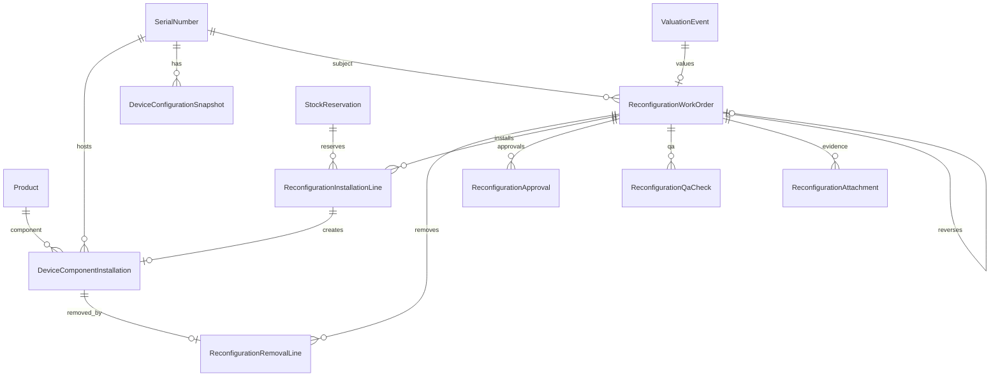
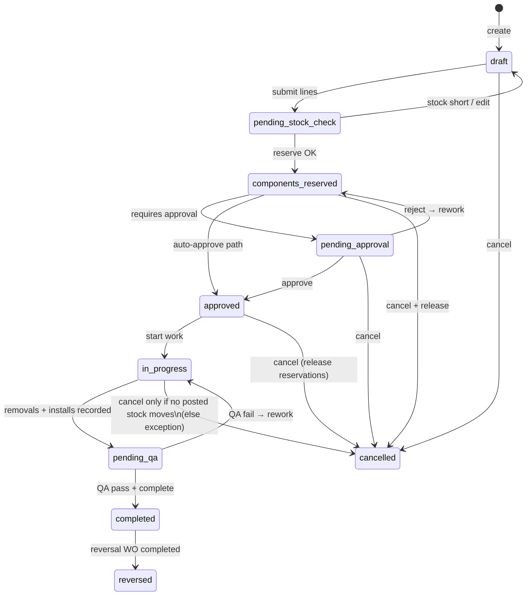

# Device Reconfiguration — ERP Audit & Solution Design

**Status:** Implementation in progress (Phases A–D landed) — see PR commits  
**Scope:** Serialized computers (laptops/desktops) — upgrade / downgrade / replacement / correction  
**ERP:** Deed ERP (Next.js 14 + Prisma + PostgreSQL + app_state blobs)  
**Date:** 2026-08-05  

---

## Table of contents

1. [ERP audit findings](#1-erp-audit-findings)
2. [Gap analysis](#2-gap-analysis)
3. [Recommended solution](#3-recommended-solution)
4. [Database design](#4-database-design)
5. [State machine](#5-state-machine)
6. [Inventory movement logic](#6-inventory-movement-logic)
7. [Costing and accounting logic](#7-costing-and-accounting-logic)
8. [UI and API design](#8-ui-and-api-design)
9. [Security and permission matrix](#9-security-and-permission-matrix)
10. [Test plan](#10-test-plan)
11. [Implementation sequence](#11-implementation-sequence)
12. [Files / modules that will change](#12-files--modules-that-will-change)

---

## 1. ERP audit findings

### 1.1 Architecture overview

Deed ERP is a dual-write system:

| Layer | Role | Examples |
|-------|------|----------|
| **App-state blobs** (`deed_*` via `/api/store`) | Operational source of truth for serials, bulk stock, stock moves, reservations, refurbishment, repairs | `deed_serials`, `deed_bulkStock`, `deed_stockMoves`, `deed_stockReservations`, `deed_refurbishmentJobs`, `deed_repairs_v2` |
| **Prisma / PostgreSQL** | Authoritative for product catalog, sale orders, quotes, invoices, CoA, journals, valuation events, reservation mirror, chatter | `Product`, `SerialNumber`, `SaleOrder`, `Invoice`, `ProductValuation`, `ValuationEvent`, `StockReservation` |

Any inventory-affecting feature must write both layers carefully (same pattern as SO → delivery → invoice and GRN valuation hooks).

### 1.2 Product model

**Prisma `Product`** (`prisma/schema.prisma`):

- Identity: `sku`, `barcode`, `name`, `modelNumber`, `productType` (`new` \| `refurbished`)
- Tracking: `trackingMethod` (`NONE` \| `QUANTITY` \| `BATCH` \| `SERIAL`), `trackStock`
- Commercial: `costPrice`, `sellingPrice`, `wholesalePrice`, `kilimallPrice`, `invoicePolicy`
- Costing: `costingMethod` default `"average"` (also accepts `fifo` \| `standard` in migration; **standard falls through to average**)
- Specs: `specs` Json default `{}` — currently used for commercial metadata (`productKind`, `unit`, `taxRatePct`), **not** structured RAM/SSD/CPU attributes
- Soft-hide: `isActive` (no `deletedAt`)

**Blob `Product`** (`lib/store.tsx`): parallel catalog with `category`, `salePrice`/`costPrice`, `trackingMethod`, `stockQty`, optional `parentId` for variants.

**Category defaults** (`lib/inventory-identifiers.ts`): Laptops / Desktops / Printers / Networking / Mobile Devices force **SERIAL**. **Parts & Components** default to **QUANTITY** (not serial-tracked).

### 1.3 Serialized-device model

**Prisma `SerialNumber`:**

- `serialNumber` (unique manufacturer serial), `inventoryBarcode`, `conditionGrade`, `status` (string, default `"in_stock"`)
- Links: `productId`, optional `purchaseItemId`, `soldViaInvoiceId`
- **No location column** — location lives only on the blob

**Blob `SerialNumber`:**

```
location: warehouse | shop | repair_unit | vendor | customer | employee
status: available | assigned | sold | under_repair | returned | written_off | refurbishment
specs?: string   // freetext e.g. "8GB RAM, 512GB SSD, Intel i5-12th Gen"
accessories?: string[]
```

**Critical finding:** Device configuration is free-text `specs` only. There is no installed-component graph, no slot model, no structured RAM/storage composition.

### 1.4 Component inventory

- Parts live as ordinary `Product` rows under category **Parts & Components** (`productKind: consumable`).
- Stock is **bulk** via `BulkStockLevel` `{ productId, location, qty }` — typically not serialized.
- Repair consumes parts via `RepairPart` / `lib/inventory/repair-parts-stock.ts`.
- Refurbishment uses job-local `RefurbPart` with statuses through `used` (“installed”) — **no persistent device ↔ component installation record**.

### 1.5 Stock ledger & locations

| Concept | Implementation |
|---------|----------------|
| Locations | Fixed enum `LocationId` — **no Warehouse/Location master tables** |
| Blob moves | `StockMove` types: `in` \| `out` \| `transfer` \| `adjustment` \| `return` |
| Server mutations | `lib/inventory/stock-transactions.ts` — receipt, delivery, POS, transfer, reserve |
| Prisma moves | `StockMovement` + `StockMovementType` enum — secondary; blob flows often skip it |
| Batches | `InventoryBatch` with varchar `warehouseId` (default `"main"`) for FIFO layers |
| Reservations | Blob `deed_stockReservations` + Prisma mirror; partial unique on active `serial_id` |

**Existing locations:** `warehouse` (Main), `shop` (With Issues), `repair_unit`, `vendor`, `customer`, `employee`.  
**No dedicated Quarantine / Pending Testing location** today. Closest: `shop` (“With Issues”) for damaged/needs-work units.

### 1.6 Cost and valuation

| Item | Finding |
|------|---------|
| System setting | `invCostingMethod` default `'average'` |
| Service | `lib/inventory/valuation-service.ts` + `valuation-math.ts` |
| Average | Weighted average on `ProductValuation`; receipt↑ / delivery↓ at average → COGS |
| FIFO | Receipt creates `InventoryBatch` (`RCV-{ref}`); delivery consumes oldest layers |
| Standard | Named but **not separately implemented** |
| Idempotency | `ValuationEvent.eventKey` unique (`VAL/RCV|DEL/...`) |
| Journals | STK / GRNI (`3201 - Accruals`) + inventory/COGS via account **codes**, never UUIDs |
| Per-serial cost | **Does not exist** — valuation is product-level |

Account resolution (`lib/product-accounts.ts`): **product override → category default → `COMPANY_ACCOUNT_FALLBACKS`** (e.g. inventory `1200`, COGS `6001`, adjustment `6200`, write-off `6205`).

### 1.7 Sales workflow

Canonical semantics: `lib/odoo-sales-flow.ts`.

| Document | States |
|----------|--------|
| Sale order | `quotation` → `quotation_sent` → `sale` \| `cancelled` |
| Delivery | `draft` \| `waiting` \| `ready` \| `done` \| `cancelled` |
| Invoice | `draft` \| `posted` \| `cancelled` (payment status derived) |

**Immutability** (`docs/FINANCE_SALES_SEALS.md`, `app/api/sale-orders/[id]/route.ts`):

- Confirmed SO commercial freeze (non-directors cannot change lines/prices)
- Completed deliveries / posted invoices / payments block cancel/reset
- `qtyDelivered` / `qtyInvoiced` monotonic

**Specs on documents:** Delivery Note PDF uses `serial.specs → product.description → accessories` (`lib/delivery-note-pdf.ts`). Quote/SO/Invoice lines carry `description` only — no structured config field.

### 1.8 Closest existing work-order patterns

| Pattern | SoT | Statuses | Fit for reconfig |
|---------|-----|----------|------------------|
| **RefurbishmentJob** | `deed_refurbishmentJobs` | queued → assigned → in_progress → ready → transferred \| written_off | Internal units with issues; parts optional; does **not** update device config |
| **RepairOrder** | `deed_repairs_v2` | full aftersales lifecycle + QA | Customer device service; parts consume; quote/invoice |
| **OutboundRelease** | Prisma | pending → … | Gate before customer collection |
| **Holdover** | `deed_holdovers` | active/returned/overdue | Temporary loan — not reconfig |

**No Device Reconfiguration entity, DocKind, permission, or UI exists** (confirmed by codebase search).

### 1.9 Permissions & roles

Roles (`lib/auth/types.ts`): `director`, `admin_officer`, `finance_officer`, `inventory_officer`, `kilimall_officer`, `sales_rep`, `technical_lead`, `technician`.

Permissions live in `lib/auth/authorization.ts` `roleMatrix`. New actions are added there + optionally mapped in `SENSITIVE_STORE_KEY_PERMISSIONS` for blob keys.

Modules: `MODULE_IDS` includes `inventory`, `repair`, `refurbishment`, `sales` — **no `reconfiguration` module yet**.

### 1.10 Document numbering

Commercial docs: `PREFIX/YYYY/NNNN` via `lib/doc-ref-counter.ts` (`DocKind`).  
Refurb: client `seq('REF')` → `REF/0001` (localStorage-style, not `doc_ref_counter`).  
**No RCF kind.**

### 1.11 Audit / chatter

- Prisma `AuditLog` + `lib/finance-audit.ts`
- Blob `deed_auditLogs` / immutable `deed_audit_timeline_v1`
- Chatter: `DocumentMessage` / `DocumentActivity` — allowed models include sale_order, repair, invoice, etc. Would need a new model string for reconfig.

### 1.12 Multi-tenancy

Single-company ERP (`CompanySetting`). No `companyId` / `branchId` FKs on inventory entities. Proposed tables should follow existing patterns (omit company/branch FKs unless introducing multi-company — **out of scope**).

---

## 2. Gap analysis

| Requirement | Current state | Gap severity |
|-------------|---------------|--------------|
| Structured device configuration | Free-text `SerialNumber.specs` | **Critical** |
| Installed-component relationship (device ↔ part ↔ slot) | None | **Critical** |
| Reconfiguration work order | None (refurb/repair are different) | **Critical** |
| Component removal → quarantine / pending testing | No location; parts not returned as stock units with QA gate | **Critical** |
| Reserve install components before work | Reservations exist for SO/repair, not reconfig | **High** |
| Compatibility rules (soldered RAM, slots, form factor) | None | **High** |
| Per-device cost recalculation | Product-level average/FIFO only | **High** |
| Selling-price methods + min-margin gate | Price lists exist; no reconfig price engine | **High** |
| Immutable config-at-sale snapshot | DN uses live `serial.specs` | **High** |
| Data sanitisation on removed storage | None | **High** |
| QA checklist for reconfig | Repair QC exists; not reusable as structured checklist for reconfig | **Medium** |
| Idempotent completion | Valuation events have pattern; reconfig does not | **High** |
| Reversal of completed WO | No pattern for reverse install/remove | **High** |
| Permissions for reconfig actions | Missing | **Medium** |
| Sales integration (quote → SO → post-delivery upgrade) | Commercial freeze blocks silent edits | **High** (by design — need controlled path) |
| Document number RCF-YYYY-NNNN | Missing DocKind | **Low** |
| Reports | None | **Medium** |
| Negative stock policy | Reservations + free-qty checks exist; no blanket negative-stock allow | **Reuse** |
| Component serial uniqueness across devices | No install graph to enforce | **Critical** once installs exist |

### Risks if we “just edit specs”

Editing `serial.specs` from `"16GB RAM, 512GB SSD"` → `"8GB RAM, 256GB SSD"` would:

1. Violate the non-negotiable rule (not inventory-affecting)
2. Lose removed component value (inventory value leak)
3. Not consume replacement stock
4. Leave sales documents inconsistent with physical unit
5. Provide no audit of who/when/why

---

## 3. Recommended solution

### 3.1 Architectural decision

**Introduce Device Reconfiguration as a first-class domain**, distinct from Refurbishment and Repair:

| Domain | When to use |
|--------|-------------|
| **Reconfiguration** | Change installed components on an in-stock (or controlled after-sales) serialized machine; inventory moves both ways; config + cost + price update |
| **Refurbishment** | Fix issues on “With Issues” units before sale (existing) |
| **Repair** | Customer device service / warranty (existing) |

**Persistence strategy (aligned with ERP):**

1. **Prisma = system of record** for work orders, installation records, configuration snapshots, QA, approvals, valuation events, and accounting journals (immutable completed records).
2. **App-state blobs = operational stock** — component qty/serial location moves, device serial status/location, reservations — via existing `stock-transactions` / reservation patterns.
3. Dual-write on completion: Prisma WO complete + blob stock mutations + valuation hook + serial `specs` regeneration from structured snapshot.

**Why Prisma-first for the WO:** Completed reconfigs must be immutable, concurrent-safe, and idempotent. Blob-only jobs (refurb) lack row locking and strong audit. Sale orders already proved the Prisma-primary pattern for commercial documents.

### 3.2 Product model extension

#### A. Base Device (existing + extensions)

Keep `SerialNumber` as the physical unit. Extend with:

- Structured **current configuration snapshot** (Prisma table + denormalized display string on blob `specs` for PDF compatibility)
- **Unit cost basis** for the serial (new field / linked valuation) — see costing section
- Sale status remains blob `status` + reservations

#### B. Components (existing products)

Continue using **Parts & Components** products. Guidance:

- Prefer QUANTITY tracking for commodity RAM/SSD unless business requires SERIAL
- Allow SERIAL tracking for high-value SSDs when needed
- Add structured attributes on component products via `Product.specs` extension (capacity GB, technology, formFactor, interface, ecc, speedMhz, removable: true/false)

#### C. Installed components (new)

`DeviceComponentInstallation` — one row per physical module currently (or historically) in a device, with slot, cost at install, source movement, removal link.

#### D. Configuration snapshot (new)

`DeviceConfigurationSnapshot` — structured JSON + generated display name. Current pointer on device; historical rows for every reconfig and every sale.

### 3.3 Document type

**Device Reconfiguration Work Order**  
Number format: **`RCF/YYYY/NNNN`** (matches existing `PREFIX/YYYY/NNNN` convention — prefer slash over `RCF-YYYY-000001` for consistency with SO/INV/DN).

Add `DocKind` `'reconfiguration'` → prefix `RCF` in `lib/doc-ref-counter.ts`.

### 3.4 High-level flow (acceptance test path)

```
Select serial (16GB/512GB)
  → Create RCF draft (downgrade for sale)
  → Propose target (8GB/256GB)
  → System diffs installed vs target → removal + install lines
  → Compatibility validation
  → Reserve 8GB RAM + 256GB SSD
  → Approval (if required)
  → Technician starts → remove → move to pending_testing
  → Install reserved components
  → QA checklist + evidence
  → Complete (idempotent):
       update installations + snapshot
       regenerate serial.specs
       recalculate device cost
       recommend/approve selling price
       post valuation journals
       release device available
  → Sales docs show new configuration
```

### 3.5 Entity relationship (logical)



---

## 4. Database design

### 4.1 Principles

- Follow Prisma naming (`camelCase` fields, `snake_case` `@map`)
- No invented `companyId`/`branchId` (ERP is single-company)
- Completed inventory/accounting rows: no soft-delete; status + immutability at service layer
- Optimistic concurrency: `version Int @default(1)` on mutable WO header
- Idempotency keys on completion / valuation (reuse `ValuationEvent.eventKey` pattern)

### 4.2 New enums

```prisma
enum ReconfigTransactionType {
  downgrade_for_sale
  upgrade_for_sale
  customer_paid_upgrade
  internal_refurbishment
  component_replacement
  warranty_replacement
  repair_related
  configuration_correction
  stock_standardisation
}

enum ReconfigStatus {
  draft
  pending_stock_check
  components_reserved
  pending_approval
  approved
  in_progress
  pending_qa
  completed
  cancelled
  reversed
}

enum ComponentSlotType {
  ram_slot
  m2_slot
  sata_bay
  battery
  keyboard
  wifi_card
  charger
  other
}

enum ComponentDisposition {
  quarantine
  pending_testing
  ready_for_sale
  repair_required
  parts_harvesting
  damaged
  write_off
  supplier_return
}

enum DataStatus {
  unknown
  none
  company
  client
  test
  awaiting_backup
  awaiting_sanitisation
  sanitised
  sanitisation_failed
  physical_destruction_required
}

enum InstallationStatus {
  installed
  removed
  quarantined
}
```

### 4.3 New models (proposed)

#### `DeviceConfigurationSnapshot`

| Field | Type | Notes |
|-------|------|-------|
| id | Uuid | PK |
| serialId | Uuid | FK → SerialNumber |
| processor, processorGeneration | String? | |
| totalRamGb | Int | |
| ramComposition | Json | e.g. `[{slot, capacityGb, technology, removable, productId, installationId}]` |
| primaryStorageGb, secondaryStorageGb | Int? | |
| storageType | String? | NVMe / SATA / … |
| screenSize, screenResolution | String? | |
| touchscreen | Boolean? | |
| graphics, operatingSystem, keyboardLayout, colour | String? | |
| includedAccessories | Json | |
| batteryCondition | String? | |
| grade | ConditionGrade? | |
| displayName | String | Generated: `Brand Model - CPU, XGB RAM, YGB SSD` |
| source | String | `intake` \| `reconfiguration` \| `sale` \| `migration` \| `manual` |
| sourceWorkOrderId | Uuid? | |
| isCurrent | Boolean | Exactly one current per serial (partial unique index) |
| createdAt, createdById | | |

#### `DeviceComponentInstallation`

| Field | Type | Notes |
|-------|------|-------|
| id | Uuid | PK |
| serialId | Uuid | Host device |
| componentProductId | Uuid | FK Product |
| componentSerialId | Uuid? | If component is SERIAL-tracked |
| componentSerialText | String? | Captured serial even for qty parts |
| category | String | ram / storage / battery / … |
| slotType | ComponentSlotType | |
| slotNumber | Int | 1-based within type |
| capacityGb | Int? | |
| technology | String? | DDR4, NVMe, … |
| quantity | Int | Usually 1 |
| removable | Boolean | false = soldered/onboard |
| status | InstallationStatus | |
| installedAt, installedById | | |
| removedAt, removedById | | |
| costAtInstallation | Decimal | Specific ID preferred |
| condition | ConditionGrade? | |
| sourceStockMoveRef | String? | Blob move / document ref |
| removalWorkOrderId | Uuid? | |
| installationWorkOrderId | Uuid? | |
| version | Int | |

**Constraints:**

- Unique active install per `(componentSerialId)` where status=`installed` and serial not null
- Unique active install per `(serialId, slotType, slotNumber)` where status=`installed`

#### `ReconfigurationWorkOrder`

| Field | Type | Notes |
|-------|------|-------|
| id | Uuid | |
| ref | String unique | `RCF/2026/0001` |
| serialId | Uuid | |
| manufacturerSerial | String | Denormalized; never changed |
| productId | Uuid | Catalog SKU at time of WO |
| transactionType | ReconfigTransactionType | |
| status | ReconfigStatus | |
| reason | String | |
| warehouseLocation | String | LocationId string |
| sourceLocation / destinationLocation | String | |
| currentSnapshotId / proposedSnapshotId | Uuid? | |
| linkedClientId / quoteId / saleOrderId / invoiceId / repairId | Uuid? | |
| requestedById, technicianId, approverId, qaOfficerId | Uuid? | |
| dateRequested, dateStarted, dateCompleted | DateTime? | |
| notes | String? | |
| costBefore, costRemoved, costInstalled, labourCost, otherCost, costAfter | Decimal | |
| sellingPriceBefore, recommendedSellingPrice, finalSellingPrice | Decimal? | |
| priceDifference, grossMargin, grossMarginPct | Decimal? | |
| priceMethod | String? | manual \| pricelist \| cost_plus \| fixed_diff \| customer \| promotion |
| valuationEventKey | String? unique | Idempotency |
| completionEventKey | String? unique | Idempotency |
| reversesWorkOrderId | Uuid? | Self-FK for reversals |
| compatibilityOverride | Boolean | |
| compatibilityOverrideReason | String? | |
| marginOverride | Boolean | |
| version | Int | Optimistic lock |
| createdAt/By, updatedAt/By | | |

#### `ReconfigurationRemovalLine`

| Field | Notes |
|-------|-------|
| workOrderId, installationId | Required link to installed component |
| componentProductId, serial text, slot | Denormalized for audit |
| qty, existingCost | |
| conditionAfterRemoval | |
| destinationLocation | Default `pending_testing` (new location — see §6) |
| disposition | ComponentDisposition |
| dataStatus | For storage only |
| qaStatus | pending / passed / failed |
| actualRemovedAt, removedById | |
| stockMoveRef | |

#### `ReconfigurationInstallationLine`

| Field | Notes |
|-------|-------|
| workOrderId, componentProductId | |
| requiredSpec Json | |
| selectedStockUnit / serial | |
| sourceLocation, qty, unitCost | |
| targetSlotType, targetSlotNumber | |
| reservationId / reservationStatus | |
| compatibilityResult | pass / fail / overridden |
| installedAt, installedById | |
| resultingInstallationId | FK after complete |
| stockMoveRef | |

#### Supporting tables

- `ReconfigurationApproval` — action (approve/reject), user, reason, margin/compat flags, timestamp
- `ReconfigurationQaCheck` — checklist item key, result, notes, evidence refs
- `ReconfigurationAttachment` — file path under `.uploads/reconfiguration/`, kind (bios/ssd_health/memtest/photo/wipe_cert)
- Extend `StockReservation.reservedFor` blob type + Prisma mirror to include `reconfiguration`
- Optional: `DeviceSerialCost` — running specific-identification cost for a serial (see §7)

### 4.4 Location extension

Add to blob `LocationId`:

| Id | Display name | Purpose |
|----|--------------|---------|
| `pending_testing` | Pending Testing | Default destination for removed components |
| `quarantine` | Quarantine | Failed QA / data-unknown storage |

Migration: update `LocationId` union + `LOCATIONS` map in `lib/store.tsx`; ensure stock calc / transfer UI include them.

### 4.5 Migration approach

1. Safe SQL migration under `database/migrations/YYYYMMDD_device_reconfiguration_safe.sql` (project convention)
2. Prisma schema models + `npx prisma generate`
3. Data migration script: parse existing `serial.specs` freestyle into best-effort snapshots + placeholder “unknown composition” installations where removable unknown
4. Import template CSV for technicians to capture real installed modules (slot, capacity, removable, serial)

### 4.6 StockMovementType extension

Add Prisma enum values (or use `referenceType = 'reconfiguration'` with existing `transfer` / `adjustment_in` / `adjustment_out`):

**Recommendation:** Prefer existing move types with `referenceType: 'reconfiguration'` + `referenceId: workOrderId` to avoid enum migration churn; document mapping clearly.

---

## 5. State machine



### Transition rules

| From | To | Guards |
|------|-----|--------|
| → components_reserved | Stock available; no conflicting reservation on selected units; device not reserved for another SO (or linked SO matches); no other active RCF on serial |
| → approved | Compatibility pass or override+reason; approval permission; margin OK or override |
| → in_progress | Device location accessible; technician assigned; reservations still valid |
| → pending_qa | All removal lines recorded; all install lines recorded; storage dataStatus set where applicable |
| → completed | All QA checks required=true passed; sign-offs; cost/price calculated; idempotent post |
| → cancelled | No completed valuation; release reservations; reverse any in-progress moves via compensating transfers |
| → reversed | Only from completed via new linked WO; original removed parts still available |

### Concurrency

- `SELECT … FOR UPDATE` on WO row + device serial row at start/complete
- `version` check on every mutating API
- Completion keyed by `completionEventKey = RCF-COMPLETE:{workOrderId}` — second call returns prior result

---

## 6. Inventory movement logic

### 6.1 Design rules

1. Every remove/install is a stock-affecting transaction (blob `StockMove` + optional Prisma `StockMovement`).
2. Never create a second device serial.
3. Never change `manufacturerSerial` / blob `serial`.
4. Removed components go to `pending_testing` (not sellable `warehouse`) until component QA.
5. Install components must be reserved first (`reservedFor: 'reconfiguration'`).
6. Do not allow negative component free qty unless system setting already permits (today: **do not allow**).
7. Same component serial cannot be installed in two devices (DB unique + service check).

### 6.2 Downgrade movements (acceptance test)

| Step | Movement |
|------|----------|
| Reserve | Reservation rows for 8GB RAM product qty + 256GB SSD product qty (or serials) |
| Remove 16GB RAM | Device context → transfer component stock **in** to `pending_testing` (create/increase bulk or serial at pending_testing); mark installation `removed` |
| Remove 512GB SSD | Same + require `dataStatus` |
| Install 8GB | Consume reserved stock from source location; create installation; fulfill reservation |
| Install 256GB | Same |
| Complete | Device stays same serial; location typically remains `warehouse` (or returns from `repair_unit` if staged there); status `available` if was held for reconfig |

**Value integrity:** Device cost decreases by removed component attributed cost; component inventory value increases at that cost at `pending_testing`; install consumes component inventory value at unit cost and adds to device cost.

### 6.3 Upgrade movements

- **Replacement:** same as downgrade (remove + install).
- **Additive:** install-only lines; no removal movements.

### 6.4 Device staging during work

Recommended: on Start Work, optionally transfer device serial `warehouse` → `repair_unit` with status held (new status `reconfiguration` or reuse `refurbishment` carefully). Prefer **new blob status `reconfiguration`** to avoid conflating with refurb jobs.

On Complete: `repair_unit` → `warehouse`, status `available` (unless linked to confirmed SO — then `assigned`).

### 6.5 Component QA gate

Removed parts at `pending_testing` / `quarantine` are **not** included in sellable free qty at `warehouse`. UI stock pickers for sales must exclude these locations (already location-scoped via `freeQtyAtLocation`).

Promotion to sellable: separate “Component QA Complete” action → transfer `pending_testing` → `warehouse` after sanitisation+QA (permission: inventory_officer / technical_lead).

### 6.6 Reservation lifecycle

Reuse `lib/inventory/reservation-mirror.ts` + blob reservations:

- Create on Reserve
- Fulfill on Install/Complete
- Cancel/release on Cancel or Reject

Extend `reservedFor` union: `'sales_order' | 'repair' | 'transfer' | 'employee' | 'reconfiguration'`.

---

## 7. Costing and accounting logic

### 7.1 Policy alignment

Use product `costingMethod` / system `invCostingMethod`:

| Method | Component consume cost | Device cost basis |
|--------|------------------------|-------------------|
| average | Current `ProductValuation.averageCost` | Maintain **serial-level cost basis** (specific ID for the machine) |
| fifo | `consumeBatchesFIFO` | Same |
| standard | Treat as average until standard is implemented | Same |

**Serialized devices:** store running **specific identification cost** on the serial (`DeviceSerialCost.currentCost` or columns on a cost ledger). Product-level average still updates for the *component* products.

### 7.2 Formulas

**Downgrade / replacement / upgrade:**

```
costAfter = costBefore - costRemoved + costInstalled + labourCost + otherCapitalisedCost
```

Guards:

- `costAfter >= 0` or require finance override (edge case 17)
- Do not double-count: when removing, attribute cost from installation `costAtInstallation` (not current selling price)

**Customer-paid upgrade charge (commercial, not inventory):**

```
upgradeCharge = installComponentsSellingPrice + labourCharge + otherServiceCharges
               - approvedTradeInValueOfRemoved
```

Trade-in value is separately approved — never auto = original selling price.

### 7.3 Journal design (perpetual inventory)

Resolve accounts via `resolveProductAccounts` — **never hardcode UUIDs**.

Suggested postings on Complete (one STK journal, idempotent event key `VAL/RCF/{ref}`):

| Leg | Debit | Credit | Purpose |
|-----|-------|--------|---------|
| 1 | Component inventory (`pending_testing` value) | Device inventory / serial cost clearing | Removed components return to stock at attributed cost |
| 2 | Device inventory | Component inventory (source) | Installed components leave stock onto device |
| 3 | Device inventory | Labour capitalisation / P&L (configurable) | If labour is capitalised |
| 4 | Expense | Accrual | If labour is expensed (customer-paid service) |

Exact account codes from category defaults (`Parts & Components` vs `Laptops`). Prefer adjustment/inventory accounts already in `COMPANY_ACCOUNT_FALLBACKS`.

Mirror pattern in `lib/inventory/valuation-service.ts` (`processStockReceipt` / `processStockDelivery`) — add `processReconfigurationValuation`.

### 7.4 Selling price

Methods (stored on WO):

1. Manual approved
2. Price-list (`PriceList` / `PriceListItem` existing)
3. Cost-plus markup (settings % by category)
4. Fixed upgrade/downgrade delta
5. Customer-specific
6. Promotion

Store before/after/recommended/final, margin, approver.  
If `grossMarginPct < minMarginPct` (company/category setting) → require `overrideMinimumMargin` permission.

After complete: update blob product sale context for the **serial** via regenerated `specs` + optional serial-level price override field (new optional `SerialNumber.salePriceOverride` on blob) — avoid silently changing catalog `Product.sellingPrice` for all units of that SKU.

**Important SKU note:** Today one Product SKU may represent many configs. Short-term: keep same `productId`, differentiate by serial snapshot/displayName. Medium-term (optional phase): variant products or config-driven pricing without SKU split.

### 7.5 Sales document snapshot

On delivery Done (and optionally invoice post), freeze `configurationAtSaleSnapshotId` on delivery line / customer asset. PDFs read snapshot `displayName` first, then fall back to `serial.specs`.

---

## 8. UI and API design

### 8.1 Module placement

| Surface | Route / component |
|---------|-------------------|
| Module page | `/reconfiguration` → `app/reconfiguration/page.tsx` |
| Module UI | `components/modules/Reconfiguration.tsx` + subfolder `components/reconfiguration/*` |
| Device tab | Extend Inventory serial drawer (`SerialManageDrawer`) with Configuration tab |
| Nav | `Sidebar.tsx` + `MODULE_IDS` += `reconfiguration` |
| UI kit | Follow `docs/ERP_UI_SPEC.md`, `TablePageLayout`, `TabBar`, `StatusBadge`, `Chatter` |

### 8.2 Screens

**A. Device Configuration Tab** (serial drawer / product serials)

- Current generated display name + structured attrs
- Installed components table (slot, product, serial, cost if permitted, removable)
- Config history, cost history, RCF history
- Sale status + active reservations

**B. New Reconfiguration Wizard** (multi-step)

1. Select device  
2. View current config  
3. Transaction type  
4. Target configuration  
5. Confirm removals (system-proposed, editable)  
6. Select installs + stock units  
7. Compatibility check  
8. Reserve stock  
9. Cost impact  
10. Selling-price impact  
11. Submit for approval / confirm  

**C. Technician Workbench**

- Work instructions, serial, remove/install lists, slots, data-handling banner  
- Start / record removal / record install / upload evidence  

**D. QA Screen**

- Checklist (see §8.4), before/after compare, attachments, tech + QA sign-off  

**E. Management Approval**

- Before/after, cost Δ, price Δ, margin, stock, reason, linked sale, Approve/Reject  

**F. Reports page** (tab or `/reconfiguration?tab=reports`)

### 8.3 API surface

Base: `/api/reconfiguration`

| Method | Path | Purpose |
|--------|------|---------|
| POST | `/` | Create WO |
| GET | `/` | List/filter |
| GET | `/[id]` | Retrieve |
| PATCH | `/[id]` | Edit draft (versioned) |
| GET | `/device/[serialId]/configuration` | Current config + installs |
| POST | `/[id]/calculate-diff` | Proposed vs current |
| POST | `/[id]/check-compatibility` | |
| POST | `/[id]/check-stock` | |
| POST | `/[id]/reserve` | |
| POST | `/[id]/release-reservation` | |
| POST | `/[id]/submit-approval` | |
| POST | `/[id]/approve` | |
| POST | `/[id]/reject` | |
| POST | `/[id]/start` | |
| POST | `/[id]/record-removal` | |
| POST | `/[id]/record-installation` | |
| POST | `/[id]/submit-qa` | |
| POST | `/[id]/complete` | **Idempotent** |
| POST | `/[id]/cancel` | |
| POST | `/[id]/reverse` | Creates linked reversal WO |
| POST | `/[id]/calculate-cost` | |
| POST | `/[id]/calculate-price` | |
| GET | `/[id]/audit` | |
| GET | `/[id]/documents` | PDF/print |

Conventions: `withApiErrorHandling`, `getRequiredSession`, `requirePermission`, Zod validation — same as sale-orders APIs.

### 8.4 QA checklist keys (seed)

`powers_on`, `bios_ram`, `bios_storage`, `ram_matches_target`, `storage_matches_target`, `memory_test`, `ssd_health`, `os_boots`, `drivers`, `battery`, `wifi`, `audio`, `camera`, `keyboard`, `ports`, `device_serial_confirmed`, `component_serials_confirmed`, `data_sanitisation`, `final_config_confirmed`, `cosmetic`, `technician_signoff`, `qa_officer_signoff`.

### 8.5 Wireframe notes (text)

Wizard: left progress stepper (desktop), single-column on mobile; primary CTA bottom-right; cost/price panel sticky summary — follow existing SO confirm / repair detail patterns, not a marketing landing layout.

---

## 9. Security and permission matrix

### 9.1 New permission actions

Add to `roleMatrix` in `lib/auth/authorization.ts`:

| Action | director | admin_officer | finance_officer | inventory_officer | sales_rep | technical_lead | technician | kilimall_officer |
|--------|:--:|:--:|:--:|:--:|:--:|:--:|:--:|:--:|
| viewReconfiguration | ✓ | ✓ | ✓ | ✓ | ✓ | ✓ | ✓ | ✓ |
| createReconfiguration | ✓ | ✓ | | | ✓ | ✓ | | ✓ |
| editReconfigurationDraft | ✓ | ✓ | | | ✓ | ✓ | | |
| reserveReconfigurationComponents | ✓ | | | ✓ | | ✓ | | |
| approveReconfiguration | ✓ | ✓ | ✓ | | | ✓ | | |
| performReconfigRemoval | ✓ | | | | | ✓ | ✓ | |
| performReconfigInstallation | ✓ | | | | | ✓ | ✓ | |
| completeReconfigQa | ✓ | | | | | ✓ | | |
| completeReconfiguration | ✓ | | | ✓ | | ✓ | | |
| overrideReconfigCompatibility | ✓ | | | | | ✓ | | |
| overrideReconfigStock | ✓ | | | ✓ | | | | |
| overrideMinimumMargin | ✓ | | ✓ | | | | | |
| reverseReconfiguration | ✓ | | ✓ | | | ✓ | | |
| viewReconfigComponentCosts | ✓ | ✓ | ✓ | ✓ | | ✓ | | |
| viewReconfigSellingPrices | ✓ | ✓ | ✓ | | ✓ | ✓ | | ✓ |
| viewReconfigAccounting | ✓ | | ✓ | | | | | |

Sensitive store key (if any blob cache): `deed_reconfigurationJobs` → `createReconfiguration` / write gated per action in API (prefer API-only writes, not wholesale client merge).

### 9.2 Module grant

Add `reconfiguration` to `MODULE_IDS` and default modules for: director, admin_officer, inventory_officer, sales_rep, technical_lead, technician, finance_officer (read), kilimall_officer (create/view).

---

## 10. Test plan

### 10.1 Acceptance tests (mandatory)

**AT-1 Downgrade 16/512 → 8/256** — exact steps in user requirements §21.  
**AT-2 Upgrade 8/256 → 16/512** — reverse path.  
**AT-3 Idempotent complete** — double POST `/complete` → one set of moves/journals.  
**AT-4 Reversal** — restores prior snapshot only via reversal WO.

### 10.2 Edge-case tests (map to requirements §18)

| # | Test | Layer |
|---|------|-------|
| 1 | Device reserved for another customer | API validation |
| 2 | Device delivered / sold | Block unless after-sales type |
| 3 | Active RCF already open | Unique active WO per serial |
| 4 | Replacement OOS | Reserve fails |
| 5 | Component reserved elsewhere | Reserve fails |
| 6 | Incompatible part | Compatibility fail |
| 7 | Soldered RAM downgrade | Block |
| 8 | SSD contains data | Require dataStatus + sanitisation path |
| 9 | Removed component fails QA | Stays quarantine; not sellable |
| 10 | Tech installs different from reserved | Block or require override |
| 11 | Multi RAM modules | Diff engine chooses correct module(s) |
| 12 | Multi storage drives | Slot-aware |
| 13 | Duplicate component serial entry | Validation |
| 14 | Serial already installed elsewhere | Unique constraint |
| 15 | Complete twice | Idempotent |
| 16 | Cancel after stock moved | Compensating moves or block |
| 17 | Cost negative | Block / finance override |
| 18 | Below min margin | Approval required |
| 19 | Component in other warehouse/location | Transfer required first |
| 20 | Warehouse transfer required | Wizard prompts transfer |
| 21 | Sold while RCF in progress | Block SO assign / delivery |
| 22 | Approved but stock later unavailable | Re-check on start |
| 23 | Damaged during install | Disposition damaged + exception |
| 24 | QA config mismatch | Cannot complete |
| 25 | Reverse completed | Reversal WO |
| 26 | Concurrent editors | version conflict 409 |
| 27 | External charger exchange | slotType charger |
| 28 | Post-purchase upgrade | customer_paid_upgrade + service invoice |
| 29 | Additive RAM | No removal lines |
| 30 | Onboard capacity cannot downgrade | Block |

### 10.3 Test types

- Unit: diff engine, compatibility, cost/price math, displayName generator  
- Integration: API + Prisma + reservation mirror  
- DB transaction / concurrency: parallel complete  
- Permission matrix tests  
- Inventory reconciliation: Σ component value + device costs  
- Valuation journal idempotency  
- Reversal  
- E2E Playwright: wizard → complete → DN shows new specs  

---

## 11. Implementation sequence

### Phase A — Foundations (reviewable commit 1)

1. LocationIds `pending_testing`, `quarantine`
2. Prisma models + safe migration
3. DocKind `reconfiguration` / RCF numbering
4. Permissions + module id (no UI yet)
5. Types + Zod schemas

### Phase B — Domain services (commit 2)

1. Configuration snapshot + displayName generator  
2. Diff engine (current → target)  
3. Compatibility rules engine  
4. Cost & price calculators  
5. Reservation integration  

### Phase C — Work order API (commit 3)

1. CRUD + state transitions  
2. Reserve / approve / start / record remove-install / QA / complete / cancel / reverse  
3. Valuation hook `processReconfigurationValuation`  
4. Audit + chatter model  

### Phase D — UI (commit 4)

1. Module list + wizard  
2. Technician workbench + QA + approval  
3. Serial Configuration tab  
4. Sidebar / search  

### Phase E — Sales integration (commit 5) — **landed (partial)**

**Foolproof rule:** SO lines never mutate `serial.specs` or component stock. Only `completeWorkOrder` does.

1. ~~Create RCF from quote/SO/device~~ — `lib/reconfiguration/sales-bridge.ts` + `POST /api/sale-orders/:id/reconfiguration`  
   - Detect RAM/SSD effect products (`specs.reconfiguration` or name/capacity fallbacks)  
   - Require a serialized host device line  
   - Create/update linked draft RCF with computed target  
2. ~~Gate delivery until RCF complete~~ — `app/api/deliveries/[id]/validate`  
3. ~~Refresh SO host line description after complete~~ — from proposed snapshot displayName  
4. Config-at-sale snapshot id on delivery note — still open  
5. Post-sale upgrade path (service SO + RCF for sold devices) — still open  

### Phase F — QA component return + reports (commit 6)

1. Component QA → sellable transfer  
2. Data sanitisation workflow  
3. Reports + export  

### Phase G — Migration & rollout (commit 7)

1. Specs parser / import template  
2. Reconciliation report  
3. UAT checklist, user/tech/inventory guides  
4. Rollback plan (feature flag `reconfigurationEnabled`)  

**Feature flag:** `deed_systemSettings.reconfigurationEnabled` default false until UAT pass.

---

## 12. Files / modules that will change

### New files (planned)

```
docs/DEVICE_RECONFIGURATION_DESIGN.md          # this document
database/migrations/YYYYMMDD_device_reconfiguration_safe.sql
prisma/schema.prisma                           # models/enums (edit)
lib/reconfiguration/types.ts
lib/reconfiguration/schemas.ts
lib/reconfiguration/diff-engine.ts
lib/reconfiguration/compatibility.ts
lib/reconfiguration/costing.ts
lib/reconfiguration/pricing.ts
lib/reconfiguration/display-name.ts
lib/reconfiguration/state-machine.ts
lib/reconfiguration/service.ts                 # orchestration
lib/reconfiguration/completion.ts              # idempotent complete
lib/reconfiguration/reversal.ts
lib/inventory/reconfiguration-stock.ts         # blob stock moves
app/api/reconfiguration/route.ts
app/api/reconfiguration/[id]/route.ts
app/api/reconfiguration/[id]/*/route.ts        # action routes
app/api/reconfiguration/device/[serialId]/configuration/route.ts
app/reconfiguration/page.tsx
components/modules/Reconfiguration.tsx
components/reconfiguration/Wizard.tsx
components/reconfiguration/TechnicianWorkbench.tsx
components/reconfiguration/QaScreen.tsx
components/reconfiguration/ApprovalScreen.tsx
components/reconfiguration/DeviceConfigTab.tsx
components/reconfiguration/Reports.tsx
__tests__/reconfiguration-*.test.ts
scripts/migrate-device-configurations.mjs
docs/guides/reconfiguration-user-guide.md
docs/guides/reconfiguration-technician-guide.md
docs/guides/reconfiguration-inventory-guide.md
```

### Existing files to modify

```
prisma/schema.prisma
lib/doc-ref-counter.ts                         # DocKind + RCF
lib/auth/types.ts                              # MODULE_IDS
lib/auth/authorization.ts                      # roleMatrix + sensitive keys
lib/auth/access.ts                             # helpers if needed
lib/store.tsx                                  # LocationId, serial status, types
lib/sales-flow-types.ts                        # reservedFor
lib/inventory/reservation-mirror.ts
lib/inventory/valuation-service.ts             # processReconfigurationValuation
lib/inventory/valuation-hooks.ts
lib/inventory/permissions.ts                   # client helpers
lib/product-accounts.ts                        # only if new account roles needed
lib/delivery-note-pdf.ts                       # prefer snapshot displayName
lib/commercial-pdf.ts / deed-document-pdf.ts
lib/odoo-sales-flow.ts                         # guards while RCF active
app/api/sale-orders/[id]/route.ts              # block assign if active RCF
components/layout/Sidebar.tsx
components/layout/GlobalSearch.tsx
components/inventory/SerialManageDrawer.tsx
components/modules/Inventory.tsx               # entry points
components/erp/Chatter.tsx                     # allowed model
middleware.ts                                  # only if legacy redirect
```

### Explicitly out of scope for v1 (document as follow-ups)

- Full Warehouse/Location master data redesign  
- Splitting catalog SKUs per configuration automatically  
- Implementing true standard-cost variance accounting  
- Multi-company / branch FKs  
- Customer portal self-serve reconfig requests (API stub only)  

---

## Appendix A — Reuse map

| Need | Reuse |
|------|-------|
| Stock transfer / consume | `lib/inventory/stock-transactions.ts`, `repair-parts-stock.ts` patterns |
| Reservations | `reservation-mirror.ts`, `StockReservation` |
| Valuation + journals | `valuation-service.ts`, `ValuationEvent.eventKey` |
| Account codes | `product-accounts.ts` → `resolveAccountId` |
| Doc numbers | `doc-ref-counter.ts` |
| Permissions | `authorization.ts` roleMatrix |
| QA evidence upload | repair-qc-reports upload pattern |
| UI chrome | ERP_UI_SPEC, TablePageLayout, StatusBadge |
| Work order UX inspiration | Refurbishment.tsx, Repair detail |
| Sales freeze | Keep — integrate via linked RCF, not silent SO edits |
| Audit | finance-audit + chatter |

## Appendix B — Open decisions for approver

1. **Number format:** Confirm `RCF/YYYY/NNNN` (recommended) vs `RCF-YYYY-000001`.  
2. **Device status during work:** New `reconfiguration` status vs reuse `refurbishment`.  
3. **Labour default:** Capitalise into device cost (internal) vs expense (customer-paid) — configurable per transaction type.  
4. **SKU strategy:** Keep single SKU + serial snapshot (recommended v1) vs auto-variant products.  
5. **Component serialisation:** Keep Parts as QUANTITY by default; optional SERIAL for SSDs.  
6. **Feature flag default:** Off until AT-1/AT-2 pass in staging.

---

## Approval

| Role | Name | Date | Decision |
|------|------|------|----------|
| Product / Business owner | | | ☐ Approve ☐ Changes requested |
| Inventory lead | | | ☐ Approve ☐ Changes requested |
| Finance | | | ☐ Approve ☐ Changes requested |
| Engineering | | | ☐ Approve ☐ Changes requested |

**Upon approval:** implement Phase A → G in small reviewable commits as specified in §11, with per-commit change notes covering: what/why/files/DB/API/UI/security/tests/risks.
