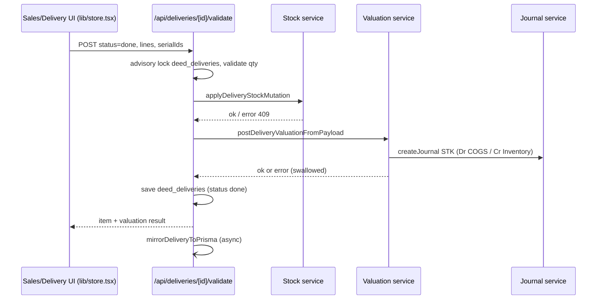
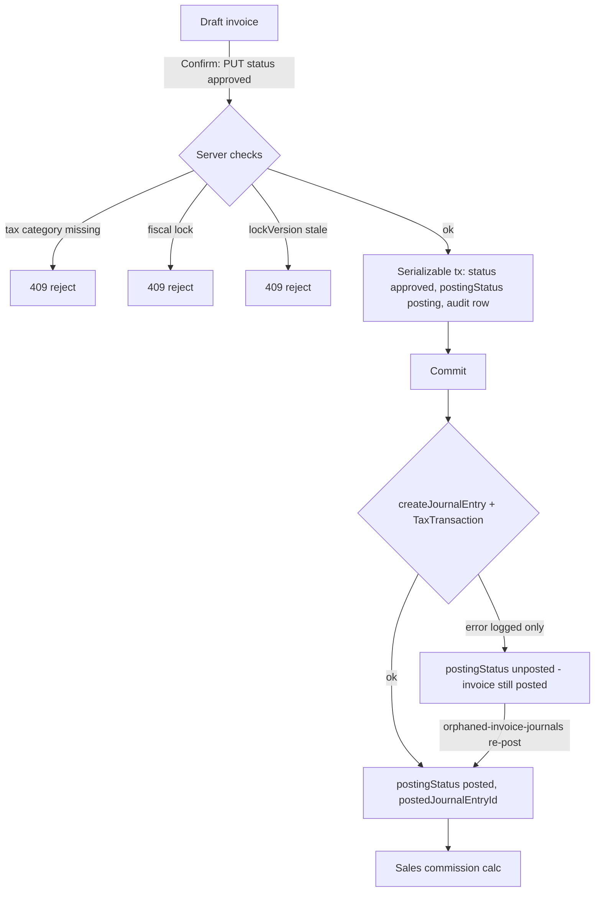
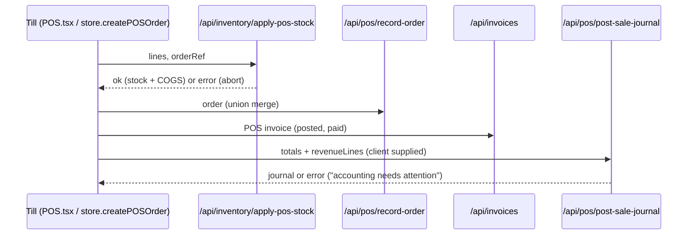
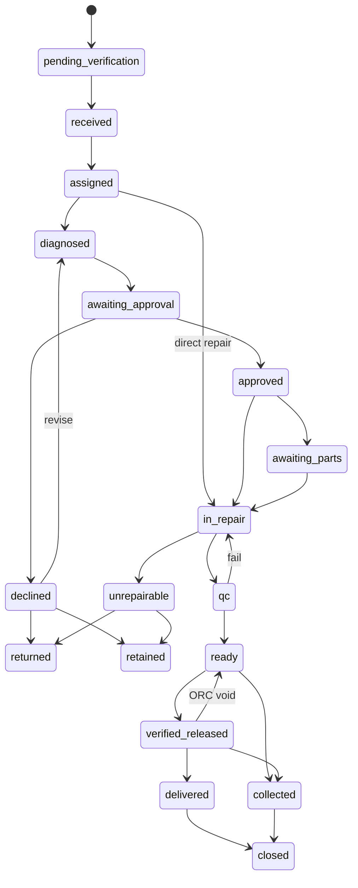
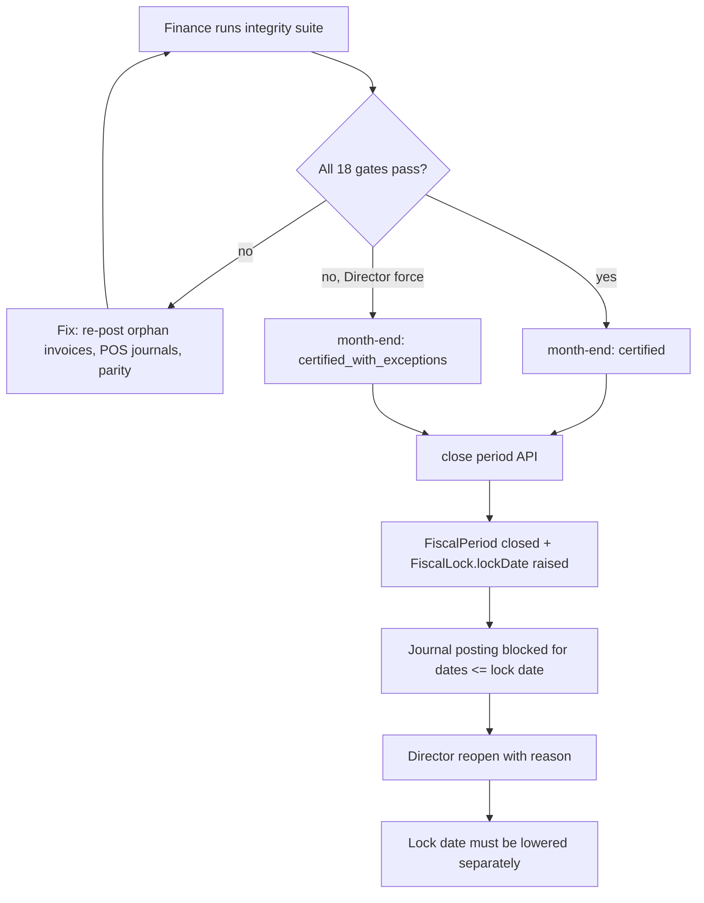

# Deed ERP — End-to-End Business Flows

| | |
|---|---|
| **Document** | ERP Business Flows (supporting document to [`DEED_ERP_SYSTEM_DOCUMENTATION.md`](./DEED_ERP_SYSTEM_DOCUMENTATION.md)) |
| **Repository / branch / commit reviewed** | `brianogango/deed-erp` · `claude/focused-einstein-lqo6u8` · `1713b7bf39c24703b8f5ab986104868d9de89b87` |
| **Review date** | 2026-10-01 |
| **Flows documented** | 21 (the 21 mandated processes) |

> **Reading guide.** Each flow follows one template: *Actors · Trigger · Preconditions · Steps · Validation · Status changes · Database writes · Accounting impact · Audit events · Failure paths · Recovery/reversal · Final output*. Statements are limited to what was found by reading the cited code. Where a step was **not traced to its implementation**, the flow says so. "Client" means code running in the browser inside `lib/store.tsx`; "server" means a route handler or service. Account codes are the live codes in `lib/accounting/coa-roles.ts`: 1800 AR, 3000 AP, 3301 Output VAT, 1150 Input VAT, 1200 Inventory, 3201 GRNI/Accruals, 6001 COGS, 5000 Sales Revenue, 3100 Customer Deposits, 3313 Customer Credits, 1933 Outstanding Receipts, 3202 Outstanding Payments, 2201 ABSA bank, 2202 Equity bank, 2211 Petty cash / mobile money, 3312 Employee Reimbursements Payable, 6703 Bank Charges, 5201 Interest income.

Index: [1 Lead→Quotation](#flow-1) · [2 Quotation→SO](#flow-2) · [3 SO→Delivery](#flow-3) · [4 SO/Delivery→Invoice](#flow-4) · [5 Invoice→Payment](#flow-5) · [6 RFQ→PO](#flow-6) · [7 PO→Receipt](#flow-7) · [8 Vendor bill→Payment](#flow-8) · [9 Expense→GL](#flow-9) · [10 POS](#flow-10) · [11 Repair booking→Diagnosis](#flow-11) · [12 Diagnosis→Quote](#flow-12) · [13 Accepted quote→Parts→Repair](#flow-13) · [14 Declined quote](#flow-14) · [15 Completion→QC→Delivery](#flow-15) · [16 Warranty](#flow-16) · [17 Warehouse transfer](#flow-17) · [18 Computer Aid custody](#flow-18) · [19 Bank reconciliation](#flow-19) · [20 Month-end close](#flow-20) · [21 Documents & printing](#flow-21)

---

## Flow 1 — Lead or contact to quotation

| | |
|---|---|
| **Actors** | Sales rep, Admin Officer, Finance Officer, Director; automated sales-inbox pipeline |
| **Trigger** | (a) Inbound e-mail to the sales mailbox read over IMAP (`POST/GET /api/cron/sales-inbox-leads`, documented as a 5-minute server cron in `docs/SALES_INBOUND_LEAD_AUTOMATION.md` — the cron entry itself is outside the repository); (b) manual lead (`POST /api/leads`); (c) direct contact creation (`POST /api/contacts`) |
| **Preconditions** | For the pipeline: `SALES_IMAP_*` and (optionally) Gemini settings configured; session with CRM/Sales access for manual paths |
| **Steps** | 1. `SalesInboundEmail` row stored (idempotent on message id). 2. Relevance filter (`lib/crm/sales-inbox-relevance.ts`, optional Gemini) → `Lead` created, assignee by round-robin (`deed_salesLeadRoundRobin`, `lead-assignees.ts`). 3. Staff review at `/api/crm/email-review`. 4. Lead converted (`POST /api/leads/[id]` with `{action:'convert', createContact?, expectedValue?}`; helpers in `lib/crm/lead-convert.ts`; `409` if already converted): resolves or creates `Client` + `ContactPerson` (duplicate policy `lib/crm/duplicate-contact-policy.ts`) and an `Opportunity`. 5. Opportunity moves through stages `prospecting → qualification → proposal → negotiation → closed_won / closed_lost / on_hold` (`/api/opportunities/[id]`). 6. A quotation is started from the opportunity (`salesQuoteHref`): either a **CRM `Quote`** (`POST /api/quotes`, number from `getNextDocNumber('quote')`, statuses `draft, sent, viewed, accepted, rejected, expired, revised`) or a **quotation-state `SaleOrder`** (`createSaleOrder`, `allocateDocRef('QUO')`) |
| **Validation** | Duplicate-contact checks; Prisma-side string clipping (`clip`), phone/e-mail normalisation; REST routes restrict writers (leads: DIR/ADM/SALES/FIN; opportunities: DIR/ADM/SALES; sales reps see only own opportunities) |
| **Status changes** | Lead → converted; opportunity stage; quote `draft → sent → viewed → accepted/rejected/expired/revised` |
| **Database writes** | `sales_inbound_emails`, `leads`, `clients`, `contact_persons`, `opportunities`, `opportunity_activities`, `quotes`, `quote_items`, `doc_ref_counter` |
| **Accounting impact** | None |
| **Audit events** | Store audit timeline for legacy keys; no financial audit (non-financial). Pipeline actions use `lead` activity rows |
| **Failure paths** | IMAP/Gemini failure → cron returns error, advisory lock prevents overlap (`lib/crm/inbox/advisory-lock.ts`); duplicate contact → merge prompt (DIR-only merge `POST /api/contacts/merge`) |
| **Recovery / reversal** | Opportunity `closed_lost`/`on_hold`; quote `revised` creates a new version; contacts archive/restore |
| **Final output** | A quotation (CRM `Quote` or `SaleOrder` in `quotation`) and, when sent, a PDF/e-mail (`/api/quotes/send`, `/api/integrations/send-quote`) and a public link `/portal/quotes/[id]` (token via `lib/quote-token.ts`) |

## Flow 2 — Quotation to sales order

| | |
|---|---|
| **Actors** | Sales rep, Admin Officer, Director (confirm); Finance/Technical Lead only for repair-linked quotes (`REPAIR_SALE_CONFIRM_ROLES`); customer (portal accept) |
| **Trigger** | Staff clicks Confirm (`confirmSO`) or the customer accepts via `/portal/quotes/[id]` (`POST /api/portal/quotes/[id]/accept`); a CRM quote is first converted by `convertQuoteToSaleOrder` |
| **Preconditions** | SO status `quotation` or `quotation_sent`; at least one product line; `validUntil` not expired (non-repair); customer credit check passes unless DIR/FIN override |
| **Steps** | 1. Client flushes unsaved draft edits (`updateSaleOrder` persist). 2. `convertQuoteToSaleOrder` (CRM quote → SO) only accepts quote status `accepted/sent/viewed` and returns an existing SO if one already references the quote. 3. `confirmSO`: line selection, credit status (`getCustomerCreditStatus`), margin/floor/discount/backorder approval triggers (`computeSaleOrderApprovalTriggers`, `requestApproval`), then allocates the SO number (`allocateDocRef('SO')` → `POST /api/doc-numbers`). 4. `PATCH /api/sale-orders/[id]` with `status:'sale'`: server runs `saleTransitionError`, `checkFiscalLock(confirmDate)`, sets `confirmedAt`, and calls `reserveStockForSaleOrder` (unless `reserveStock:false`; repair-linked orders reserve only on request). 5. Client allocates a DN number and `POST /api/deliveries` to create a *waiting* delivery |
| **Validation** | `SALE_CONFIRM_ROLES` = DIR, SALES, ADM; transition table in `lib/odoo-sales-flow.ts` (`quotation_sent` only from `quotation`; `sale` only from a quotation stage; cancel/reset of a confirmed SO only DIR/FIN/ADM); optimistic lock (`lockVersion`); stock reservation failure aborts with 4xx |
| **Status changes** | `quotation → quotation_sent → sale`; `cancelled` from any (rules above). Legacy values (`confirmed`, `delivered`, `invoiced`, `reserved`, `paid`) normalise to `sale`; `pending_approval`/`approved`/`draft` normalise to `quotation` (`normalizeSaleStatus`) |
| **Database writes** | `sale_orders` (+`sale_order_items`), `stock_reservations`, `doc_ref_counter`, `deliveries` blob + `delivery_notes` mirror, `AuditLog`/`FinancialAuditEvent` (`writeFinancialAudit`) |
| **Accounting impact** | None at confirmation (no deferred-revenue posting) |
| **Audit events** | `writeFinancialAudit` rows on confirm/cancel/reset in `app/api/sale-orders/[id]/route.ts`; client `addAuditLog` |
| **Failure paths** | Credit failure, expired quote, approval required (`approvalStatus:'pending'` set and the user is told), reservation failure, fiscal lock `409`, stale `lockVersion` `409` |
| **Recovery / reversal** | `resetSOToDraft` / `cancelSO` (DIR/FIN/ADM; blocked by `saleOrderCancelBlockers`: completed deliveries, posted invoices, payments); `createNewSOVersion` (`/api/sale-orders/[id]/new-version`) for quotation versioning; reservations released (`stockReservation.updateMany`) |
| **Final output** | Sales order `SO/YYYY/NNNN` with reserved stock and a waiting delivery note |

## Flow 3 — Sales order to delivery

| | |
|---|---|
| **Actors** | Inventory Officer, Admin Officer, Sales rep, Director (create/validate); Director/INV/ADM (reverse) |
| **Trigger** | Delivery created at confirmation, or `createDeliveryFromSO`/`prepareDelivery`; validation by `validateDelivery`/`confirmDeliveryWithStockDeduction` |
| **Preconditions** | Confirmed SO; delivery in `draft/waiting/ready`; serial-tracked lines have serials assigned and available |
| **Steps** | 1. `prepareDelivery` assigns serials/quantities (`lib/delivery-prepare.ts`). 2. `POST /api/deliveries/[id]/validate` under advisory lock `deed_deliveries`: heal `qtyDone` from serials, `deliveryFulfillmentWriteError`, require delivered qty > 0. 3. `applyDeliveryStockMutation` (serial status/location → `sold`/`customer`, stock moves). 4. `postDeliveryValuationFromPayload` → costing (FIFO or standard) and COGS journal. 5. Delivery saved `done` in the blob; `mirrorDeliveryToPrisma` (fire-and-forget). 6. SO line `qtyDelivered` updated (`POST /api/sale-orders/[id]/deliver-lines`). Partial delivery splits a back-order (`splitDeliveryForBackorder`) |
| **Validation** | `deliveryFulfillmentWriteError`; "hollow done" detection (`isHollowDoneDelivery`, script `scripts/detect-hollow-done-deliveries.mjs`) |
| **Status changes** | Delivery `draft → waiting → ready → done`, `cancelled`; delivery notes `DN/YYYY/NNNN` (DB-unique `dn_number`) |
| **Database writes** | blob `deed_deliveries`, `deed_serials`, `deed_stockMoves`; Prisma `delivery_notes`, `delivery_note_items`, `stock_movements`, `inventory_batches`, `product_valuations`, `valuation_events`, `inventory_ledger_entries`, `journal_entries` (STK) |
| **Accounting impact** | **Dr 6001 COGS (or product COGS account) / Cr 1200 Inventory** at valuation cost, journal `STK`, ref from `stockValuationJournalRef('delivery', …)`; idempotent via `valuation_events` key |
| **Audit events** | Store audit timeline; valuation events/ledger entries |
| **Failure paths** | **Stock is deducted before valuation; a valuation failure is swallowed and the delivery is still saved `done`** (COGS missing) — KI-04. Route has no role check beyond a session |
| **Recovery / reversal** | `POST /api/deliveries/[id]/reverse` (DIR, INV, ADM; optional `reason`): for a `done` delivery returns the quantities, frees the serials, restores the reservation, **reverses the COGS journal** (`reverseJournalEntry`) and leaves the delivery `cancelled` with an audit trail; an open delivery is simply cancelled and its reservation released (header comment of `app/api/deliveries/[id]/reverse/route.ts`). POS has its own `reversePosSaleValuation` |
| **Final output** | Validated delivery note (PDF via `lib/delivery-note-pdf.ts`), serials marked sold, SO fulfilment status updated |

## Flow 4 — Sales order or delivery to invoice

| | |
|---|---|
| **Actors** | Finance Officer, Admin Officer, Director (server gate `createCustomerInvoiceFromSO`); Technical Lead for repair billing |
| **Trigger** | "Create invoice" on the SO (`createInvoiceFromSO` → `POST /api/sale-orders/[id]/create-invoice`) or from a delivery (`createInvoiceFromDelivery`) |
| **Preconditions** | Confirmed SO; invoiceable quantity > 0 by line policy: stockable hardware is **delivery-first** (needs a validated delivery), services bill on ordered quantity (`resolveInvoicePolicy`) |
| **Steps** | 1. Server computes invoiceable qty per line (`invoiceableQty`), supports down-payment/final modes (`lib/sales/down-payment.ts`). 2. Creates a **draft** `Invoice` (`INV/YYYY/NNNN` allocated by `getNextDocNumber('invoice')`) with items and tax category per line. 3. User reviews and **confirms** (`PUT /api/invoices/[id]` status → `approved`): tax category mandatory per line, number clash check, optimistic-lock claim in a Serializable transaction (`postingStatus='posting'`), `post_invoice` audit row. 4. After commit: journal `JRN/<invoiceNo>` (Dr 1800 AR; Cr revenue per line account (product → category → 5000; repair service lines 5121); Cr 3301 Output VAT), `TaxTransaction` rows (`direction='output'`, `transmissionStatus='pending'` for eTIMS), `postingStatus='posted'`, `postedJournalEntryId`; sales commission calculation (`postSalesCommissionForInvoice`) |
| **Validation** | See §3.3 of the API reference; positive amount; tax category; fiscal lock on invoice date; for vendor bills 3-way match |
| **Status changes** | Invoice `draft → approved` (document state "posted"; payment progress derived from `amountPaid`); `pending_approval`/`rejected` approval states; `cancelled`/`voided` terminal. DB `DocumentStatus` enum also lists `invoiced, dispatched, delivered, paid, partially_paid` but the API maps `paid/partially_paid/posted/open/overdue/partial` onto `approved` (`INVOICE_STATUS_MAP`) |
| **Database writes** | `invoices`, `invoice_items`, `tax_transactions`, `journal_entries` + lines, `audit_logs`, `financial_audit_events`, `sales_commissions`; blob `deed_invoices` refreshed (`refreshInvoicesBlob`) |
| **Accounting impact** | Dr 1800 AR = total; Cr revenue = Σ line subtotals; Cr 3301 = tax. Journal code `SAL` |
| **Audit events** | `post_invoice`, `update_invoice`, `void_invoice` (`FinancialAuditEvent` + `AuditLog`) |
| **Failure paths** | **Journal creation failure does not roll back the posting**: the invoice stays posted with `postingStatus='unposted'` (revenue/VAT missing until re-posted) — KI-02. Detected by integrity gate `invoices_without_journal` and re-posted by `POST /api/accounting/orphaned-invoice-journals` (internal secret or session). Unknown/inactive account → 409 from journal-service |
| **Recovery / reversal** | Reset to draft (`resetToDraft:true`, only when `amountPaid=0`) or cancel/void → `reverseInvoiceJournalInPrisma` (`REV/<ref>`, original `isReversed=true`); paid invoice cancel → credit note journal (`postCustomerCreditJournalToPrisma`: Dr revenue, Dr VAT, Cr 3313 Customer Credits) and `CreditNote`; replacement document issued (posted invoices are immutable, `409` on edits) |
| **Final output** | Posted invoice with official number, PDF (`components/modules/invoice-pdf.ts` / `deed-document-pdf.ts`), e-mail send (`POST /api/invoices/[id]/send`) |

## Flow 5 — Invoice to payment and allocation

| | |
|---|---|
| **Actors** | Finance Officer, Admin Officer (SoD-limited), Director; customer via M-Pesa STK or portal payment proof |
| **Trigger** | `registerPayment(invoiceId, amount, method, bankAccountId, reference, date)` (single or bulk pay) → `POST /api/invoices/[id]/payments`; or `POST /api/payments` with allocations/outstanding; STK push `POST /api/mpesa/stk-push` |
| **Preconditions** | Invoice posted, not `paymentBlocked`, balance > 0; fiscal period open for `paidAt`; bank account (if supplied) active and mapped to an active GL account |
| **Steps** | See API reference §3.4–3.5. Client first applies an optimistic local update and builds a client journal; the server call is authoritative and the client **rolls back** local state if the API fails. The server writes `Payment`, `PaymentAllocation`, journal and audit in one transaction (`recordPaymentWithAllocations`), idempotent on `idempotencyKey` (= client payment id) |
| **Validation** | Amount > 0 and capped to balance; SoD for ADM; payment method set `cash, mpesa, bank_transfer, card, credit, cheque` (`PaymentMethod` enum) plus `customer_credit`/`deposit` application methods (`posting-service`); allocations Σ ≤ amount; ≤ 500 allocations |
| **Status changes** | `Invoice.amountPaid` updated; payment status derived (`Not Paid / In Payment / Partially Paid / Paid`, `invoicePaymentStatus`); `Payment.postingStatus`, `reconciliationStatus` |
| **Database writes** | `payments`, `payment_allocations`, `invoices.amount_paid`, `journal_entries`, `audit_logs`, `financial_audit_events`; `mpesa_stk_requests` for STK |
| **Accounting impact** | Dr cash/bank (`2211` petty cash/mobile money for cash & M-Pesa, `2201` ABSA for bank transfer, or the GL account mapped to the chosen `BankAccount`) / Cr 1800 AR. Method `customer_credit`: Dr 3313 / Cr 1800. Method `deposit`: Dr 3100 / Cr 1800. Outstanding (unallocated) receipts: Cr 1933 until `POST /api/payments/[id]/allocations` clears them (Dr 1933 / Cr 1800). Journal codes `CSH` (cash/M-Pesa), `BNK`, `SAL`/`MISC` for credit applications |
| **Audit events** | `record_invoice_payment` |
| **Failure paths** | 409 unposted/blocked/fully paid; fiscal lock; invalid bank account; STK callback only updates `mpesa_stk_requests` — **no payment is created from a successful STK**, a user must register it (KI-18) |
| **Recovery / reversal** | No payment-void endpoint found (columns `isVoided/voidReason` exist but nothing sets them); a payment is corrected by reversing its journal (`reversePosting`) — an API route for that **was not found**. Paid-invoice cancellation uses credit notes |
| **Final output** | Payment record, updated invoice, customer receipt notification (`notifyCustomerPaymentReceived`, channels per notification preferences), receipt PDF (`/api/portal/repair/[ref]/receipt-pdf` for repairs; invoice PDF) |

## Flow 6 — Purchase request or RFQ to purchase order

| | |
|---|---|
| **Actors** | Inventory Officer, Admin Officer, Finance Officer, Technical Lead, Director (`managePurchaseOrders`) |
| **Trigger** | Manual PO (`createPO`), procurement request raised from a repair (`requestProcurement`, `raisePartsPurchaseOrder`), or RFQ send from the PO form |
| **Preconditions** | Vendor (`Client.isVendor`) and product lines |
| **Steps** | 1. `POST /api/purchase-orders` creates `PurchaseOrder` (`PO/YYYY/NNNN`, DB-unique `po_number`), status `draft`. 2. "Send RFQ" → `POST /api/integrations/send-rfq` e-mails the vendor (on failure the UI falls back to opening the user's mail client); this call **does not change the PO status** — the separate `sendPO` action moves it to `sent`. 3. `confirmPO` → `confirmed` (`revertPOToDraft` available). 4. Approval requests for POs are tracked (`approvalRequestIds`, `procurementRequestId` pass-through keys) |
| **Validation** | `WRITE_ROLES` = DIR, ADM, FIN, INV, TL; money/qty/tax-rate clamps (`safeMoney`, `safeQty`, `safeTaxRate`); `lockVersion` |
| **Status changes** | `draft → sent → confirmed → partial → received`; `cancelled` |
| **Database writes** | `purchase_orders`, `purchase_order_items`, blob `deed_purchaseOrders` mirror, send history in `notification_events`/`notification_deliveries` |
| **Accounting impact** | None until receipt |
| **Audit events** | Store audit timeline; no financial audit at PO level was found |
| **Failure paths** | Mail provider failure (`/api/integrations/send-rfq` returns error); no vendor-quote comparison — **an RFQ is just a draft PO e-mailed to one vendor** |
| **Recovery / reversal** | `revertPOToDraft`, `cancelled` |
| **Final output** | Confirmed PO and PDF (`lib/purchase-pdf.ts`) |

## Flow 7 — Purchase order to stock receipt

| | |
|---|---|
| **Actors** | Inventory Officer, Admin Officer, Director (`validatePurchaseReceipt`) |
| **Trigger** | `createReceiptFromPO` then `validateReceipt` → `POST /api/inventory/validate-receipt` |
| **Preconditions** | PO `confirmed`/`partial`; receipt in `draft` linked to the PO; serial-tracked lines list unique serials |
| **Steps** | 1. Receipt created (`REC/YYYY/NNNN`, blob `deed_receipts`). 2. Validation route checks serial uniqueness (`validateReceiptInput`), refuses a GRN ref already bound to another PO, refuses a receipt that already updated inventory. 3. Stock applied: serial rows created (`deed_serials`/`SerialNumber`), stock moves, `StockLevel`/`BulkStockLevel`, FIFO batch (`InventoryBatch`). 4. Valuation journal. 5. PO line `qtyReceived` updated, PO status `partial/received`; `GoodsReceivedNote`/`GrnItem` created (`GRN` number DB-unique) |
| **Validation** | Role; serial format/uniqueness (`lib/inventory-validation.ts`, `lib/purchase/grn-serials.ts`); idempotent re-validation returns `alreadyApplied` |
| **Status changes** | Receipt `draft → validated`; PO `confirmed → partial → received` |
| **Database writes** | `goods_received_notes`, `grn_items`, `serial_numbers`, `stock_movements` (`purchase_receive`), `stock_levels`, `inventory_batches`, `product_valuations`, `valuation_events`, `inventory_ledger_entries`, `journal_entries`; blobs `deed_receipts`, `deed_serials`, `deed_stockMoves`, `deed_purchaseOrders` |
| **Accounting impact** | Journal `STK`: **Dr product inventory account (default 1200) / Cr 3201 GRNI**, plus purchase-price-variance line (default 6307) when PO cost ≠ capitalised cost. Non-stock/PPE lines are not capitalised here |
| **Audit events** | Valuation events/ledger; store audit timeline |
| **Failure paths** | Serial duplicates `422`; receipt/PO mismatch `409/422`; missing receipt `404`. Finance-setup gaps (unknown account/journal) do not reverse stock (`isFinanceSetupGap`) — the receipt can complete without a journal |
| **Recovery / reversal** | Vendor return (`createPurchaseReturn`/`confirmPurchaseReturn` → `POST /api/inventory/apply-vendor-return-stock`): stock out and **Dr 3201 GRNI / Cr Inventory** (`buildStockVendorReturnLines`) |
| **Final output** | Validated GRN, serialised stock on hand, PO progress |

## Flow 8 — Vendor bill to payment

| | |
|---|---|
| **Actors** | Finance Officer, Admin Officer, Director (`canManageFinance`) |
| **Trigger** | `createBillFromPO(poId, lineOverrides)` (draft bill) → confirm → pay |
| **Preconditions** | PO has received quantity (`poHasReceivedGoods`); billable qty = received − already billed (live bills are the source, `activeBilledQty`) |
| **Steps** | 1. Draft `Invoice` (`documentType='vendor_bill'`, ref from `draftInvoiceRef('vendor_bill')`, `BILL/YYYY/NNNN` on posting), due date from vendor payment terms (default `purDefaultPaymentTermsDays`/30). 2. Confirm (`PUT /api/invoices/[id]`): server 3-way match (`assertVendorBillThreeWayMatchServer`/`InTx`), tax category required, journal built by `buildVendorBillPerpetualLines`. 3. Payment via `registerPayment` (bulk "pay bills" in Finance → `bills`) |
| **Validation** | Billed qty ≤ received qty per PO line; PO linkage; fiscal lock |
| **Status changes** | Draft → posted (`approved`); payment progress by `amountPaid` |
| **Database writes** | `invoices`, `invoice_items` (with `purchaseOrderItemId`, `grnItemId`), `tax_transactions` (`direction='input'`, `transmissionStatus='pending_evidence'`, `inputClaimEligible`), `journal_entries`, `payments`, `payment_allocations` |
| **Accounting impact** | Bill with PO + automated valuation: **Dr 3201 GRNI at receipt cost, Dr/Cr 6307 price variance, Dr 1150 Input VAT / Cr 3000 AP**; bill without PO or non-stock: Dr purchase expense (default 6101) / PPE accounts 1701–1704 for assets, Dr 1150, Cr 3000 (`vendor-bill-perpetual.ts`). **Payment through `POST /api/invoices/[id]/payments` posts Dr cash / Cr 1800 AR** — there is no AP branch in that route's journal, so GL-side bill payments settle AR rather than AP (KI-03). The correct vendor-direction builder (`buildInvoicePaymentLines` with `isVendor`, Dr 3000 / Cr cash) exists in `posting-service.ts` and `postInvoicePaymentJournalToPrisma` but this route does not call it |
| **Audit events** | `post_invoice`, `record_invoice_payment` |
| **Failure paths** | Three-way match failure `409`; `Failed bill create` leaves no "Linked" draft because the create is awaited |
| **Recovery / reversal** | Reset/void with journal reversal (unpaid); vendor credit note path (`buildVendorCreditPerpetualLines`, `total < 0`) |
| **Final output** | Posted vendor bill, payment record, vendor ledger (`lib/inventory/…` vendor ledger gated by `viewVendorInventoryLedger`) |

## Flow 9 — Expense entry to accounting posting

| | |
|---|---|
| **Actors** | Any employee (submit), Finance Officer/Director (approve, pay, reimburse) |
| **Trigger** | `submitExpense` → `reviewExpense` → `payExpense`/`reimburseExpense` (client) → `POST /api/expenses/post-journal` with `kind` = `approval` / `payment` / `reimbursement` |
| **Preconditions** | Expense in blob `deed_expenses` (statuses `submitted, approved, rejected, paid, reimbursed`); approval chain rules (`lib/expense-approval-chain.ts`); receipt upload `/api/expense-receipts/[expenseId]` |
| **Steps** | 1. Employee submits (writes allowed to everyone; row slice shows own claims). 2. Reviewer approves → server posts approval journal. 3. Finance pays company-funded expense or reimburses the employee → payment journal. Each call: fiscal lock, `Serializable` tx, journal + `FinancialAudit` in one transaction (`tx` passed to `commitPosting`) |
| **Validation** | `canReviewExpense`, `canReimburseExpense` (DIR/FIN); positive amount; date required; ids required |
| **Status changes** | `submitted → approved → paid` (company-funded) or `approved → reimbursed` (staff-paid claim); `rejected` |
| **Database writes** | blob `deed_expenses`; `journal_entries`; `audit_logs`/`financial_audit_events`; no `expense_records` row (model unused) |
| **Accounting impact** | **Approval:** Dr expense account by category (`expenseAccountForCategory`) / Cr 3312 Employee Reimbursements Payable (payment method `reimbursement`) or Cr 3202 Outstanding Payments (company-funded) — ref `JRN/EXP/<ref>`, journal `MISC`. **Company payment:** Dr 3202 / Cr bank or cash (`JRN/EXPPAY/<ref>`, `CSH`/`BNK`). **Reimbursement:** Dr 3312 / Cr bank (`JRN/RIM/<ref>`, `MISC`) |
| **Audit events** | `FinancialAuditEvent` per posting call |
| **Failure paths** | Fiscal lock `409`; unknown expense account → journal-service `409`; the client can mark an expense approved even if the journal call fails — **not verified whether the client rolls back** |
| **Recovery / reversal** | Journals are idempotent by ref; reversal via `reverseJournalEntry` (no dedicated expense-reversal route found) |
| **Final output** | Posted expense journals; expense visible in P&L by account |

## Flow 10 — POS sale to stock and finance

| | |
|---|---|
| **Actors** | Director, Finance, Admin Officer, Sales rep, Kilimall officer |
| **Trigger** | `createPOSOrder` in `lib/store.tsx` (till checkout) |
| **Preconditions** | Open POS session (`openPOSSession`; `deed_posSessions`), lines with price, payment tender (cash, M-Pesa, bank/card, client credit, loyalty points) |
| **Steps (all orchestrated by the browser, in this order)** | 1. `allocateDocRef('POS')` → `POS/NNNN` (yearless counter `pos_seq`; local fallback `nextPosTicketRef`). 2. Customer credit applied locally (FIFO over `deed_customerCredits`). 3. `POST /api/inventory/apply-pos-stock` — authoritative stock deduction + valuation (`processStockPosSale`); failure aborts the sale. 4. Local stock/serial/loyalty mirrors. 5. `POST /api/pos/record-order` (union-merge into `deed_posOrders`, advisory lock). 6. A **posted, fully-paid customer invoice** with the POS ref is created via `POST /api/invoices` (the invoice *is* the receipt; no `INV` number consumed). 7. `POST /api/pos/post-sale-journal` with client totals → `postPosSale` in a Serializable tx + `post_pos_sale_engine` audit. If this step fails the sale stays recorded and the user sees "sale recorded, but accounting needs attention"; a `pos_accounting_post_failed` audit entry is written |
| **Validation** | Roles (`POS_ROLES`); customer credit ≤ available; **server does not recompute totals or revenue accounts in post-sale-journal** (KI-07); fiscal lock on the journal date |
| **Status changes** | POS order created (no status machine); invoice `posted`; session `open → closed` |
| **Database writes** | blobs `deed_posOrders`, `deed_posSessions`, `deed_customerCredits`; `invoices`, `invoice_items`; `stock_movements`/`inventory_batches`/`valuation_events`; `journal_entries` (+STK COGS journal) |
| **Accounting impact** | Sale journal: Dr tender account (cash `2211`/bank by method), Dr 3313 Customer Credits (credit tender), Dr 5200 Sales Discounts (loyalty), Cr revenue (per product/category account, default 5000), Cr 3301 Output VAT; journal `CSH`/`BNK`/`SAL`. COGS: Dr 6001 / Cr 1200 at FIFO/standard cost via the stock route |
| **Audit events** | `post_pos`, `pos_accounting_post_failed`, `post_pos_sale_engine`, `apply_pos_customer_credit` |
| **Failure paths** | Stock failure → sale not recorded; `record-order` failure ignored (local copy + later store sync hold the ticket); journal failure → recorded without GL (integrity gate `pos_sales_without_journal`, `lib/accounting/pos-journal-gaps.ts`); invoice POST failure not separately handled in the code read |
| **Recovery / reversal** | `reversePosSaleValuation` undoes a POS valuation when the checkout itself failed; refunds via After-Sales (`createReturnOrder`, `rma_refund` system journal); no till-ticket void endpoint found |
| **Final output** | Till receipt (`lib/pos-receipt-print.ts`), POS invoice, session summary at close |

## Flow 11 — Repair booking to diagnosis

| | |
|---|---|
| **Actors** | Admin Officer / Director (intake, verify), Technical Lead (assign), Technician (diagnose), customer (self-service intake) |
| **Trigger** | Staff `createRepair` (`POST /api/repairs`), or customer intake at `/portal/repair/new` (`POST /api/portal/intake`, public, limited to 5 requests per hour per IP) creating `pending_verification` |
| **Preconditions** | Customer (client record), device and serial; for portal intake a liability waiver |
| **Steps** | 1. Repair created with unguessable ref `REP-XXXXXXXX` (`allocateRepairRef`; `Repair.jobNumber` DB-unique). 2. `verifyRepairIntake` (TL/DIR/ADM): `pending_verification → received`. 3. `assignTechnicianToRepair` (`isRepairAssignerRole`): `received → assigned`. 4. Warranty check at intake (`checkWarrantyForRepair`, `lib/repair-warranty.ts`). 5. Technician `logDiagnosis` (assigned technician, TL, DIR): `assigned → diagnosed`; reports uploaded via `/api/repair-diagnosis-reports/[repairRef]`. 6. Diagnosis fee policy (`lib/diagnosis-fee.ts`): flat KES 1 000 for walk-in/corporate "Diagnosis First", VAT 0 %, exempt for warranty/billing-exempt/Direct Repair |
| **Validation** | Server: role + module `repair`, `canAccessRecord`; transition guard only for arrivals at `ready/verified_released/delivered/collected/closed`; date sanity (`repairDatesWriteError`); client: full `REPAIR_TRANSITIONS` |
| **Status changes** | `pending_verification → received → assigned → diagnosed` (`assigned → in_repair` allowed for Direct Repair) |
| **Database writes** | `repairs` (full job payload in column + device columns), blob backup `deed_repairs_v2`, `repair_mirror_hashes_v1` fingerprints, attachments in object store (`repair_photos_*`, `repair_diagnosis_reports_*` keys → files), tombstones |
| **Accounting impact** | None |
| **Audit events** | `appendRepairHistory`; store audit timeline; transition guard logs illegal-but-allowed moves to the server log |
| **Failure paths** | Portal intake abuse (public endpoint, rate limit); stale-tab overwrite (merge `mergeRepairsStoreWrite`, tombstones); illegal transition to guarded status → `4xx` |
| **Recovery / reversal** | `moveRepairToPreviousProgress`, `cancelled`; `DELETE /api/repairs/[id]` (hard delete + tombstone) |
| **Final output** | Assigned repair with diagnosis, sticker (`lib/repair-sticker.ts`), portal tracking link |

## Flow 12 — Repair diagnosis to quotation

| | |
|---|---|
| **Actors** | Technician (assigned), Technical Lead, Director, Admin, Sales, Finance (`generateRepairQuote` guard); customer |
| **Trigger** | `generateRepairQuote` after diagnosis (or directly from `assigned` for Direct Repair) |
| **Steps** | 1. Quote lines (parts, labour, logistics, diagnosis fee) built; revision logic `lib/sales/repair-quote-revision.ts`. 2. `sendQuoteToCustomer` (e-mail/SMS/WhatsApp link, `/portal/repair/[ref]`, PDF `quote-pdf`). 3. Status `awaiting_approval`. 4. Consolidation of repair invoices available (`consolidateRepairInvoices`, `lib/repair/consolidation-*`) |
| **Validation** | Client-side role guard (not repeated server-side); quote must have lines |
| **Status changes** | `diagnosed/assigned → awaiting_approval` |
| **Database writes** | Repair payload (`quote`, `quoteLines`), possibly linked draft SO/invoice (`lib/repair/sale-order-link.ts`) |
| **Accounting impact** | None until an invoice is posted |
| **Failure paths** | Messaging provider failure → status still changes; customer link verification requires the phone on file |
| **Recovery** | `reviseQuote`/new revision → `awaiting_approval` again; invoice re-issue path if a prior invoice already reached the ledger (`invoiceReachedLedger`, `reissueAfterClientDecision`, `POST /api/repairs/[id]/reissue-invoice`) |
| **Final output** | Customer-facing quote (portal + PDF) |

## Flow 13 — Accepted repair quote to parts issue and repair

| | |
|---|---|
| **Actors** | Customer (approve), Technician/Technical Lead (execute), Inventory Officer (parts), Finance (invoice) |
| **Trigger** | `POST /api/portal/repair/[ref]/approve` (customer, phone-verified) or staff `approveRepairQuote` |
| **Steps** | 1. Approval route: repair must be `awaiting_approval`; per-line decisions (`approved/declined/deferred`) required; status → `approved` (or `declined`); client resolved/created by phone/e-mail/name; **server creates the sale-order/invoice chain** (documents only if amount ≥ 1; failures are recorded on the repair so Finance can retry); if a posted invoice already exists the approved revision is routed to Finance for credit-and-reissue. 2. Parts: `requestProcurement` creates a procurement request; `raisePartsPurchaseOrder`; parts arrival `markPartsArrived`; `awaiting_parts → in_repair` (`startRepair`, assigned technician). 3. Parts consumption: `POST /api/repairs/[id]/parts-cogs` (DIR/ADM/TL/TECH + module + record firewall) per QC pass |
| **Validation** | Phone ownership proof (default ON, `secPortalRequirePhoneVerification`), rate limiting, decision map non-empty; `approved → awaiting_parts/in_repair/cancelled` |
| **Status changes** | `awaiting_approval → approved → (awaiting_parts) → in_repair` |
| **Database writes** | `repairs`, `clients`, `sale_orders`, `invoices` (draft/linked), `stock_*`, `valuation_events`, `journal_entries` (parts COGS) |
| **Accounting impact** | **Parts consumed: Dr 6301 Solutions and Expert Repair Services' Costs / Cr 1200 Inventory** (`processStockRepairConsume`, idempotent per repair+product key). Revenue is recognised only when the linked invoice is posted (Dr 1800 / Cr 5121 Hardware Support for service lines or product accounts / Cr 3301) |
| **Audit events** | repair history entries; `FinancialAudit` on invoice posting |
| **Failure paths** | Sale-order/invoice chain failure after approval is stored and retried by Finance; `SystemUser` fallback = first active user is used as creator for server-created docs (`prisma.user.findFirst`) |
| **Recovery / reversal** | `invoiceReissue` workflow; `correctPartsCount`; no automatic parts-COGS reversal route was found |
| **Final output** | Repair in progress with reserved/consumed parts and billing documents |

## Flow 14 — Declined repair quote to closure or collection

| | |
|---|---|
| **Actors** | Customer/staff (`declineQuote`), Admin/TL (`returnToCustomer`, `leaveDeviceWithDeed`), Finance |
| **Trigger** | Portal decline (`POST /api/portal/repair/[ref]/approve` with decline) or `declineQuote` |
| **Steps** | `awaiting_approval → declined`; options per `REPAIR_TRANSITIONS`: `declined → diagnosed` (revise), `awaiting_approval`, `returned`, `retained`. `returnToCustomer` hands the device back (`returned`, terminal); `leaveDeviceWithDeed` (DIR/ADM/TL) → `retained`, then optional `convertRetainedRepairToDonation` / `convertRetainedRepairToBuyBack` (`lib/repair-retain-convert.ts`). Diagnosis fee remains billable unless waived (`waiveDiagnosisFee`, `markDiagnosisFeePaid`) |
| **Status changes** | `declined → returned` or `retained` (terminal) |
| **Database writes** | repair payload; `deed_donations`/`deed_buyBacks` for conversions; invoice for the diagnosis fee if raised |
| **Accounting impact** | Diagnosis fee invoice (Dr AR / Cr service revenue, VAT 0 %); buy-back follows After-Sales payment/credit flow (`lib/buyback-credit.ts`); donation conversion accounting **not traced** |
| **Failure paths** | A declined decision with a posted prior invoice leaves the invoice standing (credit/reissue is a Finance task) |
| **Recovery** | `declined → diagnosed/awaiting_approval` (re-quote) |
| **Final output** | Closed repair (returned/retained) with fee settled or waived |

## Flow 15 — Repair completion to quality control and delivery

| | |
|---|---|
| **Actors** | Technician (complete), Technical Lead/Director (QC), Director/Admin Officer (ORC verification), Finance (handover billing) |
| **Steps** | 1. `markRepairComplete` (assigned technician): `in_repair → qc`. 2. QC checklist `addRepairQAItem`; `completeRepairQA` — only DIR/TL, and **never the technician who did the work**; QC reports `/api/repair-qc-reports/[repairRef]`; pass → `ready` (fail → back to `in_repair`); parts COGS posted on pass. 3. Billing handoff: `createInvoiceFromRepair` creates one draft invoice; Invoice module posts/collects (repair status ≠ invoice status). 4. Outbound release gate (`initRelease` → `POST /api/outbound-releases`; `pickRelease` → `verifyReleaseItem` → `completeRelease`): `ready → verified_released`, serial confirmation by DIR/ADM (`VERIFY_ROLES`); void after verification is DIR-only. 5. `scheduleDelivery` / `deliverRepair` → `delivered`, or customer collection → `collected`; `closeRepairJob` → `closed` (validates an existing invoice link; never creates one) |
| **Validation** | Server transition guard for `ready, verified_released, delivered, collected, closed` (`repairTransitionWriteError`); ORC unique per repair/invoice/delivery note; payment/billing-exemption checks at handover (`lib/repair-handover.ts`) |
| **Status changes** | `in_repair → qc → ready → verified_released → delivered\|collected → closed` (`verified_released → ready` when an ORC is voided) |
| **Database writes** | `repairs`, `outbound_releases`, `outbound_release_items`, `outbound_release_log`, `invoices`, `stock_*`, `journal_entries` |
| **Accounting impact** | Parts COGS (Flow 13); invoice posting (Flow 4) is independent |
| **Audit events** | `outbound_release_log` rows per action; `/api/outbound-releases/[id]/audit-log` |
| **Failure paths** | Illegal arrival → 4xx; `PATCH /api/outbound-releases/[id]` can overwrite release state without these checks (KI-05) |
| **Recovery** | Void release (before verification: DIR/ADM/FIN/SALES/TL; after: DIR); `moveRepairToPreviousProgress` |
| **Final output** | Device handed over with verified serial, delivery/collection record, closed job |

## Flow 16 — Warranty repair process

| | |
|---|---|
| **Actors** | Admin/TL/Director (verify and file claims), Technician |
| **Trigger** | Warranty check at intake (`checkWarrantyForRepair(repairId, serial)`); `fileWarrantyClaim` |
| **Steps** | Serial normalised (NFKC, upper-case, non-alphanumerics removed). `resolveRepairWarranty` matches `deed_warranties` records (`startDate`, `endDate`, `status`) and returns `covered` or a reason (`serial_missing, serial_too_short, not_found, not_started, expired, inactive, covered, manual_review, client_damage`) and a verification status (`verified, pending_manual_review, excluded_client_damage`). Covered jobs skip customer quote approval/diagnosis fee (full warranty) but never QC or handover controls |
| **Status changes** | Same repair machine; warranty flag on the job |
| **Database writes** | repair payload; blob `deed_warranties` (created elsewhere — creation on delivery/sale is **not traced**) |
| **Accounting impact** | No customer invoice; parts consumed still post COGS (Flow 13); warranty cost provisioning **not found** |
| **Distinct from** | Billing-exempt (company mistake/goodwill: manager role + typed reason + audit, `lib/repair-billing-exempt.ts`) and Direct Repair (customer declines diagnosis) |
| **Failure paths** | Manual review when ambiguous; the check is client-side |
| **Final output** | Warranty-covered job closed without billing |

## Flow 17 — Warehouse transfer

| | |
|---|---|
| **Actors** | Roles satisfying client `canManageInventoryControl` (DIR, INV, TL, FIN); server route has an inline role set |
| **Trigger** | `createTransfer` + `addTransferLine` + `validateTransfer`, or one-step `submitTransfer` |
| **Steps** | Transfer draft (blob `deed_stockTransfers`, ref generated **client-side** (`seq('TR','tr')`, per-browser counter)). `validateTransfer` → `POST /api/inventory/apply-transfer-stock` (server moves serials/bulk stock between `LocationId`s and writes stock moves) → client mirrors and sets `done`. Locations: warehouse, With Issues (`shop`), repair unit, Computer Aid (3 stages), pending testing, quarantine, vendor, customer, employee |
| **Validation** | Source ≠ destination; qty > 0; serial availability on server |
| **Status changes** | Transfer `draft → done` |
| **Database writes** | blobs `deed_serials`, `deed_bulkStock`, `deed_stockMoves`, `deed_stockTransfers`; mirrors to `stock_movements`/`bulk_stock_levels` |
| **Accounting impact** | None found (location change only) |
| **Failure paths** | Server rejection toast; transfer ref collisions are possible because numbering is client-side (KI-12) |
| **Final output** | Stock moved, move record |

## Flow 18 — Computer Aid stock custody and pickup

| | |
|---|---|
| **Actors** | Director, Admin Officer, Inventory Officer, Technical Lead (`ALLOWED_ROLES` in the route) |
| **Trigger** | `POST /api/inventory/computer-aid` with `action ∈ {direct_entry, transfer_in, collection, issue, return}` |
| **Steps** | Custody status `in_custody → collected \| with_issues \| returned` via locations `computer_aid`, `computer_aid_collected`, `computer_aid_issues`; serial and bulk rows moved; stock moves with `documentRef`; UI `ComputerAidCustodyPanel`. Computer Aid appears to be a partner/third-party custody location; the business contract was **not found in the repository** |
| **Accounting impact** | None found |
| **Final output** | Custody record and stock-move history |

## Flow 19 — Bank transaction to reconciliation

| | |
|---|---|
| **Actors** | Finance Officer, Director |
| **Trigger** | Cashbook/Reconciliation tabs (`saveBankRecon`, `addStatementLine`, `matchStatementLine`, `autoMatchStatements`) |
| **Steps (as used by the UI)** | Statement lines are entered/imported into blob `deed_bankStatementLines`; matching against journal entries (`lib/accounting/bank-statement-match.ts` scoring); a monthly `BankRecon` per account/month is saved (`deed_bankRecons`); a `reconciled` period is "locked" when system setting `accLockDates` is on — **enforced in the browser only**. Bank charges/interest adjustments post via `POST /api/bank-recon/adjustments` (DIR/FIN; `postBankStatementAdjustment`: Dr 6703 / Cr bank; Dr bank / Cr 5201) — **no UI caller found** |
| **Backend-only alternative** | `/api/accounting/bank-statements*` (Prisma `BankStatement`, `BankStatementLine`, `BankReconciliationMatch`) with no in-repo UI caller |
| **Validation** | Store ACL `deed_bankRecons`/`deed_bankStatementLines` DIR/FIN; client lock rule |
| **Accounting impact** | Reconciliation itself posts nothing; adjustments as above |
| **Failure paths / recovery** | Re-open by saving status `pending`; no server-side immutability for reconciled periods |
| **Final output** | Saved reconciliation per bank account and month |

## Flow 20 — Month-end financial close

| | |
|---|---|
| **Actors** | Finance Officer (certify/close), Director (force, reopen) |
| **Trigger** | Finance → Integrity/Month-end tab: `GET /api/accounting/integrity`, `POST /api/accounting/month-end`; period close/reopen and fiscal-lock endpoints are **API-only** |
| **Steps** | 1. `runIntegritySuite(periodEnd)`: 18 gates (see API reference §3.8) — note that `grni_vs_gl` compares the trial-balance figure with itself and `journal_parity_posted` is hard-coded `passed: true` (KI-27), so neither can fail. 2. `POST /month-end` writes `FinancialReconciliation` per gate and a `month_end_certification` row (`certified`/`certified_with_exceptions`). 3. `POST /fiscal-periods/[id]/close` re-runs the suite and, if it passes, closes the period and raises `FiscalLock.lockDate`. 4. From then on `createJournalEntry` rejects any journal dated on/before the lock date or inside a closed/locked period (`409`). 5. Reports (TB, P&L, BS, cash flow, ageing, VAT) read Prisma journals |
| **Validation** | Gates must pass (DIR may force); period must exist |
| **Status changes** | `FiscalPeriod.state` `draft → open → closed` (`locked` accepted by the guard); reopen → `open` (DIR, reason required) |
| **Database writes** | `financial_reconciliations`, `fiscal_periods`, `fiscal_locks`, `audit_logs`, `financial_audit_events` |
| **Accounting impact** | No closing entries are posted (no P&L-to-retained-earnings journal was found; reports derive balances from journal lines by date) |
| **Failure paths** | Gate failure `409`; reopen does not lower the lock date (KI-09); fiscal-lock `PUT` has no audit |
| **Recovery / reversal** | Director reopen, then lower the lock date through `PUT /api/accounting/fiscal-lock`; correct with reversal + re-post |
| **Final output** | Certification record and a locked period |

## Flow 21 — Document generation and printing

| | |
|---|---|
| **Actors** | Any user with access to the document; customers via portal links |
| **Mechanism** | Client-side PDFs with `jspdf` + `jspdf-autotable` through one shared template `buildDeedDocumentPdf` (`lib/deed-document-pdf.ts`) driven by company print settings (`printTemplate`, `printFont`, `printBackground`, `printPrimaryColor`, `printSecondaryColor`, `printTagline`, `printPaperFormat`) from `deed_companySettings`; server-side PDFs for e-mail attachments reuse the same builder (`lib/integrations/quote-pdf.ts`, `lib/pdf-logo.server.ts`); the portal PDF routes (`/api/portal/**/…-pdf`) were **not individually traced**; thermal labels/stickers (`lib/inventory/label-pdf.ts`, `thermal-label-template.ts`, `lib/repair-sticker.ts`); POS receipt print (`lib/pos-receipt-print.ts`) |
| **Documents** | Quotation, sales order/proforma, invoice, vendor bill, purchase order/RFQ, delivery note, payment receipt, repair quote/invoice/receipt (portal), serial/product labels, repair sticker, POS receipt, XLSX/CSV exports (`lib/export-utils*.ts`) |
| **Delivery channels** | Download, browser print, e-mail (`/api/invoices/[id]/send`, `/api/quotes/send`, `/api/integrations/send-quote`, `send-rfq`), WhatsApp/SMS link share (`lib/whatsapp-share.ts`, `lib/integrations/messaging.ts`) |
| **Audit** | `lib/document-email-sends.ts` records e-mail sends in `notification_events` (document-send audit record) and `notification_deliveries` (per-channel result) |
| **Known differences / risks** | Company print settings come from the blob `deed_companySettings`, whereas `/api/settings` writes the separate `CompanySetting` table; some PDFs (`components/modules/invoice-pdf.ts`, `lib/pdf-quote.ts`, `lib/pdf.ts`) are older builders alongside the shared template — layouts may differ from the configured template; legacy `printTemplate` values (`classic/light/modern/compact`) are mapped to the 7 current layouts (`normalizeDocumentLayout`) |
| **Final output** | PDF/print/e-mail artefact |
