# Deed ERP — Data Model

| | |
|---|---|
| **Document** | ERP Data Model (supporting document to [`DEED_ERP_SYSTEM_DOCUMENTATION.md`](./DEED_ERP_SYSTEM_DOCUMENTATION.md)) |
| **Repository / branch / commit reviewed** | `brianogango/deed-erp` · `claude/focused-einstein-lqo6u8` · `1713b7bf39c24703b8f5ab986104868d9de89b87` |
| **Review date** | 2026-10-01 |
| **Schema file** | `prisma/schema.prisma` — **145 models, 23 enums**, PostgreSQL, Prisma 7 with the `@prisma/adapter-pg` driver adapter (`lib/prisma.ts`, `prisma.config.ts`). |

> **Method.** Models, fields, keys, uniques, indexes and enums were parsed mechanically from `prisma/schema.prisma`. "ORM use in code" is a static search for `prisma.<model>.`/`tx.<model>.`/`db.<model>.` delegate calls in `app/`, `lib/`, `components/`, `hooks/`, `scripts/`; **"none found" means no such delegate call exists in application code** (the model may still be reached through raw SQL, which is noted where found). Semantics (purpose, source of truth) come from reading the services listed in the main document.

## 1. The three persistence layers

The system does **not** have a single data layer. Three layers coexist and every domain sits in one (or, during migration, several) of them:

| Layer | Technology | What lives there | Written by |
|---|---|---|---|
| **A. Normalised Prisma models** | PostgreSQL tables mapped by `schema.prisma` | Invoices, payments, journals, GL, sale orders, quotes, CRM, products, stock levels/movements, repairs (payload column), deposits, payroll/leave, notifications, reconfiguration, outbound release… | Dedicated REST routes (`app/api/**`) and services (`lib/accounting/*`, `lib/inventory/*`, …) |
| **B. Legacy "app state" store** | `app_state(key, value, updated_at)` — one JSON document per `deed_*` key (raw SQL table, **not in `schema.prisma`**) | Whole-array collections held by the browser store (`lib/store.tsx`) | `POST /api/store`, `PUT /api/store/[key]`, collection CRUD factories (`lib/server-store-crud.ts`), `saveStoreKeys` |
| **C. Prisma state projection** | `erp_state_keys` (key, kind, version, value) + `erp_state_records` (one row per record, `payload` JSON) and the older `store_records` | Same keys as layer B, split into per-record rows | `savePrismaStateEntries`, enabled by `STORE_BACKEND=dual\|prisma` |

Plus: object store for binaries (`lib/infra/object-store.ts`: local disk by default under `/var/lib/deed-erp/blobs` & `.uploads`, S3-compatible when configured), `localStorage` in each browser (cache and unsent state), and Redis (optional cache/queue/rate limit).

`STORE_BACKEND` (read in `lib/store-backend.ts`) selects layer B (`app_state`, **the default when unset**), `dual` (reads B, writes B+C) or `prisma` (reads C with B as fallback, writes C only). The value used in production is **not in the repository** (not in `.env.production.example`); it must be read from the server's `.env` — *unable to verify*.

`lib/domain-source-of-truth.ts` declares `prisma` as the single source for 22 domains: 17 marked `normalized` (products, quotes, opportunities, employees, leave, payroll, notifications, contacts, repairs, sale_orders, invoices, journals, payments, accounts, deposits, holdovers, stock_reservations) and 5 marked `row_projection` (`purchase_orders`, `serials`, `stock_moves`, `deliveries`, `receipts`; see the matrix in §6). That file is **declarative**: nothing in the repository enforces it at runtime except the REST-SoT key list that drops client writes (`PRISMA_REST_SOT_STORE_KEYS`) and the report layer, which reads Prisma only.

## 2. Models by domain

### Identity, security & settings (13 models)

| Model | Table | PK | FKs → | Unique / indexes | Status-like fields | Soft-delete / actor fields | Timestamps | ORM use in code |
|---|---|---|---|---|---|---|---|---|
| User | `users` | id:String | Employee (`employeeId`); User (`createdById`) | @unique employeeId; @unique username; @unique email | repairStageChanges:RepairStage[] | isActive, createdById, createdBy | createdAt, updatedAt | 21 file(s): `app/api/crm/email-review/route.ts`, `app/api/notifications/bridge/route.ts` |
| UserSession | `user_sessions` | id:String | User (`userId`, Cascade) | @unique tokenHash | — | — | createdAt | raw-SQL/other refs only (6) |
| AuditLog | `audit_logs` | id:BigInt | User (`userId`, SetNull) | — · 3 idx | — | — | createdAt | 2 file(s): `app/api/settings/route.ts`, `lib/finance-audit.ts` |
| StoreAuditArchive | `store_audit_archive` | id:String | — | — · 2 idx | — | — | createdAt | 1 file(s): `lib/audit-archive.ts` |
| CompanySetting | `company_settings` | id:String | User (`updatedById`) | — | — | updatedById, updatedBy | updatedAt | 4 file(s): `app/api/settings/route.ts`, `app/api/accounting/vat-control/route.ts` |
| TaxRate | `tax_rates` | id:String | — | — | — | isActive | createdAt | raw-SQL/other refs only (1) |
| DocumentTemplate | `document_templates` | id:String | — | — | — | — | createdAt | **none found** |
| Integration | `integrations` | id:String | User (`updatedById`) | — | — | isActive, updatedById, updatedBy | updatedAt | raw-SQL/other refs only (19) |
| PartnerApiKey | `partner_api_keys` | id:String | User (`createdById`) | @unique keyHash · 1 idx | — | isActive, createdById, createdBy | createdAt | 3 file(s): `app/api/partner-keys/route.ts`, `app/api/partner-keys/[id]/route.ts` |
| ApprovalRule | `approval_rules` | id:String | — | @unique approvalType | — | isActive | updatedAt, createdAt | 2 file(s): `app/api/settings/approval-rules/route.ts`, `lib/sales-approval-rules.server.ts` |
| BlobCutoverCertificate | `blob_cutover_certificates` | id:String | — | — · 1 idx | status:String | archivedAt | createdAt, updatedAt | 1 file(s): `lib/blob-cutover.server.ts` |
| ReportSnapshot | `report_snapshots` | id:String | — | @unique scopeKey · 1 idx | — | — | createdAt, updatedAt | raw-SQL/other refs only (1) |
| BackgroundJob | `background_jobs` | id:String | — | @unique uniqueKey · 2 idx | status:String | — | createdAt, updatedAt | 1 file(s): `lib/infra/jobs.ts` |

### HR & payroll (13 models)

| Model | Table | PK | FKs → | Unique / indexes | Status-like fields | Soft-delete / actor fields | Timestamps | ORM use in code |
|---|---|---|---|---|---|---|---|---|
| LeavePolicy | `leave_policies` | id:String | — | @unique effectiveYear | — | — | createdAt, updatedAt | **none found** |
| Department | `departments` | id:String | — | @unique name | — | isActive | — | 2 file(s): `app/api/employees/route.ts`, `app/api/employees/[id]/route.ts` |
| Employee | `employees` | id:String | Department (`departmentId`); User (`createdById`) | @unique employeeNumber; @unique idNumber · 1 idx | — | isActive, createdById, createdBy | createdAt, updatedAt | 14 file(s): `app/api/users/route.ts`, `app/api/employees/route.ts` |
| LeaveRequest | `leave_requests` | id:String | Employee (`employeeId`, Cascade); User (`reviewedById`) | @unique reference · 1 idx | status:LeaveStatus | submittedByUserId | createdAt | 2 file(s): `app/api/leave-requests/route.ts`, `app/api/leave-requests/[id]/route.ts` |
| LeaveBalance | `leave_balances` | id:String | Employee (`employeeId`, Cascade) | @@unique [employeeId, leaveType, year],  · 1 idx | — | — | updatedAt | 3 file(s): `app/api/leave-requests/route.ts`, `app/api/leave-requests/balances/route.ts` |
| AttendanceRecord | `attendance_records` | id:String | Employee (`employeeId`, Cascade); User (`recordedById`) | @@unique [employeeId, workDate] · 1 idx | — | — | — | **none found** |
| PayrollRun | `payroll_runs` | id:String | User (`approvedById`); User (`createdById`) | @unique runReference | status:String, postingStatus:String | postedById, postedAt, approvedById, createdById, approvedBy, createdBy | createdAt | 8 file(s): `app/api/payroll/route.ts`, `app/api/payroll/[id]/route.ts` |
| Payslip | `payslips` | id:String | PayrollRun (`payrollRunId`, Cascade); Employee (`employeeId`) | — | status:String, paymentStatus:String | — | createdAt | 5 file(s): `app/api/payroll/route.ts`, `app/api/payroll/[id]/route.ts` |
| EmployeeLoan | `employee_loans` | id:String | Employee (`employeeId`); User (`createdById`) | — | — | createdById, createdBy | createdAt | **none found** |
| SalaryAdvance | `salary_advances` | id:String | Employee (`employeeId`, Cascade) | @unique reference · 1 idx | status:String | approvedByUserId, approvedByName, createdByUserId | createdAt | 2 file(s): `app/api/salary-advances/route.ts`, `app/api/salary-advances/[id]/route.ts` |
| SalesCommission | `sales_commissions` | id:String | Employee (`employeeId`); Invoice (`invoiceId`, SetNull); PayrollRun (`paidViaPayrollId`) | — | — | — | createdAt | 3 file(s): `app/api/sales-commissions/route.ts`, `app/api/salesperson-sales/route.ts` |
| StatutoryRuleVersion | `statutory_rule_versions` | id:String | — | @@unique [code, effectiveFrom],  | — | approvedById | createdAt | 1 file(s): `lib/hr/payroll-store.ts` |
| PayrollComponentLine | `payroll_component_lines` | id:String | — | — · 1 idx | — | — | createdAt | 1 file(s): `lib/hr/payroll-store.ts` |

### Contacts & CRM (7 models)

| Model | Table | PK | FKs → | Unique / indexes | Status-like fields | Soft-delete / actor fields | Timestamps | ORM use in code |
|---|---|---|---|---|---|---|---|---|
| Client | `clients` | id:String | User (`createdById`); Client (`companyId`, SetNull) | @unique clientNumber · 3 idx | — | isActive, createdById, createdBy | createdAt, updatedAt | 27 file(s): `app/api/contact-persons/route.ts`, `app/api/contact-persons/[id]/route.ts` |
| Supplier | `suppliers` | id:String | User (`createdById`) | @unique supplierNumber | — | isActive, createdById, createdBy | createdAt, updatedAt | raw-SQL/other refs only (1) |
| Opportunity | `opportunities` | id:String | Client (`clientId`, Cascade); User (`assignedToId`); User (`createdById`) | — · 2 idx | stage:String | createdById, createdBy | createdAt, updatedAt | 6 file(s): `app/api/opportunities/route.ts`, `app/api/opportunities/[id]/route.ts` |
| OpportunityActivity | `opportunity_activities` | id:String | Opportunity (`opportunityId`, Cascade); User (`createdById`) | — · 1 idx | — | createdById, createdBy | createdAt | 2 file(s): `app/api/opportunity-activities/route.ts`, `app/api/opportunity-activities/[id]/route.ts` |
| ContactPerson | `contact_persons` | id:String | Client (`clientId`, Cascade) | — · 1 idx | — | — | createdAt, updatedAt | 4 file(s): `app/api/leads/[id]/route.ts`, `app/api/contacts/merge/route.ts` |
| Lead | `leads` | id:String | User (`ownerId`); Client (`clientId`); Opportunity (`opportunityId`) | @unique inboundMessageId · 3 idx | stage:String | — | createdAt, updatedAt | 6 file(s): `app/api/crm/email-review/route.ts`, `app/api/leads/route.ts` |
| SalesInboundEmail | `sales_inbound_emails` | id:String | Lead (`leadId`, SetNull) | @@unique [provider, mailbox, providerMessageId],  · 2 idx | processingStatus:String | — | createdAt, updatedAt | 2 file(s): `app/api/crm/email-review/route.ts`, `lib/crm/sales-inbox-process.ts` |

### Catalogue & inventory (21 models)

| Model | Table | PK | FKs → | Unique / indexes | Status-like fields | Soft-delete / actor fields | Timestamps | ORM use in code |
|---|---|---|---|---|---|---|---|---|
| Category | `categories` | id:String | Category (`parentId`) | — | — | isActive | — | 3 file(s): `app/api/categories/route.ts`, `lib/product-catalog-write.ts` |
| Brand | `brands` | id:String | — | @unique name | — | isActive | — | raw-SQL/other refs only (1) |
| Product | `products` | id:String | Category (`categoryId`); Brand (`brandId`); TaxRate (`taxRateId`); User (`validatedById`); User (`createdById`) | @unique sku; @unique barcode · 6 idx | — | isActive, createdById, createdBy | createdAt, updatedAt | 39 file(s): `app/api/public/v1/products/route.ts`, `app/api/public/v1/products/[id]/images/[slot]/route.ts` |
| ProductImage | `product_images` | id:String | Product (`productId`, Cascade) | — | — | — | createdAt | 3 file(s): `lib/admin/reset-tables.ts`, `lib/inventory/merge-duplicate-products.ts` |
| SerialNumber | `serial_numbers` | id:String | Product (`productId`, Cascade); GrnItem (`purchaseItemId`); Invoice (`soldViaInvoiceId`) | @unique serialNumber; @unique inventoryBarcode · 2 idx | status:String | — | createdAt, updatedAt | 12 file(s): `app/api/inventory/intake-serials/route.ts`, `app/api/products/[id]/route.ts` |
| StockLevel | `stock_levels` | id:String | Product (`productId`, Cascade) | @unique productId | — | — | updatedAt | 5 file(s): `app/api/products/[id]/route.ts`, `lib/inventory/inventory-ledger-service.ts` |
| BulkStockLevel | `bulk_stock_levels` | id:String | Product (`productId`, Cascade) | @@unique [productId, location],  · 1 idx | — | — | updatedAt | 3 file(s): `lib/reconfiguration/bench-complete.ts`, `lib/reconfiguration/service.ts` |
| InventoryBatch | `inventory_batches` | id:String | Product (`productId`, Cascade); Supplier (`supplierId`); PurchaseOrder (`purchaseOrderId`); GrnItem (`receivedLineId`) | @@unique [productId, batchNumber],  · 2 idx | — | — | createdAt, updatedAt | 4 file(s): `lib/inventory/inventory-ledger-service.ts`, `lib/inventory/valuation-service.ts` |
| LabelPrintJob | `label_print_jobs` | id:String | User (`createdById`) | — · 2 idx | status:String | createdById, createdBy | createdAt | raw-SQL/other refs only (2) |
| CustomerAsset | `customer_assets` | id:String | Client (`customerId`); Product (`productId`); SerialNumber (`inventoryItemId`); SaleOrder (`saleId`) | — · 3 idx | status:String | — | createdAt, updatedAt | 1 file(s): `lib/notifications/operational-scanner.ts` |
| StockMovement | `stock_movements` | id:String | Product (`productId`); SerialNumber (`serialNumberId`); User (`createdById`) | @@unique [blobId],  · 4 idx | — | createdById, createdBy | createdAt | 7 file(s): `app/api/products/[id]/route.ts`, `lib/blob-transfer.ts` |
| StockAdjustment | `stock_adjustments` | id:String | User (`approvedById`); User (`createdById`) | @unique reference | status:String | approvedById, createdById, approvedBy, createdBy | createdAt | **none found** |
| StockAdjustmentItem | `stock_adjustment_items` | id:String | StockAdjustment (`adjustmentId`, Cascade); Product (`productId`) | — | — | — | — | raw-SQL/other refs only (1) |
| ProductValuation | `product_valuations` | id:String | Product (`productId`, Cascade) | @unique productId | — | — | — | 7 file(s): `app/api/accounting/dashboard/route.ts`, `app/api/inventory/valuation-report/route.ts` |
| ValuationEvent | `valuation_events` | id:String | Product (`productId`, SetNull) | @unique eventKey · 1 idx | — | — | createdAt | 3 file(s): `lib/reconfiguration/service.ts`, `lib/inventory/inventory-ledger-service.ts` |
| StockReservation | `stock_reservations` | id:String | Product (`productId`); SerialNumber (`serialId`) | — · 3 idx | status:String | — | createdAt | 5 file(s): `app/api/sale-orders/[id]/route.ts`, `lib/services/sale-order.service.ts` |
| ExchangeRate | `exchange_rates` | id:String | — | — · 1 idx | — | — | createdAt, updatedAt | 1 file(s): `app/api/settings/exchange-rates/route.ts` |
| PriceList | `price_lists` | id:String | — | @unique code | — | isActive | createdAt, updatedAt | 1 file(s): `app/api/settings/pricelists/route.ts` |
| PriceListItem | `price_list_items` | id:String | PriceList (`priceListId`, Cascade); Product (`productId`, Cascade) | — · 2 idx | — | isActive | createdAt, updatedAt | raw-SQL/other refs only (2) |
| InventoryLedgerEntry | `inventory_ledger_entries` | id:String | — | @unique eventKey · 1 idx | — | — | createdAt | 2 file(s): `lib/inventory/inventory-ledger-service.ts`, `lib/inventory/valuation-service.ts` |
| ConsignmentDevice | `consignment_devices` | id:String | — | — · 2 idx | status:String | createdById | createdAt, updatedAt | 2 file(s): `app/api/inventory/consignments/route.ts`, `app/api/inventory/consignments/[id]/route.ts` |

### Purchasing (5 models)

| Model | Table | PK | FKs → | Unique / indexes | Status-like fields | Soft-delete / actor fields | Timestamps | ORM use in code |
|---|---|---|---|---|---|---|---|---|
| PurchaseOrder | `purchase_orders` | id:String | Supplier (`supplierId`); Client (`clientId`); User (`approvedById`); User (`createdById`) | @unique poNumber · 1 idx | status:PurchaseOrderStatus | approvedById, createdById, approvedBy, createdBy | createdAt, updatedAt | 14 file(s): `app/api/purchase-orders/route.ts`, `app/api/purchase-orders/[id]/route.ts` |
| PurchaseOrderItem | `purchase_order_items` | id:String | PurchaseOrder (`poId`, Cascade); Product (`productId`) | — | — | — | — | 8 file(s): `app/api/invoices/route.ts`, `app/api/products/[id]/route.ts` |
| GoodsReceivedNote | `goods_received_notes` | id:String | PurchaseOrder (`poId`); User (`createdById`) | @unique grnNumber | — | createdById, createdBy | createdAt | 6 file(s): `app/api/inventory/validate-receipt/route.ts`, `lib/blob-transfer.ts` |
| GrnItem | `grn_items` | id:String | GoodsReceivedNote (`grnId`, Cascade); PurchaseOrderItem (`poItemId`); Product (`productId`) | — | — | — | — | 4 file(s): `app/api/purchase-orders/[id]/route.ts`, `lib/inventory/inventory-ledger-service.ts` |
| SupplierPayment | `supplier_payments` | id:String | PurchaseOrder (`poId`); User (`createdById`) | @unique idempotencyKey | reconciliationStatus:String, postingStatus:String | createdById, createdBy | — | raw-SQL/other refs only (1) |

### Sales, invoicing & payments (24 models)

| Model | Table | PK | FKs → | Unique / indexes | Status-like fields | Soft-delete / actor fields | Timestamps | ORM use in code |
|---|---|---|---|---|---|---|---|---|
| SaleOrder | `sale_orders` | id:String | Client (`clientId`, Cascade); Quote (`quoteId`); PriceList (`pricelistId`, SetNull); User (`createdById`) | @unique orderNumber; @unique quoteId; @@unique [versionGroupId, versionNumber],  · 6 idx | status:String | createdById, createdBy | createdAt, updatedAt | 23 file(s): `app/api/deliveries/route.ts`, `app/api/repairs/[id]/reissue-invoice/route.ts` |
| SaleOrderItem | `sale_order_items` | id:String | SaleOrder (`saleOrderId`, Cascade); Product (`productId`); SerialNumber (`serialNumberId`) | — · 3 idx | — | — | — | 6 file(s): `app/api/sale-orders/[id]/create-invoice/route.ts`, `app/api/sale-orders/[id]/deliver-lines/route.ts` |
| Quote | `quotes` | id:String | Client (`clientId`); User (`assignedToId`); User (`approvedById`); Invoice (`convertedToId`, SetNull); User (`createdById`); PriceList (`pricelistId`, SetNull); Opportunity (`opportunityId`) | @unique quoteNumber · 2 idx | status:DocumentStatus | approvedById, createdById, approvedBy, createdBy | createdAt, updatedAt | 6 file(s): `app/api/quotes/route.ts`, `app/api/quotes/[id]/route.ts` |
| QuoteItem | `quote_items` | id:String | Quote (`quoteId`, Cascade); Product (`productId`) | — | — | — | — | raw-SQL/other refs only (1) |
| Invoice | `invoices` | id:String | Client (`clientId`); Quote (`quoteId`); PurchaseOrder (`purchaseOrderId`); Repair (`repairId`, SetNull); User (`assignedToId`); User (`approvedById`); User (`createdById`) | @unique invoiceNumber · 7 idx | status:DocumentStatus, postingStatus:String, etimsTransmissionStatus:String | approvedById, postedAt, postedById, createdById, approvedBy, createdBy | createdAt, updatedAt | 36 file(s): `app/api/outbound-releases/route.ts`, `app/api/invoices/route.ts` |
| InvoiceItem | `invoice_items` | id:String | Invoice (`invoiceId`, Cascade); Product (`productId`); SerialNumber (`serialNumberId`) | — | — | — | — | 5 file(s): `app/api/invoices/[id]/route.ts`, `app/api/products/[id]/route.ts` |
| Payment | `payments` | id:String | Invoice (`invoiceId`); User (`voidedById`); User (`createdById`) | @unique idempotencyKey · 6 idx | reconciliationStatus:String, postingStatus:String | voidedAt, voidedById, voidedAt, createdById, voidedBy, createdBy | createdAt | 11 file(s): `app/api/invoices/[id]/payments/route.ts`, `app/api/payments/route.ts` |
| MpesaStkRequest | `mpesa_stk_requests` | id:String | — | @unique merchantRequestId; @unique checkoutRequestId · 2 idx | status:String | createdById | createdAt, updatedAt | 1 file(s): `lib/mpesa/service.ts` |
| PaymentAllocation | `payment_allocations` | id:String | Payment (`paymentId`, Cascade); Invoice (`invoiceId`) | — · 2 idx | — | reversedAt | createdAt | 5 file(s): `lib/admin/reset-tables.ts`, `lib/accounting/payment-allocations.ts` |
| CreditNote | `credit_notes` | id:String | Invoice (`invoiceId`); Client (`clientId`); Invoice (`appliedToId`); User (`createdById`) | @unique creditNoteNumber | status:String, postingStatus:String, etimsTransmissionStatus:String | postedAt, postedById, createdById, createdBy | createdAt | 3 file(s): `app/api/contacts/merge/route.ts`, `lib/accounting/credit-note-service.ts` |
| DeliveryNote | `delivery_notes` | id:String | Invoice (`invoiceId`, SetNull); SaleOrder (`saleOrderId`, SetNull); Client (`clientId`); User (`dispatchedById`); User (`createdById`); User (`preparedById`); User (`deliveryNoteGeneratedById`) | @unique blobId; @unique dnNumber · 3 idx | status:String | createdById, createdBy | createdAt, updatedAt | 5 file(s): `app/api/contacts/merge/route.ts`, `lib/blob-cutover.server.ts` |
| DeliveryNoteItem | `delivery_note_items` | id:String | DeliveryNote (`dnId`, Cascade); InvoiceItem (`invoiceItemId`); Product (`productId`); SerialNumber (`serialNumberId`) | — | — | — | — | 2 file(s): `lib/reconfiguration/sales-bridge.ts`, `lib/delivery-mirror.ts` |
| OutboundRelease | `outbound_releases` | id:String | Invoice (`invoiceId`, SetNull); Repair (`repairId`, SetNull); DeliveryNote (`deliveryNoteId`, SetNull); Client (`clientId`); User (`initiatedById`); User (`verifiedById`); User (`voidedById`) | @unique ref; @unique invoiceId; @unique repairId; @unique deliveryNoteId · 6 idx | status:ReleaseStatus | voidedAt, voidedById, voidedAt, voidedBy | createdAt, updatedAt | 3 file(s): `app/api/outbound-releases/route.ts`, `app/api/outbound-releases/[id]/route.ts` |
| OutboundReleaseItem | `outbound_release_items` | id:String | OutboundRelease (`releaseId`, Cascade); SerialNumber (`serialNumberId`); User (`verifiedById`) | — · 2 idx | status:ItemReleaseStatus | — | — | 1 file(s): `app/api/outbound-releases/[id]/route.ts` |
| OutboundReleaseLog | `outbound_release_log` | id:String | OutboundRelease (`releaseId`, Cascade); User (`performedById`) | — · 3 idx | fromStatus:String?, toStatus:String? | — | — | 1 file(s): `app/api/outbound-releases/[id]/audit-log/route.ts` |
| Deposit | `deposits` | id:String | — | @@unique [ref],  · 2 idx | status:String, postingStatus:String | createdBy, createdById | createdAt, updatedAt | 6 file(s): `app/api/deposits/route.ts`, `app/api/deposits/[id]/route.ts` |
| DepositItem | `deposit_items` | id:String | Deposit (`depositId`, Cascade) | — · 1 idx | — | — | — | 1 file(s): `lib/accounting/deposit-mirror.ts` |
| DepositPayment | `deposit_payments` | id:String | Deposit (`depositId`, Cascade) | @unique idempotencyKey · 1 idx | — | createdById | — | 2 file(s): `lib/accounting/deposit-mirror.ts`, `lib/accounting/deposit-service.ts` |
| Holdover | `holdovers` | id:String | — | @@unique [ref],  · 2 idx | status:String | createdBy | createdAt, updatedAt | 2 file(s): `lib/blob-cutover.server.ts`, `lib/accounting/holdover-mirror.ts` |
| DocumentMessage | `document_messages` | id:String | — | — · 1 idx | — | — | createdAt | 1 file(s): `app/api/chatter/route.ts` |
| DocumentActivity | `document_activities` | id:String | — | — · 1 idx | status:String | — | createdAt | 1 file(s): `app/api/chatter/route.ts` |
| DepositApplication | `deposit_applications` | id:String | — | — · 2 idx | status:String | createdById | createdAt | 1 file(s): `lib/accounting/deposit-service.ts` |
| CreditNoteLine | `credit_note_lines` | id:String | — | — · 1 idx | — | — | — | 2 file(s): `app/api/repairs/[id]/reissue-invoice/route.ts`, `lib/accounting/credit-note-service.ts` |
| CreditApplication | `credit_applications` | id:String | — | — · 2 idx | — | — | createdAt | 2 file(s): `lib/accounting/credit-note-service.ts`, `lib/accounting/integrity-suite.ts` |

### Repair (5 models)

| Model | Table | PK | FKs → | Unique / indexes | Status-like fields | Soft-delete / actor fields | Timestamps | ORM use in code |
|---|---|---|---|---|---|---|---|---|
| Repair | `repairs` | id:String | Client (`clientId`); User (`assignedToId`); Invoice (`invoiceId`, SetNull); Client (`referredById`); User (`createdById`) | @unique jobNumber · 7 idx | status:RepairStatus, stages:RepairStage[] | createdById, createdBy | createdAt, updatedAt | 15 file(s): `app/api/outbound-releases/route.ts`, `app/api/outbound-releases/[id]/route.ts` |
| RepairStage | `repair_stages` | id:String | Repair (`repairId`, Cascade); User (`changedById`) | — | status:RepairStatus | — | — | 1 file(s): `lib/admin/reset-tables.ts` |
| RepairPart | `repair_parts` | id:String | Repair (`repairId`, Cascade); Product (`productId`); SerialNumber (`serialNumberId`); User (`addedById`) | — | — | — | — | 1 file(s): `lib/admin/reset-tables.ts` |
| RepairDiagnostic | `repair_diagnostics` | id:String | Repair (`repairId`, Cascade); User (`technicianId`) | — | — | — | createdAt | 1 file(s): `lib/admin/reset-tables.ts` |
| RepairClientCommunication | `repair_client_communications` | id:String | Repair (`repairId`, Cascade); User (`sentById`) | — | — | — | — | 1 file(s): `lib/admin/reset-tables.ts` |

### POS & Kilimall (8 models)

| Model | Table | PK | FKs → | Unique / indexes | Status-like fields | Soft-delete / actor fields | Timestamps | ORM use in code |
|---|---|---|---|---|---|---|---|---|
| PosSession | `pos_sessions` | id:String | User (`cashierId`) | @unique sessionNumber · 2 idx | status:String | — | — | **none found** |
| PosTransaction | `pos_transactions` | id:String | PosSession (`sessionId`); Invoice (`invoiceId`); Client (`clientId`); User (`cashierId`) | @unique transactionNumber · 1 idx | status:String | — | createdAt | 1 file(s): `app/api/pos/charge/route.ts` |
| PosTransactionItem | `pos_transaction_items` | id:String | PosTransaction (`transactionId`, Cascade); Product (`productId`); SerialNumber (`serialNumberId`) | — | — | — | — | raw-SQL/other refs only (1) |
| PosPayment | `pos_payments` | id:String | PosTransaction (`transactionId`, Cascade) | — | — | — | createdAt | **none found** |
| KilimallListing | `kilimall_listings` | id:String | Product (`productId`, Cascade); User (`createdById`) | @unique productId; @unique kilimallSku | — | isActive, createdById, createdBy | createdAt, updatedAt | 1 file(s): `lib/inventory/merge-duplicate-products.ts` |
| KilimallOrder | `kilimall_orders` | id:String | Invoice (`internalInvoiceId`); Client (`clientId`); User (`processedById`) | @unique kilimallOrderId · 2 idx | kilimallStatus:KilimallOrderStatus | — | createdAt, updatedAt | 1 file(s): `lib/admin/reset-tables.ts` |
| KilimallOrderItem | `kilimall_order_items` | id:String | KilimallOrder (`kilimallOrderId`, Cascade); KilimallListing (`kilimallListingId`); Product (`productId`) | — | — | — | — | 1 file(s): `lib/admin/reset-tables.ts` |
| KilimallSyncLog | `kilimall_sync_logs` | id:String | User (`triggeredById`) | — | status:String | — | — | **none found** |

### Reconfiguration (9 models)

| Model | Table | PK | FKs → | Unique / indexes | Status-like fields | Soft-delete / actor fields | Timestamps | ORM use in code |
|---|---|---|---|---|---|---|---|---|
| DeviceSerialCost | `device_serial_costs` | id:String | SerialNumber (`serialId`, Cascade); User (`updatedById`) | @unique serialId | — | updatedById, updatedBy | updatedAt | 2 file(s): `lib/reconfiguration/bench-complete.ts`, `lib/reconfiguration/service.ts` |
| DeviceConfigurationSnapshot | `device_configuration_snapshots` | id:String | SerialNumber (`serialId`, Cascade); ReconfigurationWorkOrder (`sourceWorkOrderId`, SetNull); User (`createdById`) | — · 1 idx | — | createdById, createdBy | createdAt | 3 file(s): `lib/reconfiguration/bench-complete.ts`, `lib/reconfiguration/service.ts` |
| DeviceComponentInstallation | `device_component_installations` | id:String | SerialNumber (`serialId`, Cascade); Product (`componentProductId`); SerialNumber (`componentSerialId`); User (`installedById`); User (`removedById`); ReconfigurationWorkOrder (`installationWorkOrderId`, SetNull); ReconfigurationWorkOrder (`removalWorkOrderId`, SetNull) | — · 3 idx | status:InstallationStatus | — | createdAt, updatedAt | 2 file(s): `lib/reconfiguration/bench-complete.ts`, `lib/reconfiguration/service.ts` |
| ReconfigurationWorkOrder | `reconfiguration_work_orders` | id:String | SerialNumber (`serialId`); Product (`productId`); Client (`linkedClientId`); SaleOrder (`linkedSaleOrderId`); Invoice (`linkedInvoiceId`); DeviceConfigurationSnapshot (`currentSnapshotId`); DeviceConfigurationSnapshot (`proposedSnapshotId`); ReconfigurationWorkOrder (`reversesWorkOrderId`); User (`requestedById`); User (`technicianId`); User (`approverId`); User (`qaOfficerId`); User (`createdById`); User (`updatedById`) | @unique ref; @unique valuationEventKey; @unique completionEventKey · 3 idx | status:ReconfigStatus | createdById, updatedById, reversedBy, createdBy, updatedBy | createdAt, updatedAt | 4 file(s): `app/api/reconfiguration/[id]/route.ts`, `lib/reconfiguration/bench-complete.ts` |
| ReconfigurationRemovalLine | `reconfiguration_removal_lines` | id:String | ReconfigurationWorkOrder (`workOrderId`, Cascade); DeviceComponentInstallation (`installationId`); Product (`componentProductId`); User (`removedById`) | — · 1 idx | dataStatus:DataStatus?, qaStatus:String | — | createdAt | 2 file(s): `lib/reconfiguration/bench-complete.ts`, `lib/reconfiguration/service.ts` |
| ReconfigurationInstallationLine | `reconfiguration_installation_lines` | id:String | ReconfigurationWorkOrder (`workOrderId`, Cascade); Product (`componentProductId`); SerialNumber (`selectedSerialId`); User (`installedById`); DeviceComponentInstallation (`resultingInstallationId`) | — · 1 idx | reservationStatus:String | — | createdAt | 2 file(s): `lib/reconfiguration/bench-complete.ts`, `lib/reconfiguration/service.ts` |
| ReconfigurationApproval | `reconfiguration_approvals` | id:String | ReconfigurationWorkOrder (`workOrderId`, Cascade); User (`userId`) | — · 1 idx | — | — | createdAt | 1 file(s): `lib/reconfiguration/service.ts` |
| ReconfigurationQaCheck | `reconfiguration_qa_checks` | id:String | ReconfigurationWorkOrder (`workOrderId`, Cascade); User (`checkedById`) | @@unique [workOrderId, checkKey] · 1 idx | — | — | createdAt | 1 file(s): `lib/reconfiguration/service.ts` |
| ReconfigurationAttachment | `reconfiguration_attachments` | id:String | ReconfigurationWorkOrder (`workOrderId`, Cascade); User (`uploadedById`) | — · 1 idx | — | — | createdAt | raw-SQL/other refs only (1) |

### General ledger & finance controls (20 models)

| Model | Table | PK | FKs → | Unique / indexes | Status-like fields | Soft-delete / actor fields | Timestamps | ORM use in code |
|---|---|---|---|---|---|---|---|---|
| AccountCode | `account_codes` | id:String | — | @unique code · 1 idx | — | isActive | createdAt, updatedAt | 10 file(s): `app/api/invoices/[id]/payments/route.ts`, `app/api/accounting/bootstrap-coa/route.ts` |
| Journal | `journals` | id:String | — | @unique code | — | isActive | createdAt | 1 file(s): `lib/accounting/journal-service.ts` |
| FiscalLock | `fiscal_locks` | id:String | — | — | — | updatedBy | updatedAt | 3 file(s): `app/api/accounting/fiscal-lock/route.ts`, `app/api/accounting/fiscal-periods/[id]/close/route.ts` |
| JournalEntry | `journal_entries` | id:String | Journal (`journalId`); JournalEntry (`reversalOfId`) | @unique ref; @@unique [sourceType, sourceId, sourceVersion],  · 3 idx | — | postedAt, postedById, createdById | createdAt | 11 file(s): `app/api/accounting/journals/route.ts`, `app/api/accounting/bank-statements/[id]/route.ts` |
| JournalEntryLine | `journal_entry_lines` | id:String | JournalEntry (`journalEntryId`, Cascade); AccountCode (`accountId`); AnalyticAccount (`analyticAccountId`, Restrict) | — · 3 idx | — | — | createdAt | 3 file(s): `app/api/accounting/budget-vs-actual/route.ts`, `app/api/accounting/dashboard/route.ts` |
| AnalyticAccount | `analytic_accounts` | id:String | — | @unique code | — | isActive | createdAt, updatedAt | 3 file(s): `app/api/accounting/analytic-accounts/route.ts`, `app/api/accounting/analytic-budgets/route.ts` |
| AnalyticBudget | `analytic_budgets` | id:String | — | — · 1 idx | state:String | — | createdAt, updatedAt | 2 file(s): `app/api/accounting/budget-vs-actual/route.ts`, `app/api/accounting/analytic-budgets/route.ts` |
| AnalyticBudgetLine | `analytic_budget_lines` | id:String | AnalyticBudget (`budgetId`, Cascade); AnalyticAccount (`analyticAccountId`, Restrict) | @@unique [budgetId, analyticAccountId, accountCode],  · 1 idx | — | — | createdAt, updatedAt | **none found** |
| FiscalPeriod | `fiscal_periods` | id:String | — | @@unique [dateFrom, dateTo],  · 1 idx | state:String | reopenApprovedById | createdAt, updatedAt | 6 file(s): `app/api/accounting/fiscal-periods/route.ts`, `app/api/accounting/fiscal-periods/[id]/close/route.ts` |
| FinancialAuditEvent | `financial_audit_events` | id:String | — | — · 2 idx | oldStatus:String?, newStatus:String? | — | createdAt | 1 file(s): `lib/finance-audit.ts` |
| BankAccount | `bank_accounts` | id:String | — | @@unique [name],  · 1 idx | — | isActive | createdAt, updatedAt | 4 file(s): `app/api/invoices/[id]/payments/route.ts`, `app/api/accounting/dashboard/route.ts` |
| BankStatement | `bank_statements` | id:String | — | @@unique [bankAccountId, statementRef],  | statementRef:String, status:String | — | — | 3 file(s): `app/api/accounting/bank-statements/route.ts`, `app/api/accounting/bank-statements/[id]/route.ts` |
| BankStatementLine | `bank_statement_lines` | id:String | — | @@unique [statementId, externalId],  · 1 idx | statementId:String, reconciliationStatus:String | — | createdAt | 4 file(s): `app/api/accounting/bank-statements/route.ts`, `app/api/accounting/bank-statements/[id]/route.ts` |
| BankReconciliationMatch | `bank_reconciliation_matches` | id:String | — | @@unique [statementLineId, journalEntryId],  | statementLineId:String | reversedAt | — | 1 file(s): `app/api/accounting/bank-statements/[id]/route.ts` |
| ExpenseRecord | `expense_records` | id:String | — | @unique reference · 1 idx | status:String, postingStatus:String | createdById, approvedById | createdAt, updatedAt | **none found** |
| TaxTransaction | `tax_transactions` | id:String | — | @@unique [sourceType, sourceId, sourceLineId],  · 1 idx | transmissionStatus:String | — | createdAt | 5 file(s): `app/api/invoices/[id]/route.ts`, `lib/accounting/credit-note-service.ts` |
| FixedAsset | `fixed_assets` | id:String | — | @unique assetNumber | status:String | — | createdAt, updatedAt | 1 file(s): `lib/accounting/fixed-asset-service.ts` |
| AssetDepreciationEntry | `asset_depreciation_entries` | id:String | — | @@unique [fixedAssetId, period],  | — | postedAt | createdAt | 1 file(s): `lib/accounting/fixed-asset-service.ts` |
| FinancialReconciliation | `financial_reconciliations` | id:String | — | @@unique [controlType, periodEnd],  | status:String | — | createdAt | 1 file(s): `app/api/accounting/month-end/route.ts` |
| AccountingOutbox | `accounting_outbox` | id:String | — | — · 1 idx | status:String | — | createdAt | **none found** |

### Notifications & communications (12 models)

| Model | Table | PK | FKs → | Unique / indexes | Status-like fields | Soft-delete / actor fields | Timestamps | ORM use in code |
|---|---|---|---|---|---|---|---|---|
| NotificationEvent | `notification_events` | id:String | — | @unique idempotencyKey · 3 idx | — | — | createdAt, updatedAt | 5 file(s): `app/api/admin/notifications/route.ts`, `lib/notifications/worker.ts` |
| NotificationRecipient | `notification_recipients` | id:String | NotificationEvent (`eventId`, Cascade) | @@unique [eventId, userId] · 1 idx | — | — | createdAt, updatedAt | 3 file(s): `app/api/notifications/route.ts`, `lib/notifications/operational-scanner.ts` |
| NotificationOutbox | `notification_outbox` | id:String | NotificationEvent (`eventId`, Cascade) | @unique eventId · 1 idx | status:String | — | createdAt, updatedAt | 3 file(s): `app/api/admin/notifications/route.ts`, `lib/notifications/worker.ts` |
| NotificationDelivery | `notification_deliveries` | id:String | NotificationEvent (`eventId`, Cascade); NotificationRecipient (`recipientId`, SetNull) | @unique idempotencyKey · 3 idx | status:String | — | createdAt, updatedAt | 7 file(s): `app/api/admin/sms/messages/route.ts`, `app/api/admin/notifications/route.ts` |
| NotificationAttempt | `notification_attempts` | id:String | NotificationDelivery (`deliveryId`, Cascade) | @@unique [deliveryId, attemptNo] · 1 idx | status:String | — | — | 1 file(s): `lib/notifications/worker.ts` |
| NotificationPreference | `notification_preferences` | id:String | — | @@unique [userId, eventType] · 1 idx | — | — | createdAt, updatedAt | 2 file(s): `app/api/notifications/preferences/route.ts`, `lib/notifications/preferences.ts` |
| NotificationEndpoint | `notification_endpoints` | id:String | — | — · 1 idx | — | — | createdAt, updatedAt | 3 file(s): `app/api/notifications/push-test/route.ts`, `app/api/notifications/endpoints/route.ts` |
| NotificationTemplate | `notification_templates` | id:String | — | @@unique [eventType, channel, version] · 1 idx | — | isActive | createdAt, updatedAt | 3 file(s): `app/api/admin/notifications/route.ts`, `app/api/admin/notifications/templates/route.ts` |
| NotificationEscalation | `notification_escalations` | id:String | NotificationEvent (`eventId`, Cascade) | @@unique [eventId, level, targetUserId] · 1 idx | status:String | — | createdAt | raw-SQL/other refs only (1) |
| CommunicationThread | `communication_threads` | id:String | — | @unique threadKey · 3 idx | status:String | — | createdAt, updatedAt | 2 file(s): `app/api/admin/sms/messages/route.ts`, `lib/notifications/sms-conversations.ts` |
| CommunicationMessage | `communication_messages` | id:String | CommunicationThread (`threadId`, Cascade) | @unique providerMessageKey; @unique notificationDeliveryId · 3 idx | status:String | createdByUserId | createdAt, updatedAt | 1 file(s): `lib/notifications/sms-conversations.ts` |
| NotificationDeadLetter | `notification_dead_letters` | id:String | NotificationDelivery (`deliveryId`, Cascade) | @unique deliveryId · 1 idx | — | — | createdAt | 3 file(s): `app/api/admin/notifications/route.ts`, `lib/notifications/worker.ts` |

### AI assistant (DIA / Jarvis) (5 models)

| Model | Table | PK | FKs → | Unique / indexes | Status-like fields | Soft-delete / actor fields | Timestamps | ORM use in code |
|---|---|---|---|---|---|---|---|---|
| AiConversation | `ai_conversations` | id:String | — | — · 1 idx | — | archivedAt | createdAt, updatedAt | 3 file(s): `app/api/jarvis/conversations/route.ts`, `app/api/jarvis/conversations/[id]/route.ts` |
| AiMessage | `ai_messages` | id:String | AiConversation (`conversationId`, Cascade) | — · 1 idx | — | — | createdAt | 1 file(s): `app/api/jarvis/chat/route.ts` |
| AiAuditLog | `ai_audit_logs` | id:String | — | — · 3 idx | — | — | createdAt | 1 file(s): `lib/jarvis/audit.ts` |
| AiDocument | `ai_documents` | id:String | — | @@unique [sourceType, sourceId],  | status:String | — | updatedAt | 1 file(s): `lib/jarvis/ingest.ts` |
| AiDocumentChunk | `ai_document_chunks` | id:String | AiDocument (`documentId`, Cascade) | — · 1 idx | — | — | createdAt | 1 file(s): `lib/jarvis/ingest.ts` |

### Legacy state bridge (3 models)

| Model | Table | PK | FKs → | Unique / indexes | Status-like fields | Soft-delete / actor fields | Timestamps | ORM use in code |
|---|---|---|---|---|---|---|---|---|
| StoreRecord | `store_records` | key:String | — | — · 1 idx | — | — | updatedAt, createdAt | 2 file(s): `lib/blob-transfer.ts`, `lib/prisma-store.ts` |
| ErpStateKey | `erp_state_keys` | key:String | — | — · 1 idx | — | — | createdAt, updatedAt | 2 file(s): `lib/store-audit.ts`, `lib/prisma-state-store.ts` |
| ErpStateRecord | `erp_state_records` | id:String | ErpStateKey (`key`, Cascade) | @@unique [key, recordKey],  · 2 idx | stateKey:ErpStateKey | — | createdAt, updatedAt | 2 file(s): `lib/store-audit.ts`, `lib/prisma-state-store.ts` |

### 2.1 Models with no ORM usage found in application code

`LeavePolicy`, `UserSession`, `TaxRate`, `DocumentTemplate`, `Integration`, `AttendanceRecord`, `EmployeeLoan`, `Supplier`, `Brand`, `LabelPrintJob`, `StockAdjustment`, `StockAdjustmentItem`, `SupplierPayment`, `QuoteItem`, `PosSession`, `PosTransactionItem`, `PosPayment`, `KilimallSyncLog`, `AnalyticBudgetLine`, `PriceListItem`, `ReconfigurationAttachment`, `ExpenseRecord`, `AccountingOutbox`, `NotificationEscalation`, `ReportSnapshot`

These are schema-only (created by `prisma db push` / SQL migrations) or are accessed by raw SQL. They should be treated as **not part of any working process** until a reader/writer is found. Notably: `ExpenseRecord` (expenses live in the `deed_expenses` store key + journals, not in a table), `PosSession`/`PosPayment` (POS sessions live in `deed_posSessions`), `StockAdjustment*` (adjustments live in `deed_stockAdjustments`), `SupplierPayment`, `Supplier`, `AccountingOutbox`, `AttendanceRecord`, `EmployeeLoan`, `LeavePolicy`, `AnalyticBudgetLine`.

## 3. Entity-relationship diagrams (per domain)

Only relations where both ends are in the same domain are drawn, to keep diagrams legible; cross-domain references are listed beneath each diagram. `||` = required parent, `|o` = optional parent, `o{` = many children.

#### Identity, security & settings

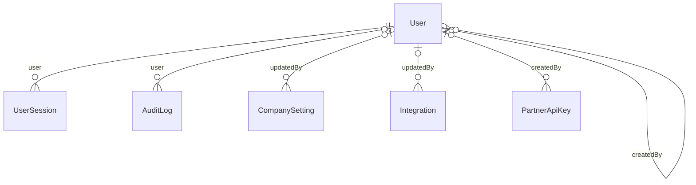

Cross-domain references from this domain: Employee.

#### HR & payroll

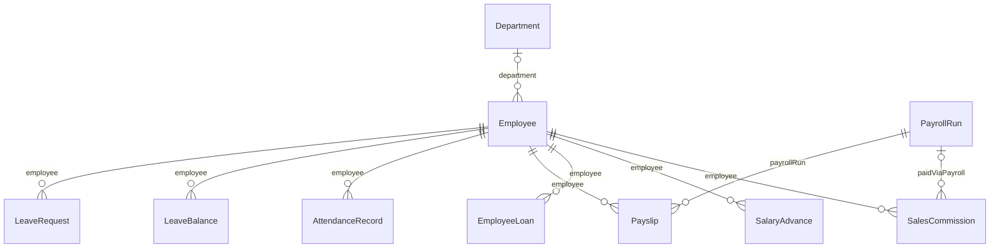

Cross-domain references from this domain: User, Invoice.

#### Contacts & CRM

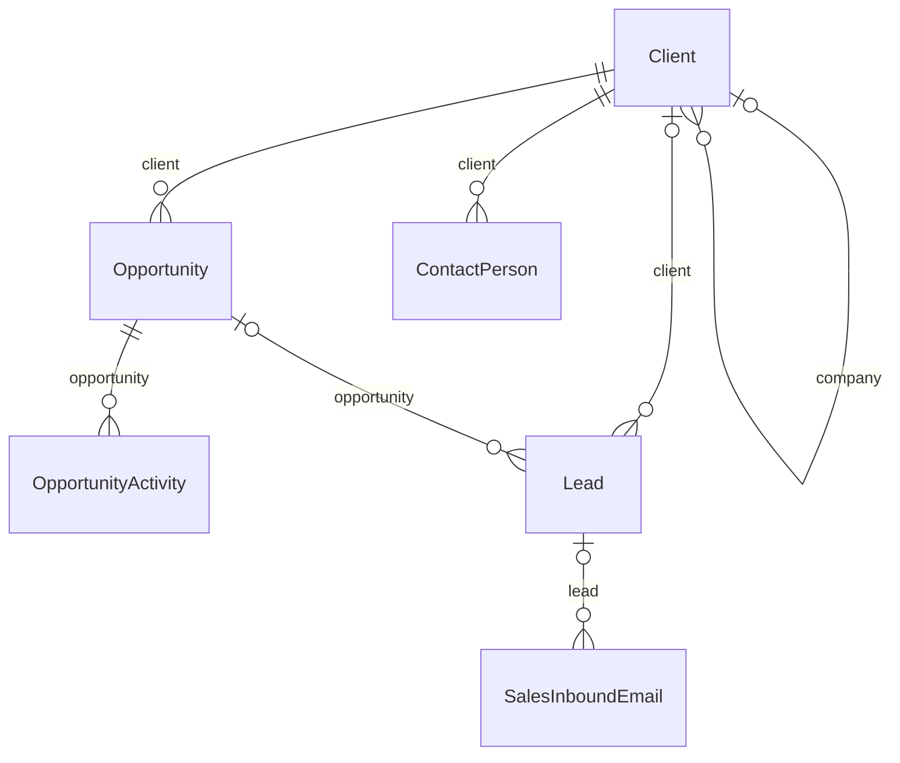

Cross-domain references from this domain: User.

#### Catalogue & inventory

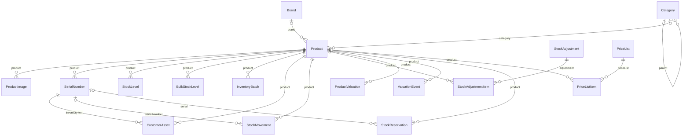

Cross-domain references from this domain: TaxRate, User, GrnItem, Invoice, Supplier, PurchaseOrder, Client, SaleOrder.

#### Purchasing

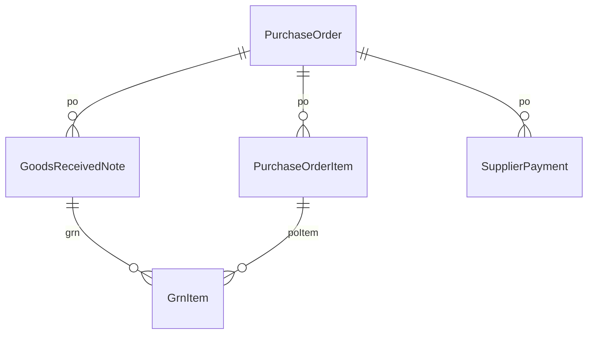

Cross-domain references from this domain: Supplier, Client, User, Product.

#### Sales, invoicing & payments

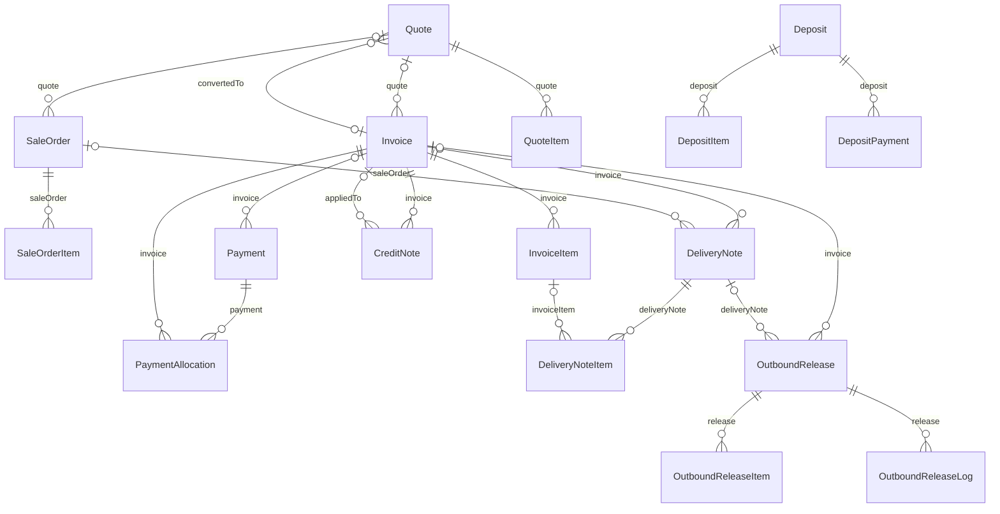

Cross-domain references from this domain: Client, PriceList, User, Product, SerialNumber, Opportunity, PurchaseOrder, Repair.

#### Repair

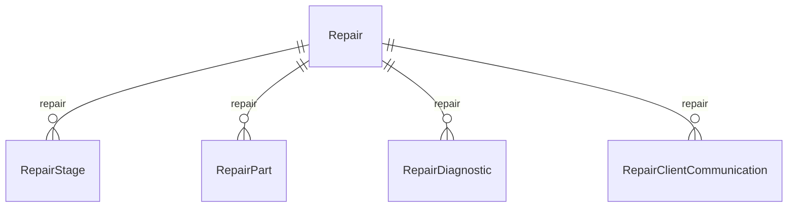

Cross-domain references from this domain: Client, User, Invoice, Product, SerialNumber.

#### POS & Kilimall

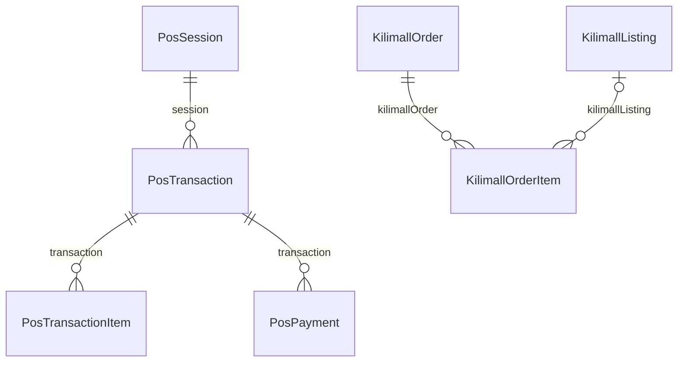

Cross-domain references from this domain: User, Invoice, Client, Product, SerialNumber.

#### Reconfiguration

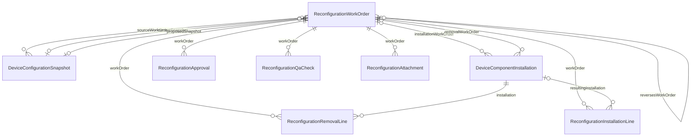

Cross-domain references from this domain: SerialNumber, User, Product, Client, SaleOrder, Invoice.

#### General ledger & finance controls

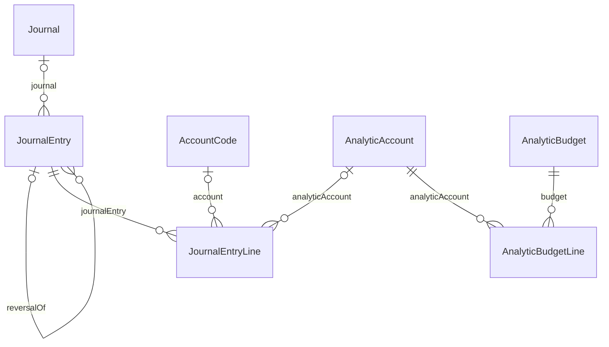

#### Notifications & communications

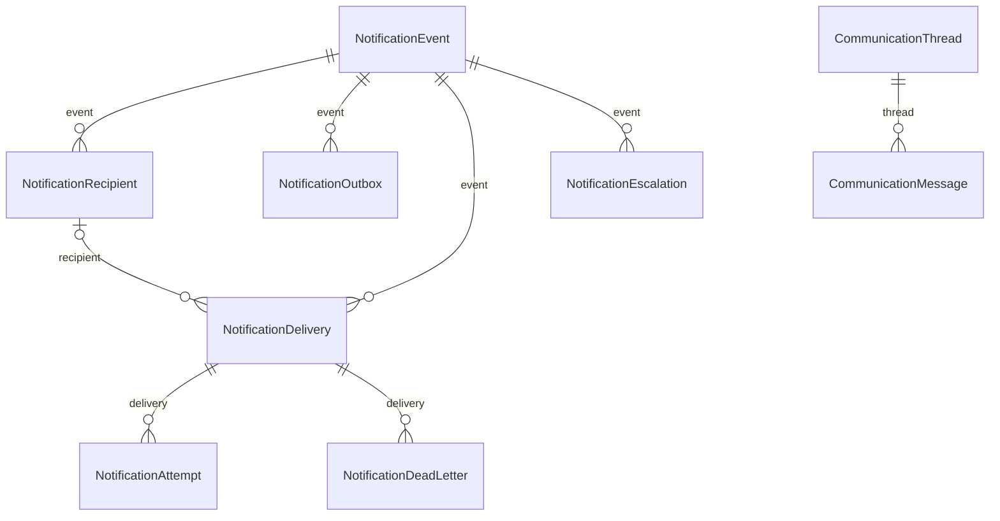

#### AI assistant (DIA / Jarvis)

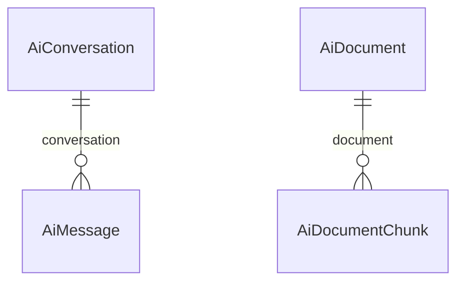

#### Legacy state bridge

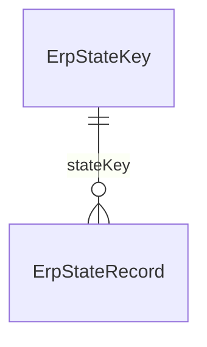

### 3.1 Cross-domain spine (the relations that carry the business flow)

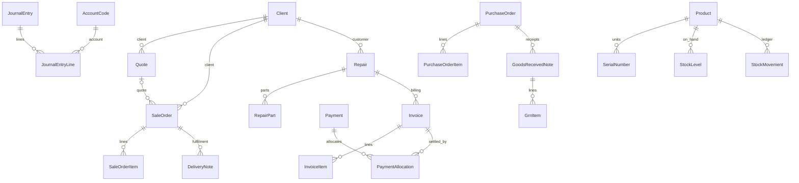

> Every edge above is a real foreign key in `schema.prisma` (verified mechanically). **Important soft links that are *not* foreign keys:** `Invoice.saleOrderId` (invoice → sale order), `JournalEntry.invoiceId` / `paymentId` / `sourceId` / `blobId` (journal → source document) and `InvoiceItem`→`SaleOrderItem`-style references are plain columns without `@relation`, so the database does not guarantee referential integrity for the sale-order→invoice→journal chain; integrity is checked after the fact by the integrity suite (`lib/accounting/integrity-suite.ts`: `invoices_without_journal`, `journal_parity_posted`, …).

## 4. Enumerations

| Enum | Values |
|---|---|
| UserRole | `admin`, `finance`, `inventory`, `kilimall`, `technician`, `sales`, `director`, `admin_officer`, `finance_officer`, `inventory_officer`, `kilimall_officer`, `sales_rep`, `technical_lead`, `super_admin`, `lead_tech`, `repair_tech`, `release_authoriser` |
| ProductType | `new`, `refurbished` |
| TrackingMethod | `NONE`, `QUANTITY`, `BATCH`, `SERIAL` |
| ConditionGrade | `A`, `B`, `C`, `parts_only` |
| StockMovementType | `purchase_receive`, `sale`, `repair_use`, `adjustment_in`, `adjustment_out`, `return_from_client`, `return_to_supplier`, `transfer`, `write_off`, `opening_stock`, `reconfiguration_in`, `reconfiguration_out` |
| DocumentStatus | `draft`, `pending_approval`, `approved`, `rejected`, `invoiced`, `dispatched`, `delivered`, `paid`, `partially_paid`, `cancelled`, `voided` |
| PaymentMethod | `cash`, `mpesa`, `bank_transfer`, `card`, `credit`, `cheque` |
| RepairStatus | `intake`, `diagnosis`, `awaiting_parts`, `in_repair`, `qc`, `ready`, `verified_released`, `collected`, `cancelled`, `unrepairable` |
| DeliveryMethod | `pickup`, `courier`, `own_delivery` |
| LeaveType | `annual`, `sick`, `maternity`, `paternity`, `compassionate`, `unpaid`, `study`, `december_closure` |
| LeaveStatus | `pending`, `approved`, `rejected`, `cancelled`, `pending_hr` |
| KilimallOrderStatus | `pending`, `confirmed`, `processing`, `shipped`, `delivered`, `cancelled`, `returned`, `refunded` |
| TaxType | `vat`, `exempt`, `zero_rated`, `out_of_scope`, `non_vat_supplier`, `not_selected` |
| PurchaseOrderStatus | `draft`, `sent`, `confirmed`, `partial`, `received`, `cancelled` |
| ReleaseStatus | `pending`, `all_picked`, `verified`, `released`, `voided` |
| ItemReleaseStatus | `picked`, `verified`, `released` |
| SignatureMethod | `digital`, `paper` |
| ReconfigTransactionType | `downgrade_for_sale`, `upgrade_for_sale`, `customer_paid_upgrade`, `internal_refurbishment`, `component_replacement`, `warranty_replacement`, `repair_related`, `configuration_correction`, `stock_standardisation` |
| ReconfigStatus | `draft`, `pending_stock_check`, `components_reserved`, `pending_approval`, `approved`, `in_progress`, `pending_qa`, `completed`, `cancelled`, `reversed` |
| ComponentSlotType | `ram_slot`, `m2_slot`, `sata_bay`, `battery`, `keyboard`, `wifi_card`, `charger`, `other` |
| ComponentDisposition | `quarantine`, `pending_testing`, `ready_for_sale`, `repair_required`, `parts_harvesting`, `damaged`, `write_off`, `supplier_return` |
| DataStatus | `unknown`, `none`, `company`, `client`, `test`, `awaiting_backup`, `awaiting_sanitisation`, `sanitised`, `sanitisation_failed`, `physical_destruction_required` |
| InstallationStatus | `installed`, `removed`, `quarantined` |

Status values that are **not** enums (free `VarChar` columns carrying state) include `SaleOrder.status` (`quotation`, `quotation_sent`, `sale`, `cancelled`), `Invoice.postingStatus` (`unposted`, `posting`, `posted`), `Payment.reconciliationStatus`, `Payment.postingStatus`, `FiscalPeriod.state` (`draft`, `open`, `closed`, `locked`), `Repair` payload `status` (20 values, see the status catalogue in the main document) and `Reconfiguration*` statuses (enum `ReconfigStatus`).

## 5. Tables that exist only in raw SQL (not in `schema.prisma`)

| Table | Created by | Purpose |
|---|---|---|
| `app_state` | `lib/server-store.ts` `ensureTable`, `database/migrations/20260709_app_state_notify.sql` (adds a `pg_notify` trigger) | Layer-B JSON documents |
| `doc_ref_counter` | `lib/doc-ref-counter.ts` | Atomic yearly counters for QUO/SO/INV/PO/DN/CN/BILL/REC/RCT/RCF (`PREFIX_YYYY` ids), plus `client_seq`, `pos_seq`, `djb_seq` |
| `orc_ref_counter` | `lib/orc-ref-counter.ts` | Outbound-release reference counter |
| `deposit_ref_counter` | `lib/deposit-ref-counter.ts` | Deposit reference counter |
| `admin_audit_log` | `app/api/admin/reset/route.ts` (raw SQL `CREATE TABLE IF NOT EXISTS`) | Log of the destructive admin-reset action (not the Prisma `AuditLog`) |
| `user_mfa`, `user_trusted_browsers` | `lib/auth/mfa.ts`, `lib/auth/trusted-browser.ts`, `database/migrations/20260830_user_mfa_security_safe.sql`, `20260902_user_trusted_browsers.sql` | MFA secrets and trusted-browser tokens |
| `users` (also modelled as `User`) | `lib/auth/users-repository.ts` `ensureTable` + additive `ALTER TABLE`s | **Authentication reads/writes this table through raw SQL**, not through Prisma, so columns added by the repository (`password_history_json`, `failed_login_attempts`, `locked_until`, `must_change_password`, `employee_id`, …) must exist in the physical table whether or not `schema.prisma` declares them |

## 6. Source-of-truth matrix (what actually controls each domain today)

"Read source" is the layer a screen/report reads; "Write source" is where the authoritative commit happens. Verified in the code paths cited in the main document §10.

| Domain | Authoritative (writes) | Read by UI | Read by reports | Secondary copies | Comment |
|---|---|---|---|---|---|
| Chart of accounts | `AccountCode` (via `/api/accounting/bootstrap-coa`, journal-service validation) | Store key `deed_accounts` + Prisma | Prisma | `deed_accounts` blob mirrored (`mirrorAccountsToPrisma`) | Posting fails if an account code is missing/inactive in Prisma |
| Journals / GL | `JournalEntry` + `JournalEntryLine` via `journal-service` | Prisma (`/api/accounting/journals`, `general-ledger`) and the client journal list (`deed_journalEntries`) | **Prisma only** (`accountingReportSourceOfTruth()` = `'prisma'`) | `deed_journalEntries` blob still written by the client unless `ACCOUNTING_PRISMA_JOURNAL_WRITERS` is enabled | Dual representation; reconciled by `journal-parity` / integrity gates |
| Invoices & vendor bills | `Invoice` (+items) via `/api/invoices` | Mixed: Prisma-hydrated + `deed_invoices` mirror | Prisma (`AR/AP ageing`, VAT) | `deed_invoices` blob refreshed by `refreshInvoicesBlob` | Posted state decided by Prisma; stale blob "draft" rows are a documented defect class |
| Payments / allocations | `Payment` + `PaymentAllocation` | Prisma (finance) | Prisma | `deed_payments` blob (legacy path) | Two write paths in `/api/payments` |
| Sale orders / quotations | `SaleOrder`/`SaleOrderItem` via `/api/sale-orders` | Store key `deed_saleOrders` (hydrated from Prisma) | Prisma | blob mirror | CRM `Quote` is a **separate** model/number series from quotation-state sale orders (both use prefix `QUO`) |
| CRM contacts/companies/persons/opportunities/quotes | Prisma (`Client`, `ContactPerson`, `Opportunity`, `Quote`) | REST hooks | Prisma | store keys exist but client writes are dropped | Fully REST-SoT |
| Products | `Product` (+images, stock levels) via `/api/products` | `deed_products` hydrated from Prisma | Prisma | blob merged on write | `Product.stockQty`-style counters also kept in the client store |
| Stock on hand | **Mixed**: `StockLevel`/`BulkStockLevel`/`SerialNumber` (Prisma) and blob `deed_serials`/`deed_bulkStock` (operational for delivery/receipt/POS stock routes) | Blob-hydrated store | `ProductValuation`, `InventoryBatch`, `InventoryLedgerEntry` (Prisma) | Mirrors (`mirrorKnownDomain`) | Highest drift risk — see KI-01 |
| Deliveries | Blob `deed_deliveries` (validate route) | Blob | n/a | `DeliveryNote` mirror | Prisma copy is a mirror, not authoritative |
| Purchase orders | `PurchaseOrder` via `/api/purchase-orders` | Prisma-hydrated list | Prisma | `deed_purchaseOrders` blob | Row-projection domain |
| Receipts / GRN | Blob `deed_receipts` + `GoodsReceivedNote` created on validation | Blob | Prisma valuation | mirror | |
| Repairs | `Repair` row (full payload in column) | Hydrated from Prisma | Prisma (counts via payload) | `deed_repairs_v2` write-only backup | Phase 2c: table authoritative |
| POS | Blob `deed_posOrders` / `deed_posSessions`; invoice + journal via REST | Blob | GL (journal) | none in Prisma (`PosTransaction` unused) | Till history is blob-only |
| Expenses | Blob `deed_expenses`; GL via `/api/expenses/post-journal` | Blob | GL | none (`ExpenseRecord` unused) | |
| Bank accounts & reconciliation | Blob `deed_bankAccounts`, `deed_bankRecons`, `deed_bankStatementLines` | Blob | n/a | Prisma `BankAccount` used only for payment FK/GL mapping; `BankStatement*` APIs have no UI | Two models |
| Deposits / holdovers | Prisma (`Deposit*`, `Holdover`) via REST | Prisma | Prisma | blob mirrors | |
| Payroll / leave / salary advances | Prisma via REST | REST | Prisma | none | Fully REST-SoT (payroll posts a `PAY` journal) |
| Company / system settings | `deed_companySettings`, `deed_systemSettings` blobs | Blob | PDFs read blob | Prisma `CompanySetting` via `/api/settings` (separate fields) | Two sources — see §7 |
| Users & sessions | `users` table (raw SQL) | REST | n/a | `User` Prisma model (partial) | |
| Audit | `AuditLog`, `FinancialAuditEvent` (Prisma) + `deed_audit_timeline_v1` (store trail) + `store_audit_archive` | Director-only reads | n/a | | Three audit trails |
| Notifications | Prisma `Notification*` | REST/SSE | n/a | | Normalised |
| Reconfiguration | Prisma `Reconfiguration*`, `Device*` | REST | Prisma | | Normalised |
| Kilimall / E-commerce | Blob `deed_kilimall*` | Blob | none | `Kilimall*` models exist but have no operational reader/writer | No marketplace integration |
| KPI / SOPs | Blob `deed_sops`, `deed_sopActuals`, `deed_hr_perf_targets`, `deed_ref_sops` | Blob | n/a | | |

## 7. Legacy store key inventory

All client-writable keys registered in `lib/app-state-hydration.ts`:

| Store key | Prisma counterpart | Pattern / notes | Write ACL entry (`STORE_WRITE_POLICIES`) |
|---|---|---|---|
| `deed_accounts` | AccountCode | dual-write, fire-and-forget `mirrorAccountsToPrisma` | yes |
| `deed_approvalRequests` | — | **blob/store-record only** (no Prisma counterpart found) | yes |
| `deed_bankAccounts` | BankAccount (partial: payment FK / GL map) | blob is the UI list; Prisma rows used by payment routes | yes |
| `deed_bankRecons` | BankStatement / BankReconciliationMatch (no UI) | blob only in practice | yes |
| `deed_bankStatementLines` | BankStatementLine (no UI) | blob only in practice | yes |
| `deed_bulkStock` | BulkStockLevel | blob operational; backfill script `backfill-bulk-stock-levels-from-blob.mjs`; reconfiguration uses Prisma levels | yes |
| `deed_buyBacks` | — | **blob/store-record only** (no Prisma counterpart found) | yes |
| `deed_candidates` | — | **blob/store-record only** (no Prisma counterpart found) | yes |
| `deed_clientExchanges` | — | **blob/store-record only** (no Prisma counterpart found) | yes |
| `deed_companies` | Client (company) | REST-SoT: client POST/PUT dropped by `isPrismaRestSotStoreKey` | yes |
| `deed_companyAssets` | FixedAsset (API-only, no UI caller) | blob register; GL via system journals | yes |
| `deed_companySettings` | — | **blob/store-record only** (no Prisma counterpart found) | yes |
| `deed_contacts` | Client | REST-SoT: client POST/PUT dropped by `isPrismaRestSotStoreKey` | yes |
| `deed_contracts` | — | **blob/store-record only** (no Prisma counterpart found) | yes |
| `deed_customerContracts` | — | **blob/store-record only** (no Prisma counterpart found) | yes |
| `deed_customerCredits` | CreditNote / CreditApplication (partial) | blob ledger + `credit-note-service` | yes |
| `deed_deliveries` | DeliveryNote / DeliveryNoteItem | dual-write `mirrorDeliveriesToPrisma`; blob still operational (validate route reads/writes blob) | yes |
| `deed_deliveryJobs` | — | **blob/store-record only** (no Prisma counterpart found) | yes |
| `deed_departments` | — | **blob/store-record only** (no Prisma counterpart found) | yes |
| `deed_deposits` | Deposit / DepositItem / DepositPayment | dual-write `mirrorDepositsToPrisma`; dedicated /api/deposits writes Prisma | yes |
| `deed_documentPaymentDetails` | — | **blob/store-record only** (no Prisma counterpart found) | yes |
| `deed_donations` | — | **blob/store-record only** (no Prisma counterpart found) | yes |
| `deed_employeeAssets` | — | **blob/store-record only** (no Prisma counterpart found) | yes |
| `deed_employeeTrainings` | — | **blob/store-record only** (no Prisma counterpart found) | yes |
| `deed_expenses` | ExpenseRecord (model unused) | blob only in practice; GL via `/api/expenses/post-journal` | yes |
| `deed_holdovers` | Holdover | dual-write `mirrorHoldoversToPrisma` | yes |
| `deed_hrDocuments` | — | **blob/store-record only** (no Prisma counterpart found) | yes |
| `deed_hr_perf_targets` | — | **blob/store-record only** (no Prisma counterpart found) | yes |
| `deed_hr_sops` | — | **blob/store-record only** (no Prisma counterpart found) | yes |
| `deed_invoices` | Invoice / InvoiceItem | dedicated /api/invoices writes Prisma; blob mirror refreshed (`refreshInvoicesBlob`) | yes |
| `deed_jobPostings` | — | **blob/store-record only** (no Prisma counterpart found) | yes |
| `deed_journalEntries` | JournalEntry / JournalEntryLine | dual-write, fire-and-forget `mirrorJournalEntriesToPrisma`; reports read Prisma only | yes |
| `deed_kilimallDispatches` | — | **blob/store-record only** (no Prisma counterpart found) | yes |
| `deed_kilimallOrders` | KilimallOrder (model unused) | blob only in practice | yes |
| `deed_kilimallSettlements` | — | **blob/store-record only** (no Prisma counterpart found) | yes |
| `deed_leaveBalances` | LeaveBalance | REST-SoT: client POST/PUT dropped by `isPrismaRestSotStoreKey` | yes |
| `deed_leaveRequests` | LeaveRequest | REST-SoT: client POST/PUT dropped by `isPrismaRestSotStoreKey` | yes |
| `deed_openingStockPosted` | — | **blob/store-record only** (no Prisma counterpart found) | yes |
| `deed_opportunities` | Opportunity | REST-SoT: client POST/PUT dropped by `isPrismaRestSotStoreKey` | yes |
| `deed_outboundReleases` | OutboundRelease | relational via /api/outbound-releases; key still writable | yes |
| `deed_outsourceJobs` | — | **blob/store-record only** (no Prisma counterpart found) | yes |
| `deed_outsourcePayments` | — | **blob/store-record only** (no Prisma counterpart found) | yes |
| `deed_outsourceVendors` | — | **blob/store-record only** (no Prisma counterpart found) | yes |
| `deed_payments` | Payment / PaymentAllocation | legacy blob CRUD (`/api/payments` no-allocation path) + Prisma path with allocations | yes |
| `deed_payrollRuns` | PayrollRun | REST-SoT: client POST/PUT dropped by `isPrismaRestSotStoreKey` | yes |
| `deed_posOrders` | PosTransaction (used only by dead `/api/pos/charge`) | blob only in practice | yes |
| `deed_posSessionId` | — | **blob/store-record only** (no Prisma counterpart found) | yes |
| `deed_posSessionOpen` | — | **blob/store-record only** (no Prisma counterpart found) | yes |
| `deed_posSessionOpeningCash` | — | **blob/store-record only** (no Prisma counterpart found) | yes |
| `deed_posSessions` | PosSession (model unused) | blob only in practice | yes |
| `deed_productPriceHistory` | — | **blob/store-record only** (no Prisma counterpart found) | yes |
| `deed_products` | Product (+ProductImage, StockLevel) | dedicated /api/products writes Prisma; store merge `mergeProductsStoreWrite` | yes |
| `deed_profileImages` | — | **blob/store-record only** (no Prisma counterpart found) | yes |
| `deed_purchaseOrders` | PurchaseOrder / PurchaseOrderItem | `mirrorKnownDomain` (blob-transfer); /api/purchase-orders writes Prisma | yes |
| `deed_purchaseReturns` | — | **blob/store-record only** (no Prisma counterpart found) | yes |
| `deed_quotes` | Quote / QuoteItem | REST-SoT: client POST/PUT dropped by `isPrismaRestSotStoreKey` | yes |
| `deed_receipts` | GoodsReceivedNote / GrnItem | `mirrorKnownDomain`; blob operational | yes |
| `deed_ref_sops` | — | **blob/store-record only** (no Prisma counterpart found) | yes |
| `deed_refundPayments` | — | **blob/store-record only** (no Prisma counterpart found) | yes |
| `deed_refurbishmentJobs` | — | **blob/store-record only** (no Prisma counterpart found) | yes |
| `deed_repairs_v2` | Repair | Prisma table authoritative on read (`overlayAuthoritativeRepairs`); blob = write-only backup; sync upsert `mirrorRepairsToPrisma` | yes |
| `deed_returnOrders` | — | **blob/store-record only** (no Prisma counterpart found) | yes |
| `deed_riderWeeklyPays` | — | **blob/store-record only** (no Prisma counterpart found) | yes |
| `deed_riders` | — | **blob/store-record only** (no Prisma counterpart found) | yes |
| `deed_salaryAdvances` | SalaryAdvance | relational via /api/salary-advances (key retained for legacy writes) | yes |
| `deed_saleOrders` | SaleOrder / SaleOrderItem | dedicated /api/sale-orders writes Prisma; blob = client mirror | yes |
| `deed_serials` | SerialNumber | `mirrorKnownDomain`; blob = row-projection operational store | yes |
| `deed_sopActuals` | — | **blob/store-record only** (no Prisma counterpart found) | yes |
| `deed_sops` | — | **blob/store-record only** (no Prisma counterpart found) | yes |
| `deed_stockAdjustments` | StockAdjustment (model unused) | blob only in practice | yes |
| `deed_stockMoves` | StockMovement | `mirrorKnownDomain`; blob operational | yes |
| `deed_stockReservations` | StockReservation | dual-write `mirrorStockReservationsToPrisma` | yes |
| `deed_stockTransfers` | — | **blob/store-record only** (no Prisma counterpart found) | yes |
| `deed_systemSettings` | — | **blob/store-record only** (no Prisma counterpart found) | yes |
| `deed_trainingPrograms` | — | **blob/store-record only** (no Prisma counterpart found) | yes |
| `deed_warranties` | — | **blob/store-record only** (no Prisma counterpart found) | yes |
| `deed_workflowApprovals` | — | **blob/store-record only** (no Prisma counterpart found) | yes |

## 8. Table-to-module mapping

| Module | Prisma models / tables |
|---|---|
| Dashboard | read-only over invoices, sale orders, repairs, expenses, deposits, contacts, accounts, bank accounts (store keys listed in `appStateKeysForRoute('/')`) |
| Contacts / Customers / Vendors | `Client` (type distinguishes customer/vendor/company), `ContactPerson`; `Supplier` unused |
| CRM | `Lead`, `SalesInboundEmail`, `Opportunity`, `OpportunityActivity`, `Quote`, `QuoteItem` |
| Sales | `SaleOrder`, `SaleOrderItem`, `Quote`, `SalesCommission`, `StockReservation`, `DocumentMessage`, `DocumentActivity` |
| Delivery | `DeliveryNote`, `DeliveryNoteItem`, `OutboundRelease*`; blob riders/jobs/weekly pay |
| Purchase | `PurchaseOrder`, `PurchaseOrderItem`, `GoodsReceivedNote`, `GrnItem`; vendor bills are `Invoice` rows with `documentType='vendor_bill'` |
| Inventory | `Product`, `Category`, `ProductImage`, `SerialNumber`, `StockLevel`, `BulkStockLevel`, `StockMovement`, `InventoryBatch`, `InventoryLedgerEntry`, `ProductValuation`, `ValuationEvent`, `ConsignmentDevice`, `CustomerAsset`, `LabelPrintJob` |
| Repair / Refurbishment / Outsource | `Repair` (+`RepairPart`, `RepairStage`, `RepairDiagnostic`, `RepairClientCommunication` — the last four have no ORM usage except reset scripts); blob refurbishment/outsource keys |
| Reconfiguration | `ReconfigurationWorkOrder`, `…RemovalLine`, `…InstallationLine`, `…Approval`, `…QaCheck`, `…Attachment`, `DeviceConfigurationSnapshot`, `DeviceComponentInstallation`, `DeviceSerialCost` |
| Finance / GL | `AccountCode`, `Journal`, `JournalEntry(+Line)`, `FiscalLock`, `FiscalPeriod`, `FinancialAuditEvent`, `FinancialReconciliation`, `TaxTransaction`, `AnalyticAccount`, `AnalyticBudget`, `FixedAsset`, `AssetDepreciationEntry`, `BankAccount`, `BankStatement(+Line)`, `BankReconciliationMatch` |
| Invoicing / payments | `Invoice`, `InvoiceItem`, `Payment`, `PaymentAllocation`, `CreditNote(+Line)`, `CreditApplication`, `MpesaStkRequest`, `Deposit*` |
| POS | blob keys; `PosTransaction` referenced only by the dead `/api/pos/charge` route |
| Kilimall | blob keys; `Kilimall*` models have no operational reader/writer |
| HR | `Employee`, `Department`, `LeaveRequest`, `LeaveBalance`, `PayrollRun`, `Payslip`, `PayrollComponentLine`, `SalaryAdvance`, `StatutoryRuleVersion` |
| Settings / audit / users | `CompanySetting`, `AuditLog`, `StoreAuditArchive`, `User`, `UserSession`, `ApprovalRule`, `PartnerApiKey`, `ExchangeRate`, `PriceList(+Item)` |
| Notifications | `Notification*`, `CommunicationThread/Message` |
| AI assistant | `AiConversation`, `AiMessage`, `AiAuditLog`, `AiDocument`, `AiDocumentChunk` |
| Infrastructure | `BackgroundJob`, `ReportSnapshot`, `BlobCutoverCertificate`, `StoreRecord`, `ErpStateKey`, `ErpStateRecord` |

## 9. Soft-delete and immutability behaviour

| Entity | Delete behaviour |
|---|---|
| `Invoice` | Never hard-deleted by the API; `DELETE` sets `status='voided'` (blocked once paid). |
| `JournalEntry` | No update/delete API; `reverseJournalEntry` creates `REV/<ref>` and sets `isReversed=true` on the original (`reversalOfId` on the reversal). **No database trigger or constraint prevents direct SQL updates** (searched `database/migrations/*.sql` and `prisma/migrations/*`; only notification and `app_state` NOTIFY triggers exist). |
| `Client` (contacts) | `archive`/`restore` endpoints; `DELETE` exists; Director-only merge. |
| `Payment` | `isVoided`, `voidedAt`, `voidReason` columns exist and are *read* (allocation and residual logic refuse voided payments) but **no code path that sets `isVoided=true` was found**; `PATCH/PUT/DELETE /api/payments/[id]` operate on the blob collection `deed_payments`. |
| `Repair` | Hard delete allowed (`/api/repairs/[id]` `DELETE`) with tombstones (`repair-tombstones`) to stop stale clients resurrecting rows. |
| Blob collections | Whole-array replacement; bulk-delete guard refuses > 5 removals unless explicitly allowed. |
| `AuditLog` / `FinancialAuditEvent` | Append-only by convention (no update/delete code), **not enforced by the database**. |
