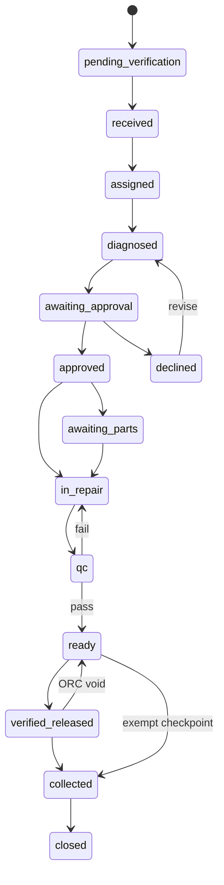

# Repair business-flow contract

This document is the architectural reference for every Repair change. Code,
Cursor prompts and reviews must treat it as a non-negotiable contract.

## Module ownership

| Module | Owns | Must not do |
| --- | --- | --- |
| Repair | intake, assignment, diagnosis, quote request, workshop work, QC, readiness, handover and closure | post/reverse invoices, register payments, create purchase orders |
| Sales | commercial quotation and confirmed sales-order representation | mutate workshop progress |
| Invoice | draft invoice, confirmation/posting, payment and credit/debit notes | move a Repair through technical stages |
| Procurement | sourcing request, vendor selection and purchase-order creation | approve Repair QC |
| Inventory | reservation/consumption and stock ledger | decide Repair or Invoice status |
| Accounting | COGS and journal posting | act as the Repair state machine |

## Canonical operational flow

Direct Repair is the explicit `assigned → in_repair` exception. Warranty and
manager-approved no-charge jobs may bypass customer billing, but never QC or
handover controls.

## Billing contract

Repair status and invoice status are independent. A Repair passing QC becomes
`ready` and nothing else. An explicit billing handoff may create one draft
invoice. Only the Invoice module may confirm/post, receive payment, or correct a
posted invoice. Posted invoices are immutable; corrections use credit/debit
notes. Closing a Repair validates an existing link and never creates an invoice.

Legacy Repair rows with status `invoiced` may be read and moved forward, but
new code must never write `invoiced`.

## Procurement contract

A Repair action creates a procurement request. Procurement/Purchase owns vendor
selection and PO creation. A Repair action must never create a vendor-less PO.

## Change-control checklist

Every Repair change must:

1. Use `lib/repair-transition-policy.ts` for status validity.
2. Keep invoice, payment, PO and journal statuses outside Repair status.
3. Avoid hidden side effects from QC, Close, Return or Cancel.
4. Preserve posted-document immutability.
5. Add tests for the happy path, rejection, rework and role boundary.
6. Run typecheck, unit tests and production build before merge.
