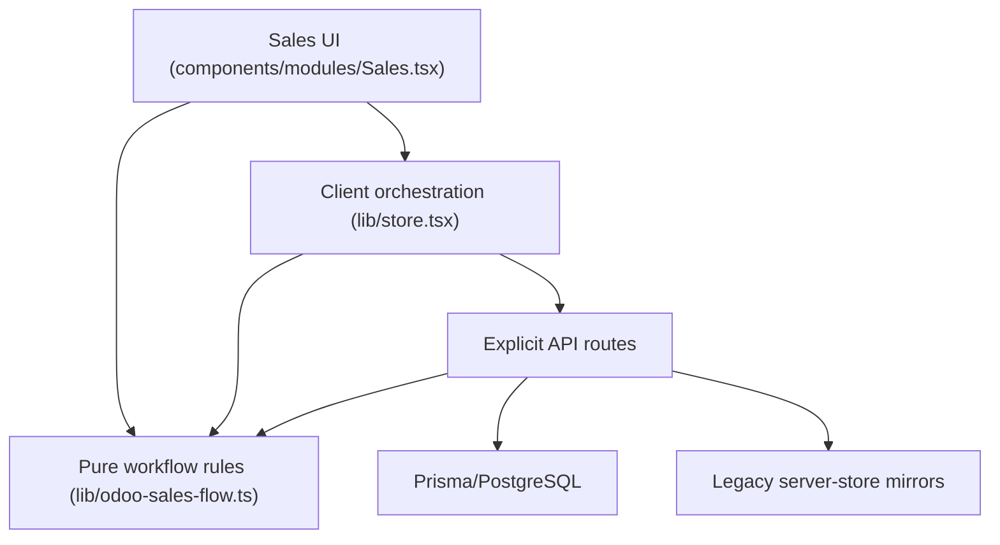

# Current Sales Architecture

Status: reviewed against `master` on 2026-09-13.

## Implemented architecture

The system already preserves separate Sales Order, delivery, invoice-document and payment projections. The create-invoice API is transactional and calculates invoiceable quantity from delivered/order quantities. It does not import or call inventory stock-posting services.

## Confirmed defect

The Sales UI combines Prisma-derived records with a legacy client mirror. A posted invoice can temporarily remain `status: draft` in the client mirror after the server has assigned its official `INV/...` number. The previous next-action resolver trusted only that stale status and offered **Confirm invoice**. Posting again then reached the server, whose immutability guard correctly rejected the mutation.

## Delivery error assessment

The create-invoice endpoint does not perform delivery validation or serial availability checks. The exact “serial … is not available for delivery” error belongs to the stock-delivery validation boundary. This change seals and documents that separation; any recurrence must be traced as an unintended delivery command/event, not fixed by weakening inventory controls.

## Transitional risk

The application is still dual-source in places (Prisma plus server-store/client mirror). Official document references and server APIs are authoritative. Long term, retiring the invoice mirror after parity verification removes this stale-state class entirely.
