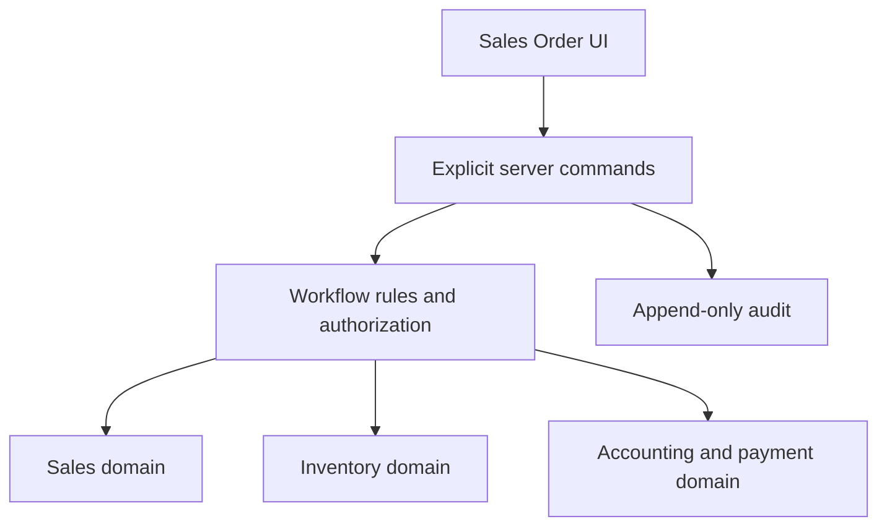
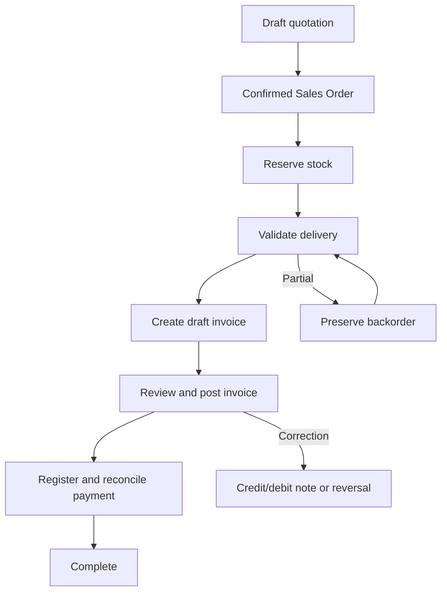

# Sales Order Workflow

This is the canonical, binding workflow reference for Sales, Delivery, Inventory, Invoice and Payment changes.

## Architecture

Commands are explicit: confirm order, reserve stock, validate delivery, create draft invoice, post invoice, register payment, reverse/correct. A generic “advance status” command is forbidden.

## Commercial document continuity

Confirmation changes the accepted quotation into the same Sales Order record. Preserve the lineage:

`Quotation → Sales Order → Delivery/stock moves/serials → Invoice → Payment`

Never manufacture an unrelated replacement Sales Order during confirmation.

## Canonical logical flow

Physical stock sales are delivery-first. Creating an invoice reads validated delivery evidence; it never repeats delivery.

## Independent state dimensions

| Dimension | Valid projections |
|---|---|
| Sales document | Quotation, Quotation Sent, Sales Order, Cancelled |
| Delivery | Nothing to Deliver, Waiting Delivery, Partially Delivered, Fully Delivered |
| Invoice document | Not Created, Draft, Posted, Cancelled/Reversed |
| Invoiceability | Nothing to Invoice, To Invoice, Fully Invoiced, Upselling |
| Payment | Awaiting Invoice, Not Paid, In Payment, Partially Paid, Paid, Reversed, Blocked |

Never overwrite one dimension from another. Payment cannot change delivery status. Invoice posting cannot change delivered quantity.

## Next-action decision table

| Authoritative condition | Primary action |
|---|---|
| Confirmed; delivery not validated | Prepare/Validate delivery |
| Partial delivery | Continue delivery/backorder |
| Fully delivered; no invoice | Create invoice |
| Genuine draft invoice (`DRAFT/INV/...`) | Confirm invoice |
| Posted invoice with residual | Register payment |
| Posted invoice fully paid | View invoice / Complete |
| Posted invoice needs correction | Credit/debit note or reversal |

The server state is authoritative. During mirror propagation, a non-draft official `INV/...` reference is durable evidence that an invoice is posted and must never be offered for confirmation.

## Inventory invariants

- Reservation allocates but does not reduce physical on-hand stock.
- Delivery validation atomically posts stock movement.
- Delivered quantities derive from validated stock movements.
- A delivery and a serial cannot be consumed twice.
- Partial delivery preserves remaining demand/backorder.
- Invoice creation never reserves stock, validates delivery, changes serial availability, or posts stock.
- Corrections use returns/reversals, never deletion or history rewriting.

## Invoice and payment invariants

- Draft invoices may be edited within permissions.
- Posted invoices are immutable.
- Posted corrections use credit/debit notes, cancellation/reversal and replacement documents.
- Invoiceable quantity cannot exceed the configured eligible quantity.
- Invoice creation is transactional and idempotent under retries/concurrency.
- Payment is registered against a posted invoice and reconciled independently.
- Fiscal locks, journal numbering, tax and ledger rules are not bypassed by Sales UI actions.

## Permissions and security

Every transition is checked server-side. Hidden buttons are not authorization. Commands require role checks, transition guards, transactional writes and auditable actor/time/result evidence.

## Error guidance

- Stock/serial availability errors belong to reservation or delivery validation.
- Invoice creation may report missing validated delivery evidence or nothing invoiceable.
- Invoice confirmation may report immutable posted state only for a direct stale/invalid request; the normal UI must resolve that invoice to Register payment/View.
- Do not suppress errors or weaken domain guards to make a UI action succeed.

## Regression matrix

| Scenario | Required result |
|---|---|
| Fully delivered; no invoice | Create draft invoice from validated delivered quantities |
| Delivered serial is now sold/delivered | Invoice succeeds; no availability recheck |
| Repeated create request | No duplicate invoice or stock move |
| Genuine draft invoice | Confirm invoice |
| Stale mirror says draft but ref is official | Treat as posted; never confirm |
| Posted unpaid invoice | Register payment |
| Posted paid invoice | View/Complete |
| Partial delivery | Invoice eligible delivered quantity; preserve backorder |
| Payment update | Delivery unchanged |
| Invoice posting | Delivered quantities unchanged |
| Posted correction | Compensating document, never mutation |

## Change control

Any approved workflow change must update this document and its tests in the same pull request. If code conflicts with this reference, stop and raise the conflict; do not silently invent new business logic.
