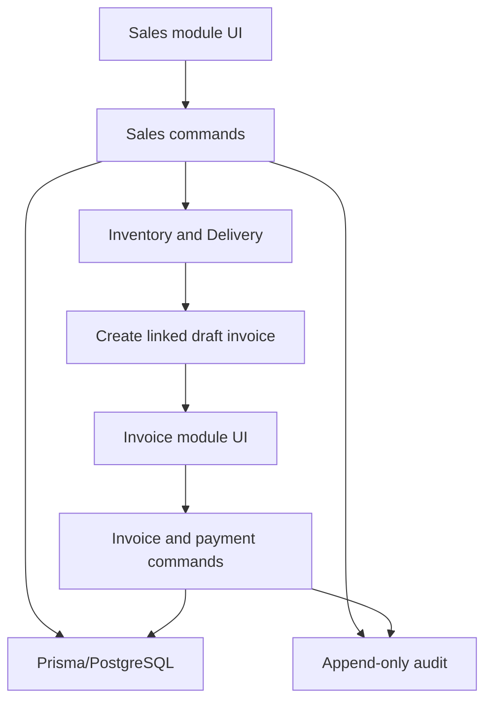
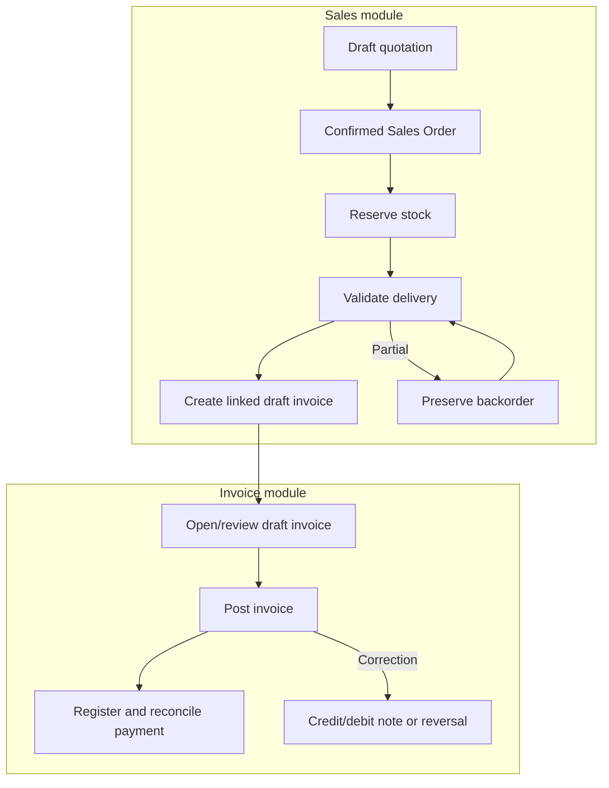

# Sales Order and Invoice Workflow

This is the canonical, binding workflow reference for the Sales, Delivery, Inventory and Invoice modules.

## Module ownership

| Module | Owns | Must not do |
|---|---|---|
| Sales | Quotation, Sales Order, stock reservation request, delivery journey, creation of a linked draft invoice, document lineage | Post invoices, register payments, reconcile payments, issue accounting reversals |
| Invoice | Review/edit a draft invoice, post invoice, register/reconcile payment, credit/debit notes, reversals | Reserve stock, validate delivery, change delivered quantities or serial availability |
| Inventory/Delivery | Reservation, picking, validated stock movement, serial consumption, returns/backorders | Create/post invoices or register payments |

The handoff is explicit: **Sales creates the draft invoice and opens it in the Invoice module.** All subsequent invoice and payment actions happen in the Invoice module.

## Architecture

Commands are explicit. A generic “advance status” command is forbidden.

## Commercial document continuity

Confirmation changes the accepted quotation into the same Sales Order record. Preserve:

`Quotation → Sales Order → Delivery/stock moves/serials → Draft Invoice → Posted Invoice → Payment`

Never manufacture an unrelated replacement Sales Order during confirmation.

## Canonical logical flow

Physical stock sales are delivery-first. Creating an invoice reads validated delivery evidence; it never repeats delivery.

## Independent state dimensions

| Dimension | Valid projections |
|---|---|
| Sales document | Quotation, Quotation Sent, Sales Order, Cancelled |
| Delivery | Nothing to Deliver, Waiting Delivery, Partially Delivered, Fully Delivered |
| Invoice document | Not Created, Draft, Posted, Cancelled/Reversed |
| Invoiceability | Nothing to Invoice, To Invoice, Fully Invoiced, Upselling |
| Payment | Awaiting Invoice, Not Paid, In Payment, Partially Paid, Paid, Reversed, Blocked |

Never overwrite one dimension from another. Payment cannot change delivery status. Invoice posting cannot change delivered quantity.

## Sales-module next actions

| Authoritative condition | Sales primary action |
|---|---|
| Confirmed; delivery not validated | Prepare/Validate delivery |
| Partial delivery | Continue delivery/backorder |
| Fully delivered; no invoice | Create invoice |
| Linked draft invoice | Open draft invoice in Invoice module |
| Linked posted invoice | View invoice in Invoice module |
| Sales fulfilment and invoicing complete | Sales complete — continue in Invoices |

The Sales module must never expose a button that directly posts/confirms an invoice or registers a payment.

## Invoice-module next actions

| Authoritative condition | Invoice primary action |
|---|---|
| Draft invoice | Review/Edit or Post invoice |
| Posted invoice with residual | Register payment |
| Posted invoice fully paid | View/Close |
| Posted invoice needs correction | Credit/debit note or reversal |

The server state is authoritative. During mirror propagation, a non-draft official `INV/...` reference is durable evidence that an invoice is posted and must never be treated as a draft.

## Inventory invariants

- Reservation allocates but does not reduce physical on-hand stock.
- Delivery validation atomically posts stock movement.
- Delivered quantities derive from validated stock movements.
- A delivery and serial cannot be consumed twice.
- Partial delivery preserves remaining demand/backorder.
- Invoice creation never reserves stock, validates delivery, changes serial availability, or posts stock.
- Corrections use returns/reversals, never deletion or history rewriting.

## Invoice and payment invariants

- Draft invoices may be edited within permissions in the Invoice module.
- Posted invoices are immutable.
- Posted corrections use credit/debit notes, cancellation/reversal and replacement documents.
- Invoiceable quantity cannot exceed eligible quantity.
- Invoice creation is transactional and idempotent under retries/concurrency.
- Payment is registered against a posted invoice and reconciled independently.
- Fiscal locks, journal numbering, tax and ledger rules are not bypassed by Sales actions.

## Permissions and security

Every transition is checked server-side. Hidden buttons are not authorization. Commands require role checks, transition guards, transactional writes and auditable actor/time/result evidence.

## Error guidance

- Stock/serial availability errors belong only to reservation or delivery validation.
- Invoice creation may report missing validated delivery evidence or nothing invoiceable.
- The Sales module only navigates to existing invoices; it does not call invoice posting/payment mutations.
- Posted-invoice immutability must never be weakened to accommodate stale UI state.
- Do not suppress errors or weaken domain guards.

## Regression matrix

| Scenario | Required result |
|---|---|
| Fully delivered; no invoice | Sales creates draft invoice from validated delivery |
| Delivered serial is now sold/delivered | Invoice creation succeeds; no availability recheck |
| Repeated create request | No duplicate invoice or stock move |
| Linked genuine draft invoice | Sales opens it in Invoice module; Invoice module may post |
| Stale mirror says draft but ref is official | Treat as posted; Sales opens it, never confirms |
| Posted unpaid invoice | Sales opens it; Invoice module offers Register payment |
| Posted paid invoice | Sales opens it; Invoice module shows paid/close state |
| Partial delivery | Invoice eligible delivered quantity; preserve backorder |
| Payment update | Delivery unchanged |
| Invoice posting | Delivered quantities unchanged |
| Posted correction | Compensating document, never mutation |

## Change control

Any approved workflow change must update this document and its tests in the same pull request. If code conflicts with this reference, stop and raise the conflict; do not silently invent new business logic.
